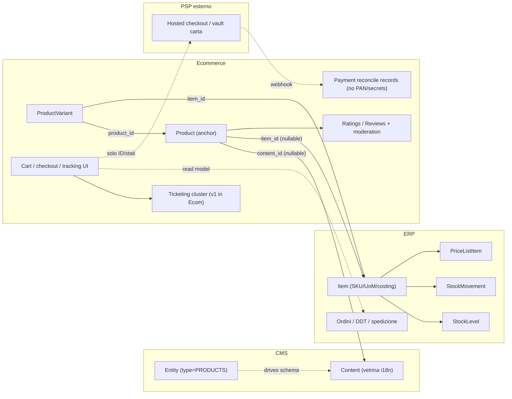

# Piano modulo Ecommerce (embrionale)

## Obiettivo
Catturare le decisioni architetturali per non perderle. Nessun codice obbligatorio in questo file: documento di piano in `.cursor/plans/` allineato alla convenzione esistente ([nebula_verso_business_0d6eb0ed.plan.md](.cursor/plans/nebula_verso_business_0d6eb0ed.plan.md), [mes_requirements_revision_8a9d6c58.plan.md](.cursor/plans/mes_requirements_revision_8a9d6c58.plan.md)).

## File di riferimento
- Questo file: `.cursor/plans/ecommerce_module_embryo_5a2b64dd.plan.md` (unica fonte aggiornata per l'embrione Ecommerce).

### Front-matter (stile esistente)
- `name`: ecommerce module embryo
- `overview`: modulo **non avviato** in `Modules/Ecommerce/`. Il piano **blocca le decisioni** prima dell'implementazione.

### 1. Principio guida
- "Reuse, don't reinvent": l'Ecommerce **orchestra**, non ricostruisce.
- `Content` (CMS) = vetrina (i18n, gallery, SEO editoriale, approvals, lock, drafting).
- `Item` (ERP) = record gestionale (SKU, UoM, costing, stock, listini, ordini, fatture, movimenti contabili).
- `Product` (Ecommerce) = **anchor** che lega i due bounded context con FK e aggiunge solo cio' che e' specifico dell'asse **vendita online**.

### 1.b Perimetro: cosa gestisce Ecommerce che non e' "gia'" CMS o ERP
| Area | Ruolo Ecommerce |
|------|-----------------|
| Anchor + varianti | Legame scheda shop ↔ `Content` + `Item`(s); attributi solo vetrina (es. variant attributes JSON). |
| Visibilita' e merchandising web | `is_published_in_shop`, featured, release, badge/metadata di canale — non duplicano listino ne' stock. |
| Pre-ordine | Carrello, checkout, sessione ospite/loggato, merge carrelli; finche' non diventa documento ERP. |
| Promo solo web | Override layer sopra `PriceResolverService` (ERP); vietato duplicare listino come fonte di verita'. |
| Pagamenti (PSP) | Orchestrazione flusso (hosted checkout / elementi ospitati dal PSP), webhook/callback, riconciliazione verso ordine ERP; **nessun salvataggio in applicazione di dati carta (PAN/CVV ecc.) ne' di credenziali/account merchant del PSP** — solo riferimenti tecnici idempotenti e metadati non sensibili (vedi §3.d). |
| Feed / URL shop | Integrazioni tipo merchant feed; colla tra identita' commerciale e path/editoriale. |
| **UGC** | Voti (stelline), recensioni testuali, moderazione (vedi sezione dedicata). |
| **Ticketing (cluster)** | Assistenza, richieste rimborsi/resi/tracciamento dal punto di vista **cliente**; decisione: **resta nel modulo Ecommerce per ora**, rivalutazione modulo Support in seguito. |
| **Tracking consegna (UX)** | Schermate "stato ordine / pacco"; **verita' operativa** (DDT, corriere, eventi) in ERP o integrazione logistico — Ecommerce legge e mostra. |

Funzioni tipiche ancora nel perimetro candidato (da affinare in implementazione): wishlist, confronto prodotti, avvio RMA/reso lato cliente (esecuzione contabile/inventariale in ERP). Notifiche email/SMS: infrastruttura preferibilmente **Core** + code; template possono essere dedicati o riallineati al CMS per contenuti statici.

### 2. Diagramma di riferimento

### 3. Schema dati proposto (bozza)
- Tabella `products`:
  - `id`, `company_id` (riusa `BelongsToCompany` ERP, vedi [Item.php](Modules/ERP/app/Models/Item.php))
  - `content_id` nullable -> `cms.contents` (FK)
  - `item_id` nullable -> `erp.items` (FK)
  - `is_published_in_shop` boolean
  - `featured` boolean
  - `release_date` nullable
  - `metadata` JSON per badge marketing/promo flags
- Tabella `product_variants`:
  - `id`, `product_id`, `item_id` (1 variante = 1 SKU ERP), `attributes` JSON (taglia, colore, ...)
- **Ratings / recensioni (bozza concettuale, non schema finale)**:
  - Entita' legate a `product_id` (e opzionalmente `user_id`, `order_line_id` per "solo acquirenti verificati").
  - Stati moderazione (es. pending / approved / rejected); si possono riprendere **pattern** CMS (`HasApprovals`, workflow) senza memorizzare la recensione come `Content` se non serve SEO unificato.
  - Valutazione aggregata (media stelle) derivabile o cached su `products` — decidere in implementazione (consistenza vs query).

### 3.b Ticketing nel modulo Ecommerce (decisione v1)
- **Decisione**: il cluster **ticketing** (assistenza, richieste rimborso/reso, richieste informazioni su tracciamento, allegati, thread con il cliente) vive nel modulo **Ecommerce** nella prima iterazione.
- **Motivo**: riduce superficie moduli; il portale cliente e' naturalmente lo shop.
- **Evolutivo**: se crescono SLA, reparti, integrazioni CRM o volumi fuori dal retail online, valutare estrazione in modulo **Support** / Helpdesk dedicato senza cambiare il principio "ERP = soldi e fulfillment".
- **Split con ERP**:
  - Il ticket **non** sostituisce nota di credito, rimborso eseguito, o movimento magazzino: restano in ERP.
  - Il ticket porta `references` (es. `order_id` ERP, testo libero) e stati lato cliente; transizioni che richiedono documento ERP sono **eventi** verso ERP (queue/command), non doppia scrittura contabile.

### 3.c Tracciamento ordini in consegna
- **ERP** (o integrazione da ERP): numeri tracking, corriere, eventi di spedizione, legati all'evasione.
- **Ecommerce**: pagine "Il mio ordine" / stato consegna che **consumano** API read-model o servizi ERP; no duplicazione come fonte di verita' degli eventi logistico.

### 3.d Pagamenti e transazioni (PSP esterno, zero dati sensibili in DB applicativa)
- **Decisione**: non memorizzare nell'applicazione (database o storage equivalente gestito come persistenza dominio) **dati di carte di credito/debito** (PAN, CVV/CVC, track data, PIN, ecc.) ne' **credenziali o segreti degli account dei servizi di pagamento** (API keys segrete, webhook signing secrets, private keys del merchant sul PSP). Questi ultimi vivono in **config sicura** / secret manager / env **fuori** dalle tabelle di business, mai come dati utente o righe versionabili nel codice.
- **Implementazione attesa**: checkout **ospitato dal PSP** (redirect, embedded hosted fields, Payment Element / equivalente) cosi' che PAN e dati autenticazione forte restino nel perimetro del provider; eventuali **token** opachi per ricorrenti o wallet sono **referenze lato PSP**: in app si conservano solo ID tecnici restituiti dal PSP (es. payment intent / charge / session id), mai il payload completo della carta.
- **Transazioni in app (consentito)**: record di **riconciliazione** legati all'ordine shop — es. ID pagamento provider, stato normalizzato, importo, valuta, timestamp, esito, motivo errore **non sensibile**, correlazione `order_id` / checkout session — utili a idempotenza webhook, supporto e audit **senza** PCI scope da carta.
- **ERP**: resta la fonte per documento vendita e registrazione economica come gia' previsto; il PSP resta sistema esterno; le transazioni "contabili" non vanno confuse con il log tecnico PSP lato Ecommerce.

### 4. Riuso esplicito da CMS
- `Modules/CMS/app/Models/Entity.php` definisce `Entity extends CoreEntity` con enum `EntityType`. Aggiungere `EntityType::PRODUCTS` quando il modulo nasce.
- `Modules/CMS/app/Models/Content.php` porta gia': `HasPath`, `HasTranslatedDynamicContents`, `HasTags`, `HasMultimedia`, `HasApprovals`, `Searchable`, `HasValidity`, `HasLocks`. **Non duplicare** testi lunghi o gallery sul modello `Product`.

### 5. Riuso esplicito da ERP
- `Item` resta unico autoritativo per stock/UoM/costing. La pagina prodotto **legge** disponibilita' tramite servizio (es. `ProductAvailabilityService` lato Ecommerce -> ERP).
- Prezzo: vive in `PriceList` + `PriceListItem` (gia' M7.1 nel piano ERP). Il modulo Ecommerce risolve il prezzo via `PriceResolverService` (ERP). Promo/sconti shop-only sono override locali.
- Ordini, fatture, movimenti contabili, evasione e dati tracking **autoritativi** in ERP.

### 6. Vincoli e regole architetturali
- `ecommerce` dipende da `cms` + `erp` via composer (dipendenza esplicita, no inversione di controllo prematura).
- Nessuna sync bidirezionale automatica fra `Item.name` e `Content.title`: nomi diversi (gestionale vs marketing) sono **feature**, non bug.
- `company_id` propagato e coerente fra `Product`, `Item` e (se serve) `Content`.
- Cancellazione: `content_id` e `item_id` nullable + `onDelete('set null')`; UI gestisce stato "scheda non disponibile".
- **Pagamenti**: rispetto stretto a §3.d — niente colonne o JSON che possano contenere PAN/CVV o segreti merchant; logging e dump eccezioni devono **filtrare** payload webhook noti per contenere dati sensibili.

### 7. Trappole note (da non dimenticare)
- Doppia fonte di verita' su nome/descrizione -> chiarire da subito lato i18n.
- Prezzo duplicato in `Product` -> vietato.
- Stock query diretta da frontend -> vietato, solo via service ERP.
- Multi-company: decidere mono vs multi prima di scrivere migration.
- **Recensioni**: spam, duplicate SEO rispetto a `Content`, policy "solo chi ha acquistato", GDPR/consensi — definire prima dell'MVP UGC.
- **Ticket ↔ ERP**: evitare due workflow paralleli senza ID di correlazione (ticket vs documento); eventi verso ERP espliciti.
- **Tracking**: rate limit e caching su API corriere; fallbacks UI se ERP non ha ancora aggiornato.
- **PSP**: leakage di dati carta o secret in log/backup DB; usare sempre pattern hosted + revisione sicurezza webhook.

### 8. Criteri di "ready"
Quando si decidera' di partire davvero, prerequisiti minimi:
- ERP M7.1 (listino avanzato) **GA**.
- CMS `EntityType::PRODUCTS` aggiunto e seed di `Entity` per "Product".
- Decisione formale (ADR breve) su mono/multi-company per lo shop.
- Per UGC: policy moderazione + (opzionale) verified purchase allineata agli ordini ERP.
- Per ticketing v1: elenco tipologie ticket e mapping "cosa richiede sempre un comando ERP".
- Pattern PSP scelto (hosted / embedded conforme a §3.d) e checklist sicurezza (secret fuori DB, redazione log).

### Todos del piano (stato `pending`, nessuna esecuzione obbligatoria ora)
- `define-product-anchor` — Definire schema migrazione `products` + `product_variants` (campi minimi sezione 3).
- `wire-cms-entity-type` — Aggiungere `EntityType::PRODUCTS` lato CMS e seed Entity.
- `price-availability-services` — Contratti `PriceResolverService` e `ProductAvailabilityService` lato ERP, consumati da Ecommerce.
- `multi-company-decision` — ADR mono/multi-company per lo shop.
- `reviews-ratings-moderation` — Schema e stati moderazione; eventuale aggregate rating; policy verified purchase.
- `ticketing-v1-domain` — Modello ticket (tipi, allegati, riferimenti ordine ERP, stati cliente vs trigger ERP).
- `shipment-tracking-read-path` — Contratto lettura stato spedizione da ERP per area account / email.
- `payments-psp-hosted-reconcile` — Modello transazioni solo riconciliazione (ID provider, stato, importo, ordine); segreti in vault/env; webhook idempotenti e redazione log.
- `ecommerce-rag-doc` — `Modules/Ecommerce/docs/rag/MODULE.md` con diagrammi (anchor, variant, prezzo/stock, pagamenti §3.d, ticket, tracking).

## Out of scope (per ora)
- Codice PHP, migration, test (salvo avvio esplicito del modulo).
- Modifiche a `Modules/CMS` o `Modules/ERP` non pianificate qui.
- Modulo **Support** separato: solo backlog / rivalutazione futura.
- Documentazione RAG di altri moduli (Core, CMS) gia' a roadmap.
