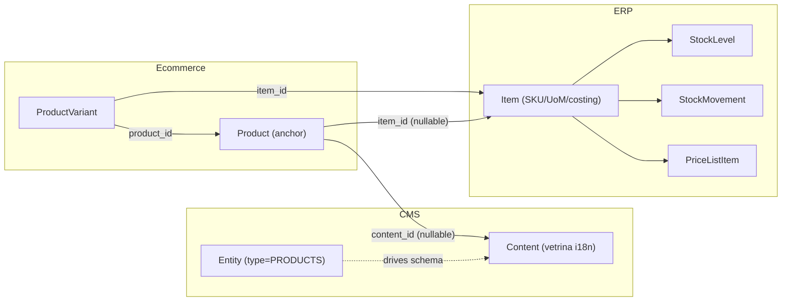

# Piano modulo Ecommerce (embrionale)

## Obiettivo
Catturare ora la decisione architetturale per non perderla. Nessun codice da scrivere: solo un documento di piano in `.cursor/plans/` allineato alla convenzione esistente ([nebula_verso_business_0d6eb0ed.plan.md](.cursor/plans/nebula_verso_business_0d6eb0ed.plan.md), [mes_requirements_revision_8a9d6c58.plan.md](.cursor/plans/mes_requirements_revision_8a9d6c58.plan.md)).

## File da creare
- `.cursor/plans/ecommerce_module_embryo.plan.md` — unico file, sola modifica del filesystem.

## Contenuto del piano

### Front-matter (stile esistente)
- `name`: Laraplate Ecommerce modulo (embrione)
- `overview`: stato `not started`. Nessun file in `Modules/Ecommerce/`. Il piano serve a **bloccare la decisione** prima che venga messa mano al codice.

### 1. Principio guida
- "Reuse, don't reinvent": l'Ecommerce **orchestra**, non ricostruisce.
- `Content` (CMS) = vetrina (i18n, gallery, SEO, approvals, lock, drafting).
- `Item` (ERP) = record gestionale (SKU, UoM, costing, stock, listini).
- `Product` (Ecommerce) = **anchor** che lega i due bounded context con FK e aggiunge solo cio' che e' specifico dell'asse "vendita online".

### 2. Diagramma di riferimento

### 3. Schema dati proposto (bozza)
- Tabella `products`:
  - `id`, `company_id` (riusa `BelongsToCompany` ERP, vedi [Item.php](Modules/ERP/app/Models/Item.php))
  - `content_id` nullable -> `cms.contents` (FK)
  - `item_id` nullable -> `erp.items` (FK)
  - `is_published_in_shop` boolean
  - `featured` boolean
  - `release_date` nullable
  - `metadata` JSON per badge marketing/promo flags
- Tabella `product_variants`:
  - `id`, `product_id`, `item_id` (1 variante = 1 SKU ERP), `attributes` JSON (taglia, colore, ...)

### 4. Riuso esplicito da CMS
- `Modules/CMS/app/Models/Entity.php` definisce `Entity extends CoreEntity` con enum `EntityType`. Aggiungere `EntityType::PRODUCTS` quando il modulo nasce.
- `Modules/CMS/app/Models/Content.php` porta gia': `HasPath`, `HasTranslatedDynamicContents`, `HasTags`, `HasMultimedia`, `HasApprovals`, `Searchable`, `HasValidity`, `HasLocks`. **Non duplicare**.

### 5. Riuso esplicito da ERP
- `Item` resta unico autoritativo per stock/UoM/costing. La pagina prodotto **legge** disponibilita' tramite servizio (es. `ProductAvailabilityService` lato Ecommerce -> ERP).
- Prezzo: vive in `PriceList` + `PriceListItem` (gia' M7.1 nel piano ERP). Il modulo Ecommerce risolve il prezzo via `PriceResolverService` (ERP). Promo/sconti shop-only sono override locali.

### 6. Vincoli e regole architetturali
- `ecommerce` dipende da `cms` + `erp` via composer (dipendenza esplicita, no inversione di controllo prematura).
- Nessuna sync bidirezionale automatica fra `Item.name` e `Content.title`: nomi diversi (gestionale vs marketing) sono **feature**, non bug.
- `company_id` propagato e coerente fra `Product`, `Item` e (se serve) `Content`.
- Cancellazione: `content_id` e `item_id` nullable + `onDelete('set null')`; UI gestisce stato "scheda non disponibile".

### 7. Trappole note (da non dimenticare)
- Doppia fonte di verita' su nome/descrizione -> chiarire da subito lato i18n.
- Prezzo duplicato in `Product` -> vietato.
- Stock query diretta da frontend -> vietato, solo via service ERP.
- Multi-company: decidere mono vs multi prima di scrivere migration.

### 8. Criteri di "ready"
Quando si decidera' di partire davvero, prerequisiti minimi:
- ERP M7.1 (listino avanzato) **GA**.
- CMS `EntityType::PRODUCTS` aggiunto e seed di `Entity` per "Product".
- Decisione formale (ADR breve) su mono/multi-company per lo shop.

### Todos del piano (stato `pending`, nessuna esecuzione ora)
- `define-product-anchor` — Definire schema migrazione `products` + `product_variants` (campi minimi sopra).
- `wire-cms-entity-type` — Aggiungere `EntityType::PRODUCTS` lato CMS e seed Entity.
- `price-availability-services` — Contratti `PriceResolverService` e `ProductAvailabilityService` lato ERP, consumati da Ecommerce.
- `multi-company-decision` — ADR mono/multi-company per lo shop.
- `ecommerce-rag-doc` — `Modules/Ecommerce/docs/rag/MODULE.md` con i diagrammi (anchor + variant + flusso prezzo/stock).

## Out of scope (per ora)
- Codice PHP, migration, test.
- Modifiche a `Modules/CMS` o `Modules/ERP`.
- Documentazione RAG di altri moduli (Core, CMS) gia' a roadmap.
