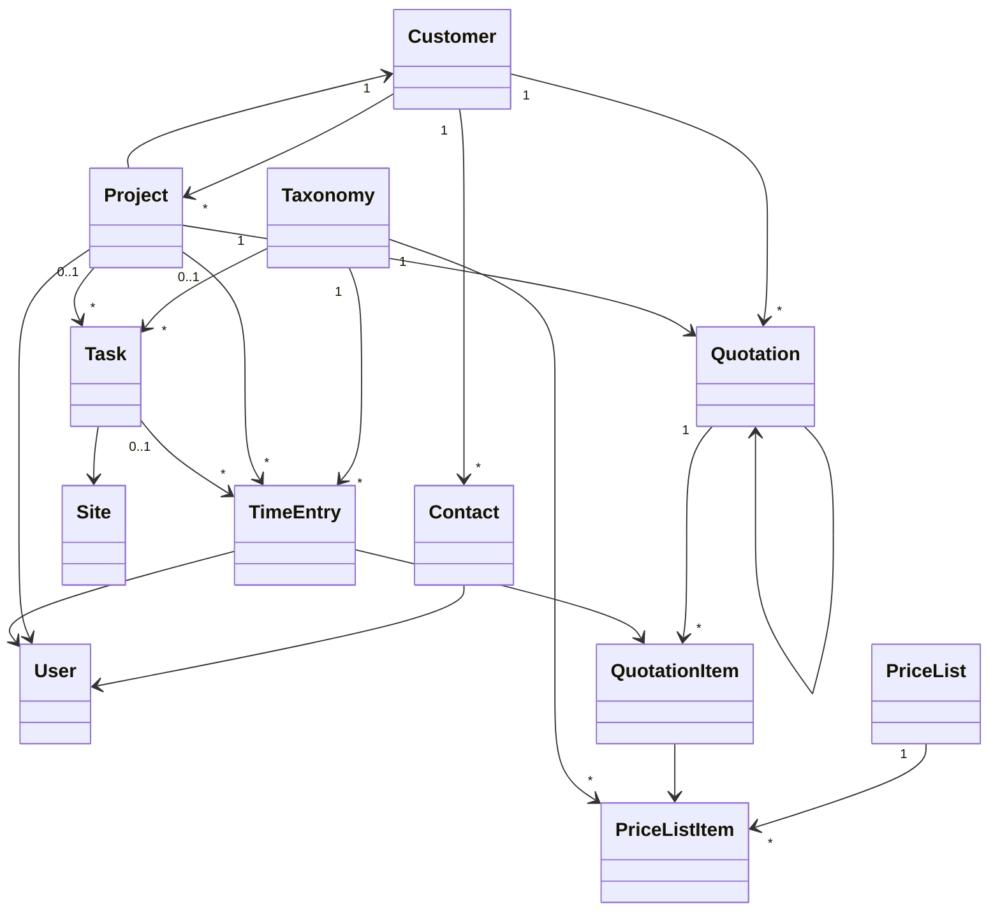
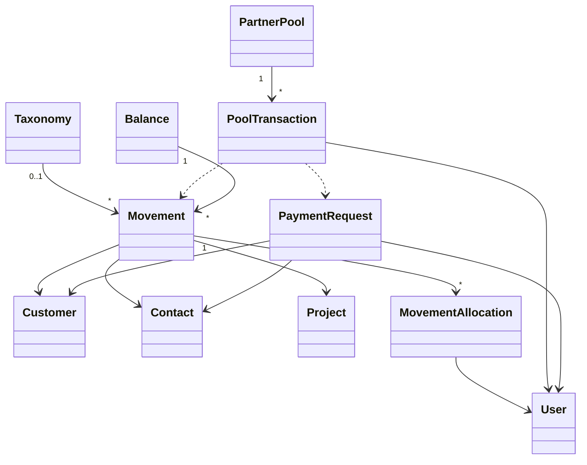
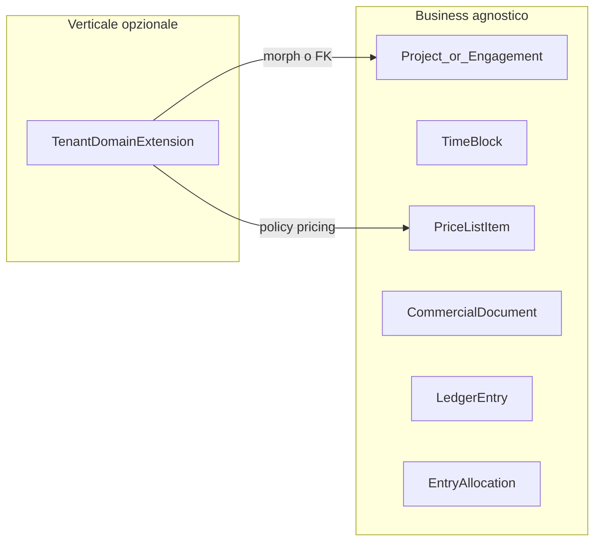

# Modulo Business in Laraplate (scaffolding gestionale agnostico)

## MVP v1 — perimetro **pre-contabilità** (primo utilizzabile)

Obiettivo: un **ciclo chiuso dati** commessa / commerciale / tempo **senza** cassa, movimenti IN-OUT, bilanci, settlement o pool soci. Allineato al todo **`mvp-precontabilita-v1`** nel frontmatter.

**Dentro al MVP**

- Anagrafica: `Customer`, `Contact` (M:N con `Customer` via **`contactables`**; niente `customer_id` su `contacts`), `Site` (già in `business-anagrafica-v1`).
- **Listino**: `price_lists` (include **`currency`** ISO 4217), `price_list_items` (**`taxonomy_id` obbl.**, `unit_price` **decimal 15,4** nella valuta del listino).
- **Preventivo**: `quotations` (**`customer_id` obbl.**, **`currency`**), righe in tabella **`quotations_items`** (+ `unit_price` 15,4 opz.), FK opz. verso listino.
- **Commessa**: `projects` con **`customer_id` obbl.** e `quotation_id` opz.; **nessun** `lead_user_id` (decisione prodotto).
- **Pianificazione**: `tasks` con **`taxonomy_id` obbl.** → `taxonomies` (niente tabella `activities` dedicata).
- **Consuntivo**: `time_entries` con `user_id`, **`started_at` / `ended_at`**, `taxonomy_id` obbl., FK opz. a `task`, `project`, `quotation_item`; più righe per utente (pause); sovrapposizione solo **validazione app**.
- **Dominio**: modelli su `Core\Overrides\Model`, `fillable`, `casts`, `$rules`, relazioni Eloquent; **migrate** su DB vuoto + **seed** minimo (albero attività Business).

**Fuori dal MVP v1** (contabilità / cassa / chiusure)

- `movements`, `movement_allocations`, `balances`, partner pool, settle-up, `PaymentRequest`, enum cassa a regime, ETL, magazzino.
- **Filament** modulo Business: resta **dopo** il dominio stabile (`business-filament-final`); per “utilizzabile” nel MVP si intende **backend verificabile** (test/artisan/tinker/API opzionale), non obbligatoriamente UI completa.

**Ordine di lavoro suggerito**

1. ~~`fix-task-activity-migrations`~~ (**completato** in repo).
2. ~~`business-models-rules-casts-relations`~~ (**completato**: `getRules()` MVP + `Movement` su Core stub).
3. `time-domain` (sovrapposizione applicativa `TimeEntry`; scope/query aggregati se servono).
4. Chiusura `mvp-precontabilita-v1` quando `time-domain` + seed dev + verifica migrate/test sono **completed**.

**Nota su struttura file migration**: raggruppare o separare file è una **scelta di manutenzione** (rollback, code review). Il vincolo duro resta solo l’**ordine delle dipendenze** tra file e `down()` speculari.

## Principi prodotto (Laraplate ≠ applicazione verticale)

- **Laraplate** è **piattaforma** per costruire applicazioni (gestionali, CMS, ecommerce, agenti, siti): moduli prefatti, estendibili, componibili. **Non** è un singolo prodotto verticale chiuso né un ERP monolitico tipo SAP.
- Il modulo **Business** deve restare **settore-neutro**: vocabolario da **economia / operatività / amministrazione leggera** comprensibile a **programmatori** che montano soluzioni per clienti diversi. Dove un nome è ambiguo (`Quote`, `Project`), il piano accetta **alias documentati** (config, interfaccia, o subclass) senza cambiare il cuore dati se non serve.
- **Obiettivo di profondità**: core **snello** + punti di estensione (`BillingStrategy`, provider pagamenti, policy lock) + verticali opzionali (professionisti, retail, …) **fuori** dal contratto minimo del modulo.
- **Regole di naming** (per commit e PR degli integratori):
  - evitare nomi o strutture giustificati solo con «così avevamo fatto in un progetto interno» senza valutazione di dominio generico;
  - preferire nomi che **descrivono il ruolo nel dominio generico** (`CommercialDocument` vs `Quote` se un giorno si generalizza; oggi `Quote` resta accettabile come «offerta numerata» in molti gestionali);
  - documentare in **README modulo** (quando si scrive) il **glossario** ufficiale e gli alias consigliati.

## Contesto verificato (repo Laraplate)

- **Modulo Business** (`[Modules/Business](file:///srv/http/laraplate/Modules/Business)`): migration per `price_lists`, `price_list_items`, `time_entries`, `tasks.taxonomy_id`, `quotations`/`quotations_items`, `projects`, pivot `contactables`; modelli MVP su `Core\\Overrides\\Model` incluso **`Movement`** (stub tabella). **`getRules()`** su Project, Task, TimeEntry, PriceList, PriceListItem, QuotationItem (+ anagrafica/preventivo già coperti). Restano seed dev tassonomie operativo, validazione sovrapposizione `TimeEntry`, test/`migrate` su DB pulito. Stub `movements`/`balances` fuori MVP pre-contabilità.

---

## Definizioni entità Business

Obiettivo: **stessa semantica** in piano, codice, API e UI. I nomi in **grassetto** sono i concetti; tra parentesi il nome attuale in repo se diverso dal piano storico.

### Convenzione naming documento vs codice

- Il modello e la tabella reali sono **`Quotation`** / **`quotations`**; le righe sono **`QuotationItem`** / **`quotation_items`** (stesso schema di naming di `PriceList` / `PriceListItem`). Il termine **Quote** resta solo sinonimo discorsivo di «offerta/preventivo» se serve in prosa, non come nome di tabella.

### Core / Cms (solo confine con Business)

| Entità | Ruolo | Confine |
|--------|--------|---------|
| **`Place`** | Luogo geografico neutro (indirizzo, coordinate opz.) | Business **non** duplica colonne indirizzo su `Site`: usa `place_id` → `places`. |
| **`Taxonomy`** (tabella `taxonomies`) | Albero configurabile (parent, traduzioni, preset dove previsto) | **Foglie e rami** = dati applicativi. **`Modules\Business\Casts\EntityType`** indica **quale albero** (es. attività lavorative vs etichette movimento cassa). **Non** enum per ogni tipo di lavoro del cliente. |
| **`Category` (Cms)** | Tassonomia contenuti CMS | Fuori dal perimetro Business salvo riuso concettuale del pattern. |

### Business — anagrafica e sedi

| Entità (modello) | Scopo | Non è | Relazioni note | Stato / gap |
|------------------|--------|-------|----------------|-------------|
| **`Customer`** | Soggetto commerciale **leggero** (anagrafica senza contabilità ufficiale): per **v1** **nessun dato fiscale/commerciale esteso** (niente P.IVA, fatturazione elettronica, registrazioni contabili nel perimetro del modulo). | Un `User` del sistema; non è automaticamente “contatto”. | `hasMany` Contact, Quotation, Project. | Tabella minimale (`name`, …); estensioni fiscali **posticipate**. |
| **`Contact`** | Persona / punto di contatto; legame a **uno o più** `Customer` tramite pivot **`contactables`** (stesso record contatto riusabile su più clienti). Può avere **`User`**. | Non è il “lead progetto” (non esiste più `lead_user_id` su `Project`). | `belongsToMany` Customer via `contactables`; opz. `belongsTo` User. | **Nessun** `customer_id` sulla tabella `contacts`. **Nessun contatto primario** in v1. |
| **`Site`** | Sede operativa **dell’organizzazione** che usa il gestionale (studio, cantiere, filiale), per calendario e contesto fisico. | Un indirizzo cliente (quello resta su Customer/Contact/Place lato anagrafica se serve). | `place_id` (da aggiungere); Task opz. `site_id`. | Migrare da colonne duplicate a `Place`. |

### Business — commessa e commerciale

| Entità | Scopo | Non è | Relazioni note | Stato / gap |
|--------|--------|-------|----------------|-------------|
| **`Project`** | **Contenitore di lavoro** verso un cliente: obiettivi, stato, collegamento opzionale a offerta accettata. Aggrega task, tempo, (dopo) movimenti. | Non è la singola “sessione” o la singola riga di listino. | `customer_id` **obbl.**, `quotation_id` opz.; **nessun** `lead_user_id`. | Migration `ProjectStatus`; lock preventivo / observer in backlog (`quote-revisions-core`). |
| **`Quotation`** | **Documento offerta** (header): cliente, stato, note, validità, **lineage/revisioni** quando implementato. | Non contiene il dettaglio economico senza righe; non è il consuntivo ore. | `belongsTo` Customer; `hasMany` `QuotationItem` (tabella `quotation_items`). | Estendere colonne revisione + `HasLocks` per bind progetto. |
| **`QuotationItem`** | **Riga offerta**: quantità, `billing_mode`, `unit_price` (15,4), opz. `price_list_item_id`. | Non è una timbratura. | FK a Quotation; opz. PriceListItem. | Tabella DB **`quotations_items`** (`QuotationItem::$table`). |
| **`PriceList`** | Contenitore listino con **`currency`** (ISO 4217); voci ereditano la valuta. | Non è il progetto né il preventivo. | `hasMany` PriceListItem. | Migration `price_lists` + `HasValidity`. |
| **`PriceListItem`** | Voce listino: **`taxonomy_id` obbl.**, `unit_price` 15,4, UOM opz. | Non enum applicativo chiuso nel modulo. | → `taxonomies` / `Activity`. | Migration `price_list_items`. |

### Business — pianificazione e tempo

| Entità | Scopo | Non è | Relazioni note | Stato / gap |
|--------|--------|-------|----------------|-------------|
| **`Task`** | **Impegno calendarizzato o backlog pianificato**. | **Non** sostituisce le ore consuntive. | `project_id` opz., `site_id` opz., **`taxonomy_id` obbl.** → `taxonomies`. | FK verso `taxonomies` (no tabella `activities`). |
| **`TimeEntry`** | **Lavoro effettivo** / sessione (pause = più righe stesso utente). | Non è movimento di cassa. | **`taxonomy_id` obbl.**; `user_id`; **`started_at` / `ended_at`**; `task_id` / `project_id` / `quotation_item_id` opz. | Tabella `time_entries`; sovrapposizione **solo app**. |

### Business — contabilità leggera (dopo organizzativo)

| Entità | Scopo | Non è | Nota |
|--------|--------|-------|------|
| **`Movement`** | Registrazione entrata/uscita **cassa** e metadati collegati a progetto/contatto dove serve. | Dettaglio IN/OUT e allocazioni: **da definire** dopo le entità organizzative. | Enum `MovementType` = solo direzione **income/expense**; granularità su **Taxonomy** + `EntityType::MOVEMENTS` se serve. **Oggi** (`movements` stub): **nessuna** FK a `Customer`/`Contact` in DB. **Target** (piano): FK **opzionali** `customer_id` e/o `contact_id` e/o `project_id` a seconda del caso (es. incasso collegato al cliente e al contatto che ha pagato; solo cliente; solo progetto) — cardinalità e vincoli da fissare con il dominio movimenti. |
| **`MovementAllocation`** (prevista) | Quota di riparto su socio / attore. | — | Posticipato con il modello movimenti. |
| **`Balance`** | Snapshot / congelamento periodo (es. anno). | — | Stub; regole lock da affinare con movimenti. |

### Regole trasversali (da rispettare in analisi)

1. **Tipo di attività lavorativa** = nodo **`Taxonomy`** (dati), discriminato da **`EntityType`** Business, **mai** enum chiuso nel modulo per le foglie cliente-specifiche.
2. **Pianificazione (`Task`) ≠ consuntivo (`TimeEntry`)**; il secondo può esistere senza il primo (sessione libera).
3. **Listino** è la **fonte** del tipo attività per righe che nascono da `PriceListItem`; **sessione** porta comunque **`taxonomy_id`** per report e casi senza preventivo/riga.
4. **`QuotationItem`** (via `quotation_item_id`) opzionale su **`TimeEntry`** per confronto commerciale, non per sostituire `taxonomy_id` sulle aggregazioni per tipo attività.
5. **`TimeEntry` ha esattamente un’activity (tassonomia)** — cardinalità **1:1** lato sessione verso il nodo scelto; niente tabella pivot tipo `categorizables` per questo legame.

---

## Glossario: mapping da gestionale Symfony legacy (solo per ETL / analisi)

| Classe / concetto nel gestionale sorgente | Ruolo nel gestionale sorgente | Mappa concettuale Laraplate (non normativa) |
| ----------------------------------------- | ----------------------------- | ------------------------------------------- |
| `Client`, `Contact`, `user_client`        | Anagrafica                    | Mappa concettuale → `Customer` / `Contact`  |
| `Work`                                    | Commessa                      | Mappa → `Project`                           |
| `Appointment` / `WorkSession`             | Pianificazione vs consuntivo  | Mappa → `Task` / `TimeEntry`                |
| `Quotation` (+ parent)                    | Offerta con revisioni         | Mappa → `Quotation` + duplica + lineage     |
| `PriceList`                               | Listino                       | Mappa → `PriceList` / `PriceListItem`       |
| `Movement` IN/OUT, `MovementUser`         | Entrate/uscite e riparti      | Mappa → `Movement`, `MovementAllocation`    |
| `Equipment`                               | Asset                         | **Non** nel core Business; verticali        |
| `Transfer`                                | Compensazioni tra soci        | Mappa → pool / settlements (piano Tricount) |

## Modello Business (requisiti) e glossario implementativo

| Concetto Business (generico)                                                               | Tabella / classe sorgente (solo ETL)                           | Note implementative                                                                                                                                                                                                                                                                                                                             |
| ------------------------------------------------------------------------------------------ | -------------------------------------------------------------- | ----------------------------------------------------------------------------------------------------------------------------------------------------------------------------------------------------------------------------------------------------------------------------------------------------------------------------------------------- |
| Customer + Contact                                                                         | `Client`, `Contact`                                            | Già in `[customers](file:///srv/http/laraplate/Modules/Business/database/migrations/2026_04_08_191717_create_customers_table.php)` / `[contacts](file:///srv/http/laraplate/Modules/Business/database/migrations/2026_04_08_191726_create_contacts_table.php)` + pivot **`contactables`**. **Nessun** `customer_id` su `contacts` (M:N); v1 senza dati fiscali estesi su `customers`; **nessun contatto primario**.                   |
| Project obbligatorio su Customer, opzionale su offerta, **owner interno** (`lead_user_id`) | `Work` + `client_id`, `quotation` opzionale                    | `lead_user_id` → `users` (Core). Distinto dal contatto principale cliente.                                                                                                                                                                                                                                                                      |
| Task = todo/appuntamento pianificato                                                       | `Appointment` (calendario) + meta su `Work`                    | Non fondere todo e sessione sulla stessa riga: la **pianificazione** (stime, calendario) e l’**effettivo** (ore lavorate) hanno cicli di vita diversi.                                                                                                                                                                                          |
| Sessione / lavoro effettivo                                                                | `WorkSession` (con `event_start`/`event_end` + utenti)         | La “pivot utente–todo” **sola** non basta per parallelismo o fasce orarie: serve una entità **TimeEntry** (o `work_sessions`) con `user_id`, `actual_start`, `actual_end`, **`taxonomy_id`** (catalogo attività), `quotation_item_id` **opzionale**, `task_id` **nullable**, `project_id` **nullable** (denormalizzato da task o libero per lavoro non pianificato). Più righe = più persone o turni. |
| Attività non pianificate                                                                   | Sessioni senza appuntamento collegato                          | `task_id` null + `project_id` opzionale (progetto) o null (solo attività interna organizzazione).                                                                                                                                                                                                                                               |
| Tipologia attività (calendario vs consuntivo)                                              | (nel sorgente: accoppiamento listino / sessione)               | **Nessun enum “ActivityType” nel Business** (troppo dipendente dalla verticale). **Catalogo = nodi `taxonomies`** con discriminante `Modules\Business\Casts\EntityType::ACTIVITIES` (e modelli concreti che estendono `Taxonomy`). Sul **Task**: `taxonomy_id` indicativo. Sul **TimeEntry**: `taxonomy_id` consuntivo per aggregati; `quotation_item_id` opzionale per allineamento commerciale. Opzionale: snapshot tipo su `quotation_item` se il listino cambia dopo l’offerta. |
| Movimenti IN/OUT, categorie, riparti                                                       | `Movement`, `MovementType`/`Category`, `MovementUser`          | **Posticipato** dopo il livello organizzativo (progetti, tempo, listino, preventivo). Classificazione cassa: enum `MovementType` (income/expense) + alberi `taxonomies` con `EntityType::MOVEMENTS` dove serve granularità. Dettaglio riparti/IN-OUT da affrontare in conversazione dedicata.                                                                                                                    |
| Versamenti soci per quadrare spese                                                         | `Transfer` + (idea) `Payment`                                  | Modellare come movimenti di **rettifica** o tabella `partner_settlements` che referenzia movimento spesa + movimento versamento, per evitare doppi conteggi nel bilancio.                                                                                                                                                                       |
| Congelamento anno + totali                                                                 | (nel sorgente: report mensili aggregati; lock globale assente) | Tabella `balances` (snapshot: anno, total_in, total_out, crediti/debiti clienti, debiti/crediti soci, `frozen_at`). Flag `movements.locked_by_balance_id` o `locked_at` + anno competenza. Runtime: somma solo righe non lockate + somma snapshot anni chiusi.                                                                                  |

### Luoghi: `Place` (Core) — `Location` (Cms) — `Site` (Business)

- **P0 — Place + Location** (Core + Cms): **completato**; consolidare Business su `sites.place_id` / ICS quando si tocca il modulo Business. Riferimento todo: `p0-core-place-location-refactor`.
- **Non** spostare in Core il modello Cms `**Location`** così com’è: è accoppiato a slug, tag, Typesense, spatial avanzato, pivot con **Content**, Filament.
- **Sì** a `**Place`** in **Core**: identità geografica neutra — etichetta, righe indirizzo testuale, opz. coordinate (decimali o spatial **solo** se accettabile in Core senza dipendenze Cms).
- `**GeoPoint`** separato: **solo** se serve riuso forte dello stesso punto; altrimenti coordinate su `Place`. Composizione **1:1** preferibile a ereditarietà SQL.
- **Cms `Location`**: colonna `**place_id**` (FK Core); slug, search, tag, **Content** restano in Cms.
- **Trait trasparente (stesso spirito di `HasTranslations` / `HasDynamicContents`)**: un trait (nome da scegliere, es. `HasBridgedPlace` o `DefersGeographyToPlace`) su `**Location`** che intercetta **getter/setter** (o `getAttribute` / `setAttribute` con le stesse priorità del pattern esistente) così che i campi “geografici” usati oggi in app (`address`, `city`, `province`, `country`, `postcode`, coordinate…) **leggano e scrivano** sul `**Place`** collegato, creando/aggiornando `Place` al bisogno. Obiettivo: **non rompere** Filament, API e codice che già fa `$location->city = …` / `$location->address`.
- **Rotte e servizi**: spostare in **Core** ciò che è **generico** (interfacce geocoding, HTTP client verso provider, eventuale controller/route registrata dal Core o route Cms che delega a servizio Core) — stesso approccio “logica condivisa in Core, wiring UI in Cms”. Oggi es. rotta Cms `[web.php](file:///srv/http/laraplate/Modules/Cms/routes/web.php)` `locations.geocode` e servizi tipo `AbstractGeocodingService` / `NominatimService` / `GoogleMapsService` vanno **ripacchettizzati** (contratti + implementazioni Core dove non servono dipendenze Cms).
- **Business `Site`**: evolvere con `**sites.place_id**` e deprecazione colonne duplicate (P0 disponibile).
- **ICS / calendario**: dopo `Place` stabile; vedi `calendar-ics-export`.

### Tassonomie: `Taxonomy` astratta (Core), tabella `taxonomies`

- **P1 — Taxonomy + Category** (Core + Cms): **completato**. Todo: `p1-core-taxonomy-category-refactor`.
- **Regola architetturale Laraplate**: tutto dipende da **Core**; **Core non referenzia** altri moduli. I moduli (Cms, Business, …) **estendono** classi Core.
- `**Entity` + `Preset`** restano il precedente di astrazione Core / concretezza nei moduli.
- **Naming**: in Core la base non si chiama `Category` (nome troppo legato al CMS); si introduce `**Taxonomy`** come `**abstract class`** (o equivalente idiom Laravel) con **tabella unica** `**taxonomies`** (plurale coerente con il resto del framework).
- `**protected $table = 'taxonomies';`** va dichiarato **sul modello base** `Taxonomy` così **tutte le sottoclassi** ereditano lo stesso nome tabella e Laravel **non** inferisce nomi diversi dal nome corto della classe (`categories`, `activity_types`, …). Le sottoclassi (`Modules\Cms\Models\Category`, eventuali `BusinessActivityTaxonomy`, …) aggiungono solo **scope globali**, **cast**, **relazioni** e trait Cms-specifici dove serve; oppure restano classi “vuote” che servono solo da **type hint** / query builder dedicato.
- **Schema tabella** (indicativo): `parent_id`, `scope` o `domain` (stringa enum applicativa: es. `cms.content`, `business.activity`, `business.movement`), ordinamento, `meta` JSON opzionale, soft delete coerente Core; eventuale colonna **STI** `type` se un giorno servono sotto-modelli con cast diversi sulla stessa tabella (valutare vs solo `scope`).
- `**Category` Cms** oggi è ricca (media, traduzioni, approvals, pivot Content, …): **refactor** verso `**Category extends Taxonomy`** (stessa tabella `taxonomies` + scope Cms), mantenendo i trait Cms sulla sottoclasse; **migrazione dati** da `categories` → `taxonomies` dove si unifica lo storage.
- **Business**: `taxonomy_id` → `taxonomies` per attività su Task/TimeEntry e (in seguito) per etichette movimento cassa; **enum `Modules\Business\Casts\EntityType`** (`MOVEMENTS`, `ACTIVITIES`, …) indica **quale albero / entità dinamica** (stesso ruolo concettuale di `Modules\Cms\Casts\EntityType` per Cms), non le singole foglie del catalogo.
- **Effetto**: alberi multipli riusabili (attività lavorative, etichette movimento, …) con vincoli per contesto lato app (es. “solo foglie su TimeEntry”). **Non** si introduce `MovementCategory` come tabella separata: la gerarchia è nei nodi tassonomia per lo scope scelto.

### Task vs sessione: significato e flusso UI (calendario + timbrature)

- `**Task`** resta il nome preferito: non equivale a “solo appuntamento fisico”. È una **unità di lavoro calendarizzata** — stesso concetto per (a) slot in studio con cliente, (b) lavoro remoto in finestra oraria, (c) **backlog da chiudere** per un programmatore (“implementare funzione X” con `planned_start`/`planned_end` o scadenza). Il canale (on-site / remote / async) si modella con **tassonomia** e/o **campo leggero** (`fulfillment_mode`, enum) senza rinominare l’entità in `Appointment` (troppo legato al fisico nel linguaggio naturale).
- `**TimeEntry`** = **sessione di lavoro reale** (timbratura inizio/fine, più righe per pause o segmenti): **N sessioni** possono riferire lo **stesso** `Task`; **più utenti** = più `TimeEntry` (stesso `task_id`, `user_id` diversi). Pause: o più righe consecutive o tipo segmento “pause” — da definire in implementazione.
- **Senza Task pianificato**: `TimeEntry` con `task_id` null, `**project_id`** + tassonomia attività scelti da elenco commesse aperte.
- **Sessioni interne** (utilizzo struttura, corrente, riparti): `TimeEntry` con `**project_id` null**, tassonomia attività **interna** (scope dedicato), così si misura **chi** ha occupato lo spazio e **quanto**, senza commessa cliente.
- **Gantt / pianificazione teorica** (milestone, dipendenze, barre lunghe): **entità separata**, **posticipata** (todo `gantt-planning-entity`); non blocca MVP calendario + timbrature.
- **Non** mettere solo `session_start`/`session_end` sul Task: mescola pianificazione e consuntivo.
- **Sì**: Task con `planned_start` / `planned_end` (o equivalente), FK tassonomia attività, `project_id` dove il lavoro è di commessa (cliente noto); `**site_id`** opzionale (sede fisica prescelta per lo slot, allineabile in seguito a `**Place`** Core); eccezioni per slot puramente organizzativi se si modellano come Task senza `project_id` o solo via TimeEntry — da fissare in prodotto. **TimeEntry** con intervallo reale, `user_id`, FK opzionale a `task_id`, `project_id` opzionale, tassonomia consuntiva (può coincidere con quella pianificata o divergere con regole di validazione).

### Cosa rischi di dimenticare (checklist)

- **Righe offerta** (`quotation_items`): senza righe strutturate non confronti ore consuntive vs stime per tipo/riga.
- **Listino** (`price_list_items`): utile quando molte offerte riusano le stesse voci tariffarie versionate nel tempo.
- **Allegati** su movimenti (pattern generico tipo `Attachment` / media Core).
- **Periodo competenza** uscite (`period_from`/`period_to`) per spese pluriennali o rate in bilancio.
- **Valuta, IVA, arrotondamenti** (evitare `float` in contabilità).
- **Stati Task** (todo / in corso / fatto / annullato) e regole transizione.
- **Sovrapposizioni** TimeEntry stesso utente (validazione).
- **Permessi** su congelamento anno e chi può sbloccare (se mai).
- **Audit** su lock e modifiche post-facto.
- **Asset / inventario** (es. attrezzature): fuori dal core Business; verticali o modulo dedicato.

Concetto trasversale utile: **audit** trail sulle entità commerciali — in Laraplate allineare a convenzioni Core (`HasVersions`, blameable, soft delete) già usate nei moduli.

---

## Modello dati Laraplate (tabelle / entità target)

Riferimento unico per **nome concettuale** → **tabella** prevista nel modulo Business (salvo `users` in Core). Colonna «Stato» rispetto al repo `[Modules/Business](file:///srv/http/laraplate/Modules/Business)`.

| Entità (concettuale)       | Tabella (prevista)     | Ruolo sintetico                                                                                                                           | Stato repo                                 |
| -------------------------- | ---------------------- | ----------------------------------------------------------------------------------------------------------------------------------------- | ------------------------------------------ |
| Customer                   | `customers`            | Anagrafica cliente                                                                                                                        | Presente                                   |
| Contact                    | `contacts`             | Contatti; `user_id` opz.; legame clienti via **`contactables`** (M:N)                                                                      | Migration + modello                        |
| Taxonomy (abstract)        | `taxonomies`           | Core: albero gerarchico generico; `**abstract class Taxonomy`** con `**$table = 'taxonomies'`**; sottoclassi senza inferenza nome tabella | **P1 completato** (Core+Cms)               |
| Place                      | `places`               | Luogo geografico neutro (Core): indirizzo + opz. coordinate; condiviso da Cms/Business                                                    | **P0 completato** (Core+Cms)               |
| Site                       | `sites`                | Sede operativa; `place_id` → `places`                                                                                                     | Presente                                   |
| Quotation                  | `quotations`           | Preventivo; `customer_id`+`currency` obbl.; lock colonne (HasLocks); lineage in backlog                                                   | Migration + modello                        |
| QuotationItem             | `quotations_items`     | Voci preventivo (`billing_mode`, `unit_price` 15,4, FK `price_list_item_id` opz.)                                                          | Migration + modello                        |
| PriceList                  | `price_lists`          | Listino + **`currency`** + validità (`HasValidity`)                                                                                      | Migration + modello                        |
| PriceListItem              | `price_list_items`     | Voce: **`taxonomy_id` obbl.**, `unit_price` 15,4, UOM opz.                                                                                 | Migration + modello                        |
| Project                    | `projects`             | Commessa: `customer_id` obbl., `quotation_id` opt.; **nessun** `lead_user_id`                                                               | Migration + modello                        |
| Activity / movement labels | `taxonomies`           | Stesso albero Core (`taxonomy_id` su Task/TimeEntry; movements dopo); discriminante `EntityType` Business + scope app; **no** tabella `activity_types` obbligatoria nel core modulo | P1 fatto (infra); FK Business da aggiungere con evoluzione schema |
| Task                       | `tasks`                | **Lavoro calendarizzato**; opz. `**site_id`** per sede; non Gantt teorico                                                                 | Presente (FK da correggere vs tassonomia)  |
| TimeEntry                  | `time_entries`         | Sessione lavoro reale per `user_id`; **`taxonomy_id`** = un solo nodo attività (no pivot); `quotation_item_id` opz. se legame a voce preventivo | Da creare                                  |
| Movement labels (gerarchia)| `taxonomies`           | Macro/tipi cassa come **nodi** sotto `EntityType::MOVEMENTS` (nessuna `movement_categories` dedicata)                                      | Dopo strato organizzativo                  |
| MovementType (enum cassa)| (enum / colonne)       | Solo **direzione contabile** `income` / `expense` in `Modules\Business\Casts\MovementType` — **non** il catalogo foglie                    | Presente (enum); uso pieno posticipato   |
| Movement                   | `movements`            | Movimento IN/OUT; lock su bilancio                                                                                                        | Stub                                       |
| MovementAllocation         | `movement_allocations` | Quota su socio (OUT) o meta riparto IN                                                                                                    | Da creare                                  |
| PartnerPool                | `partner_pools`        | Cassa soci (v1: tipicamente una riga per org)                                                                                             | Da creare                                  |
| PoolTransaction            | `pool_transactions`    | Versamento / prelievo cassa ↔ socio                                                                                                       | Da creare                                  |
| Balance                    | `balances`             | Congelamento anno fiscale + snapshot                                                                                                      | Stub                                       |
| PaymentRequest             | `payment_requests`     | Richiesta incasso verso cliente/contact o saldo verso socio; stub provider                                                                | Da creare                                  |
| User                       | `users`                | Socio, lead progetto, allocazioni                                                                                                         | **Core** (solo FK)                         |

---

## Diagrammi UML (Mermaid `classDiagram`)

**Nota**: la classe `User` modella la tabella `**users`** del modulo Core; tutte le FK verso utenti restano in Business. `**Taxonomy`** è il modello astratto Core sulla tabella `**taxonomies`** (con `$table` esplicito sul base); nel diagramma è mostrato come tipo di dominio per le FK attività e listino. **`Modules\Business\Casts\EntityType`** (e/o scope su query) distingue **quale albero** si sta usando (attività vs movimenti cassa, ecc.).

### Dominio anagrafica — preventivo — progetto — tempo

**Nota anagrafica**: `Contact` e `Customer` sono in relazione **M:N** tramite pivot **`contactables`** (nessun `customer_id` su `contacts`).

### Dominio movimenti — cassa soci — bilancio — richieste pagamento

**Nota (2026-04)**: diagramma semplificato rispetto al piano originale — **niente** `MovementCategory` / tabella `movement_types` per la gerarchia: classificazione **su `Taxonomy`** dove serve il dettaglio; direzione cassa minima con enum `MovementType`. **Regole IN/OUT, allocazioni e UX** restano da definire **dopo** il perimetro organizzativo.

---

## Principio di design: core agnostico + verticali

Il modulo **Business** espone linguaggio di dominio **riusabile** (commessa, pianificazione, consuntivo, documento commerciale, listino, movimenti, riparti, pool liquidità). I **verticali di settore** restano in **moduli o package** che *usano* Business, non nel vocabolario minimo delle migration core:

- **Estensione** via moduli Laraplate, oppure
- **Riferimenti polimorfici** / metadata dove serve agganciare entità esterne senza accoppiare il core a un CRM specifico.

---

## Cosa tenere (idee/strutture) e come generalizzarle

### 1. Contenitore di lavoro (`Work` → **Project**)

- **Tenere**: stato attivo, descrizione, aggregazione tempo e incassi; **offerta** (`quotation_id`) opzionale (pattern comune: commessa con o senza preventivo accettato).
- **Nel tuo Business**: `customer_id` **obbligatorio**, `quotation_id` **nullable**, `lead_user_id` **obbligatorio** → utente/socio responsabile interno. **`Contact`**: `customer_id` **sempre obbligatorio** (nessun contatto orfano). **Contatto primario**: non previsto in v1. **Fornitore / `Party`**: interessante ma **posticipato** (tocca dominio movimenti, non ancora definito).
- **Comportamento**: `isPaid()` / saldo progetto = **servizio dominio** sulle righe movimento IN collegate a `project_id` / `contact_id`, più eventuale confronto con totale `quotations` + `quotation_items`.

### 2. Eventi temporali (`AbstractEvent` → **TimeBlock** unificato o due tipi)

- **Tenere**: `start`, `end`, `day` (denormalizzazione per report), partecipanti many-to-many, descrizione, indici anno/mese (reporting).
- **Generalizzare**: pianificazione vs consuntivo possono essere `kind` enum (`planned`, `actual`) su un’unica tabella o due tabelle; il legame opzionale tra impegno calendario e consuntivo resta una **relazione esplicita**, non ereditarietà tipo ORM legacy.
- **Policy di valorizzazione**: importi / overflow rispetto a offerta e listino → interfaccia `**BillingStrategyInterface`** nel modulo o in estensione; implementazione default generica + implementazioni verticali opzionali (non nel contratto minimo del core).

### 3. Documento commerciale e righe (**`Quotation`** + `quotation_items`)

- **Tenere**: intestazione (date, scadenza, sconto, descrizione), righe con quantità/opzioni e regole economiche per voce.
- **Revisioni (decisione confermata)**: **non** merge ad albero tipo legacy (`EXTEND`/`OVERWRITE` su entità collegate). Flusso: **duplica** documento offerta → nuovo record con **lineage** e **numero revisione** persistito (§ «Duplica + lineage»).
- **Legame al progetto**: `projects.quotation_id` opzionale (allineare naming al repo). **Immutabilità**: alla creazione progetto con preventivo, il **`Quotation`** (e le sue `quotation_items`) viene **bloccato** — vedi § 3quater (non serve tabella pivot progetto–righe solo per congelare: il lock è la fonte di verità). Consuntivo vs offerta: `**time_entries.quotation_item_id`** opzionale + aggregati per **`taxonomy_id` sulla sessione**; con legame preventivo, controlli commerciali anche sulla riga.

### 3bis. Progetto, preventivo e attività (requisito operativo)

- Il **progetto** ha **attività** (Task / TimeEntry): possono **non** rispecchiare il preventivo, essere **di più**, o il preventivo può **decadere** (nuovi accordi): modello da PMI, non da procedure rigide.
- **Con `quotation_id` sul progetto**: le voci restano su `quotation_items` del `Quotation` scelto; il **lock** impedisce retroattività indesiderata senza duplicare righe sul progetto.
- **Senza preventivo**: nessun lock; confronti solo a livello tipo attività / totali progetto.

**Requisito righe offerta**: ogni `quotation_item` definisce **tipo di prezzo** (fisso, a ore, overflow incluso, consuntivo, …).

### 3ter. Duplica + lineage su `quotations` (alternativa al merge ad albero)

Campi previsti sulla tabella **`quotations`** (nomi colonna possono restare suffisso `quote` per compatibilità legacy oppure rinominarsi in `root_quotation_id` / `previous_quotation_id` in una migration dedicata):

| Campo               | Obbligo                                   | Note                                                                                                                                                                                  |
| ------------------- | ----------------------------------------- | ------------------------------------------------------------------------------------------------------------------------------------------------------------------------------------- |
| `root_quote_id`     | FK, primo della catena                    | Stabile per intestazioni e listing «tutte le revisioni di X». Sull’**originale**: `null` oppure **self** (`id`) dopo insert — una sola convenzione in app.                            |
| `previous_quote_id` | nullable                                  | Da **quale** preventivo è stata creata questa revisione (duplica). **Null** sull’originale.                                                                                           |
| `revision_number`   | int, persistito, readonly in UI post-save | Default **1** sull’originale; su duplica: `max(revision_number ove root_quote_id = stesso root) + 1` in **transazione** (preferito al solo `COUNT` per soft delete / buchi / branch). |
| `revision_scope`    | enum                                      | Es. `amendment` (aggiunta / revisione incrementale) vs `full_replacement` (nuova offerta che sostituisce la precedente a fini commerciali), senza motore di merge automatico.         |

- **UX**: azione «Nuova revisione» = duplica righe + header, precompila lineage, consente edit prima del salvataggio.
- `**HasVersions`** (Core): opzionale su `Quotation` / `QuotationItem` per **audit** sullo stesso record revisione, **ortogonale** al lineage sopra.

### 3quater. Lock preventivo alla creazione progetto (decisione confermata)

Quando un `**Project`** viene creato (o al primo salvataggio coerente) **con `quotation_id` valorizzato**, il **`Quotation`** collegato **non è più modificabile** — **né intestazione né righe** (`quotation_items`).

- **Trait `[HasLocks](file:///srv/http/laraplate/Modules/Core/app/Locking/Traits/HasLocks.php)`** su `Quotation` (colonne `locked_at` / `locked_user_id` da config `[Locked](file:///srv/http/laraplate/Modules/Core/app/Locking/Locked.php)`, lock effettivo = `locked_at` non null). Stesso trait **su `QuotationItem`** *oppure* divieto di update solo in applicazione se `$quotation->isLocked()` — da scegliere; con trait sulle righe il comportamento è simmetrico e visibile in UI.
- **Orchestrazione applicativa**: `**ProjectObserver`** (o evento `created` / `saved` con guardia) che, in transazione, chiama `$quotation->lock($user)` quando `quotation_id` passa da null a valorizzato o alla creazione con preventivo già presente. Evitare doppi lock; gestire fallimento rollback progetto se il lock fallisce.
- **Trigger DB** (preferenza dichiarata per alcune operazioni): ad esempio `BEFORE UPDATE` / `BEFORE DELETE` su `quotations` e `quotation_items` che impediscono mutazioni se il preventivo padre ha `locked_at` NOT NULL (su `quotation_items` join a `quotations.id = quotation_items.quotation_id`). Copre accessi raw, script, regressioni Eloquent. Coordinare messaggi errore SQL con UX.
- **Sblocco**: valutare `config('core.locking.can_be_unlocked')` / classi ammesse in `[Locked::classesThatCanBeUnlocked](file:///srv/http/laraplate/Modules/Core/app/Locking/Locked.php)` — per offerte vincolate al progetto spesso **nessuno** o solo ruolo amministrativo eccezionale.

**Nota**: non è prevista una **tabella pivot** dedicata tra progetto e righe preventivo: sostituita da **lock** sul `Quotation` + `quotation_item_id` opzionale su time entry / task dove serve il legame per voce.

### 4. Catalogo prezzi (`PriceList` + `**PriceListItem`**)

- **Modello**: contenitore `**price_lists`** (validità opzionale sul listino) + righe `**price_list_items`** (servizio offerto, prezzo per unità, UOM, validità per voce se serve); **`price_list_items.taxonomy_id`** (o equivalente) = **riferimento catalogo** condiviso con task/sessioni per “che tipo di lavoro è questa voce”. `quotation_item` deriva il tipo dalla voce listino; **snapshot opzionale** sulla riga preventivo se serve immutabilità dopo revisioni listino. Pivot tipo `catalog` / `catalog_service` solo se servono **più cataloghi** con stesso servizio a prezzi diversi (fase successiva).
- **UOM**: tabella o enum con conversione opzionale; regole tipo «8 h = 1 giorno» come dato/config, non hardcoded.

### 5. Movimenti finanziari (`Movement` → **LedgerEntry**)

- **Tenere**: direzione (entrata/uscita), importo totale, data di competenza, tipo classificatorio, allegato, **periodo** per uscite rateizzate/amortizzate (`period_from` / `period_to`), riparto tra attori (`MovementUser` → **EntryAllocation** con `user_id` o morph `participant`).
- **Generalizzare**: niente STI su tabella unica obbligatoria: in Laravel puoi usare **una tabella** + `direction` enum, oppure tabelle separate `inbound_entries` / `outbound_entries` se vuoi vincoli diversi; l’importante è un **unico servizio di registrazione** che valida tipo vs direzione (come `setType` in `MovementIN`/`OUT`).
- `**MovementCalculation`**: resta enum/config su come allocare importo tra partecipanti (equal/presence) — utile e generico.
- **N non nel core Business**: `MovementOUT` → `Equipment` resta **estensione** (tabella `business_assets` nel verticale o `ledger_entry_id` su equipment).

### 6. Reportistica (viste `month_expenses`, `month_total`)

- **Tenere**: l’**idea** (aggregazioni per mese/categoria/durata), non SQL hardcoded su uno schema legacy fisso.
- **In Laraplate**: query builder / materialized reporting table / job notturno; in alternativa viste DB **nel modulo** con prefisso tabelle Business, generate da migration.

### 7. `Transfer` e `Payment` (riferimento legacy)

- `**Transfer`**: concetto di **giroconto interno** tra allocazioni — utile se in futuro gestisci split revenue; nel core Business può essere `internal_transfer` tra due `EntryAllocation` collegate allo stesso o diverso `LedgerEntry`, oppure lasciato al verticale finché non serve.
- `**Payment`**: in schema DB esiste tabella `payment`; nel codice entity gran parte è commentata — in Business agnostico conviene `**LedgerEntry` di tipo "payment"** o tabella `payments` legata 1–1 a una riga di entrata, senza accoppiamento stretto a `MovementUser` finché non chiarisci il modello contabile.

---

## Cosa non mettere nel core Business (o solo come plugin)

- **Equipment** e tassonomia type/category hardware.
- **Client** come entità nominata: sostituisci con **Party** generico o integrazione esterna.
- **Logica overflow ore vs righe offerta** nelle implementazioni legacy (mantieni come `**BillingStrategy`** configurabile).
- **Viste SQL** hardcoded su un solo schema database legacy.

---

## Struttura modulo `Modules/Business` (stato + prossimi file)

- Migration principali: `create_customers_table`, `create_contacts_table`, `create_contactables_table`, `create_price_lists_table`, `create_price_list_items_table`, `create_quotations_table`, `create_quotation_items_table` (`quotations_items`), `create_projects_table`, `create_sites_table`, `create_tasks_table`, `create_time_entries_table`, stub `movements` / `balances`.
- Ordine consigliato **post-MVP**: movimenti / allocazioni / bilanci; Filament (`business-filament-final`).
- `app/Contracts`: `BillingStrategyInterface` per ore vs preventivo; `BalanceCalculatorInterface` per snapshot + runtime.
- **Test**: somme allocazioni, congelamento; se presente ETL legacy, campioni di parità su totali noti (evitare bug tipo closure che non muta accumulatori).
- **Filament**: **non** come primo deliverable del modulo Business; vedi **§ Fase finale — Filament** (ultimo passo).

---

## Piano di lavoro per fasi (dettaglio operativo)

### Fase P0 — `Place` + refactor `Location` (Core + Cms) **[completata]**

- Migration Core `places` + modello `Place` (fillable, cast coordinate se presenti).
- Migration Cms `locations.place_id` + backfill da colonne esistenti → `Place`, poi (fase successiva) rendere colonne geografiche su `locations` **virtuali** via trait o rimuoverle quando il trait copre tutto e i test passano.
- Trait **trasparente** su `Location` (vedi sezione Luoghi): allineamento a pattern `**HasTranslations`** / `**HasDynamicContents`** in `[HasTranslations.php](file:///srv/http/laraplate/Modules/Core/app/Helpers/HasTranslations.php)` e `[HasDynamicContents.php](file:///srv/http/laraplate/Modules/Core/app/Helpers/HasDynamicContents.php)` (priorità lettura: attributi nativi → relazione `place` → parent).
- Spostare / duplicare con deprecazione: **servizi geocoding** e **rotte** usate dall’app in **Core**; Cms mantiene resource Filament e relazioni Content ma chiama Core.
- Test regressione: geocode, salvataggio Location da Filament, Content ↔ locations, search index se ancora basato su attributi “flat” (aggiornare mapping se i campi diventano delegati).

### Fase P1 — `Taxonomy` + refactor `Category` (Core + Cms) **[completata]**

- Migration Core `taxonomies` + `**abstract class Taxonomy`** con `**protected $table = 'taxonomies';`**.
- Refactor `**Category extends Taxonomy`**: scope `cms.content` (o equivalente), trait Cms esistenti sulla sottoclasse; migrazione `categories` → `taxonomies` se si unifica lo storage; aggiornare pivot **Content**, Filament, search Typesense, regole validazione.
- Predisporre scope `**business.activity`** / `**business.movement`** per FK successive da Business (`taxonomy_id` su Task, TimeEntry, movements).
- Test regressione: CRUD Category, contenuti categorizzati, query gerarchiche.

### Fase 0 — Confini dati

- Schema `projects`: **nessun** `lead_user_id` (decisione 2026). Contatti: **`contactables`** (M:N); niente `customer_id` su `contacts`. **`HasValidity`**: su **`PriceList`** (come da migration); altre entità con validità dove già presente in schema.

### Fase 1 — Riparazione schema attuale

- **Completato in repo**: `tasks.taxonomy_id` → `taxonomies`; `time_entries`; listino; vincoli preventivo/progetto; pivot contatti.

### Fase 2 — Projects + quotation items

- Popolare `projects` (customer, quote nullable, lead, descrizione, flags).
- `quotations`: **duplica + lineage**; trait `**HasLocks`** + colonne lock Core; `ProjectObserver` (o equivalente) che esegue `**lock()`** sul `Quotation` quando il progetto viene creato/aggiornato con `quotation_id`; **migration trigger** opzionali su `quotations` / `quotation_items` per enforcement DB.
- `quotation_items` + `**price_lists` / `price_list_items`**; campi **modalità economica per voce**; FK opzionale `price_list_item_id` su `quotation_items`.
- `time_entries`: `quotation_item_id` opzionale (legame consuntivo → voce); niente `project_quotation_items` nel perimetro minimo.

### Fase 3 — Tempo: Task + TimeEntry

- Task pianificati; TimeEntry consuntive con utenti multipli e casi senza task.

### Fase 4 — Movements + allocazioni + settlements

- Tipi/categorie movimento; IN verso contact/project; OUT con allocazioni user; movimenti rettifica soci.

### Fase 5 — Balances (snapshot + lock)

- Record `balances` per anno chiuso; `movements.locked_by_balance_id` (o equivalente); servizio che calcola totali runtime + snapshot.

### Fase 6 — ETL opzionale (es. database legacy)

- Mapping (solo se si importa da DB legacy): entità calendario → `Task` / `TimeEntry`; sessioni lavoro → `TimeEntry`; documenti offerta → `Quotation` / `quotation_items`; movimenti e riparti → `Movement` / `MovementAllocation`; compensazioni interne → pool / settlements (secondo schema sorgente).

### Fase finale — Filament (modulo Business)

- **Regola di delivery**: tutto il **back-office Filament** del modulo `Modules/Business` (Resources, Pages, relation managers, policy UI) è l’**ultimo passo** del modulo: si affronta **dopo** migrazioni, modelli allineati a `Modules\Core\Overrides\Model`, validazioni, e i flussi di dominio principali (anagrafica, progetti, preventivi, tempo, movimenti/bilanci dove previsti).
- **Motivo**: evitare risorse UI che inseguono schema instabile; Filament resta consumatore del dominio, non driver del modello dati.
- **API / mobile**: da pianificare in parallelo o subito dopo Filament, a seconda del primo consumatore reale (vedi todo `business-filament-final`).

---

## Analisi critica: siamo «al buono» con il piano?

**Sì, con riserva consapevole**: il perimetro (clienti/contatti, commessa con owner, **lock offerta** al bind, pianificazione + consuntivo, movimenti + riparti, cassa tipo Tricount, bilanci, pagamenti esterni) è **coerente** come **scaffolding** gestionale agnostico. Le **riserve** sono backlog (complessità, UX split, allineamento Core), non dipendenza da un vertical specifico:

1. **Complessità implementativa**: molte entità interconnesse; conviene delivery incrementale (MVP movimenti + progetti, poi time entry, poi pool Tricount, poi payment provider).
2. **Regola «chi partecipa allo split» per spesa**: richiede UX chiara (Tricount-style) e validazione somme.
3. **Coerenza `revision_number`**: calcolo in transazione alla creazione revisione; vincoli DB/app su `root_quote_id` + `previous_quote_id` per evitare cicli.
4. **Allineamento moduli**: `Quotation` oggi estende `Model` base; per `HasVersions` e soft delete Core allineare a `[Modules\Core\Overrides\Model](file:///srv/http/laraplate/Modules/Core/app/Overrides/Model.php)` ove previsto.

---

## Rischi e decisioni da prendere prima di codificare

- **Moneta e arrotondamenti**: usare **decimal** a livello DB e importi in minor unit o `bcmath` (evitare `float` in contabilità).
- **Soft delete / audit**: allineare a `[Modules\Core\Overrides\Model](file:///srv/http/laraplate/Modules/Core/app/Overrides/Model.php)` (o pattern già usato nei moduli) + versioning dove serve.
- **Filament / API**: **Filament Business = fase finale** del modulo (vedi § Fase finale — Filament). Il primo consumatore (solo back-office vs anche API mobile) si decide in quella fase; non cambia il modello dati ma influenza ordine di lavoro e permessi.
- **`Quotation` / `QuotationItem`**: modello Core + `**HasLocks`** + `HasVersions` opz.; colonne **duplica + lineage**; `**ProjectObserver`** + **trigger DB** opz. per mutazioni quando locked; niente merge ad albero legacy.

---

## Esito atteso

Modulo **Business** come **scaffolding** per applicazioni gestionali: **anagrafiche**, **commessa** (`Project`) con **offerta** opzionale (`Quotation`: **duplica + lineage**; **lock** su offerta e righe al bind commessa via `**HasLocks`** + observer + trigger DB opzionali), **owner interno**, **pianificazione** e **consuntivo** (`quotation_item_id` opzionale), **listino** (`price_lists` / `price_list_items`), **movimenti** e **pool soci** (modello Tricount), **bilanci**. Estensioni verticali e **ETL da DB legacy** restano **opzionali**; policy listino/overflow in `**BillingStrategy`**.

## Modello tipo Tricount (cassa soci) — bozza in piano

Ispirazione **Tricount / Splitwise**: ogni spesa ha **quote di riparto** per socio (uguali o importi espliciti); i saldi netti (chi deve a chi) derivano dalla somma algebrica. Estensione richiesta: una **cassa** da cui i soci **versano** e **prelevano** in proporzione (copertura spese + utile lavori).

**Decisioni confermate (questionario):**

- **Una cassa** a livello azienda / attività (`single_org`).
- **Saldo interno in v1**, ma con **predisposizione estensibile** a: provider di incasso (**PayPal**, **Satispay**), **richieste di pagamento** verso clienti, **richieste di saldo / versamento** verso soci (modello dati o interfacce senza integrare subito tutte le API).
- **Partecipanti al split**: scelta **per ogni spesa** del sottoinsieme di soci (`pick_each_time`).
- **Settle-up**: **suggerimento trasferimenti minimi** + possibilità di **registrare/confermare** i versamenti effettivi (`suggest_and_record`).
- **Utile lavori**: **solo movimenti espliciti** di distribuzione (`manual_movement`), non in automatico in v1.

**Predisposizione tecnica (v1 schema / contratti):**

- Tabella o enum `payment_rail` / `external_provider` nullable (`internal`, `paypal`, `satispay`, …).
- Entità leggera `PaymentRequest` (o `OutgoingPaymentIntent`): verso `Contact`/`Customer` (cliente) o verso `User` (socio), stato (`draft`, `sent`, `paid`, `cancelled`), importo, scadenza, `provider` nullable finché resta solo interno.
- `PoolTransaction` (versamento/prelievo cassa) con campo opzionale `payment_request_id` per tracciare che un movimento interno è stato saldato via provider esterno.

### Entità dati probabili (indipendenti dall’UI)

- `PartnerPool` o `Cassa` (nome TBD): saldo logico aggregato; movimenti collegati come sottotipo.
- `ExpenseSplit` / righe `movement_allocations`: `user_id`, `amount` o `weight` (se %), vincolo somma = totale spesa.
- `PoolTransaction`: versamento socio → cassa, prelievo cassa → socio (mirror contabile se serve).
- Servizio `SettlementSuggestionService` (opzionale): calcolo trasferimenti minimi tra coppie di soci da saldi netti.

### Fase 4bis (dopo risposte)

- Estendere Fase 4 con **una cassa** (`partner_pool` o equivalente), **split per spesa** con elenco soci scelto, righe importo (uguali = stesso importo calcolato o righe esplicite), **settle-up** (servizio calcolo minimo + registrazione trasferimenti), **PaymentRequest** stub per futuro PayPal/Satispay e richieste a clienti/soci.

### Domande residue (da chiarire in seguito, non bloccanti per il piano)

- **Arrotondamenti** quando si divide in parti uguali tra N soci (centesimo avanzante: chi lo assorbe?).
- **Chi autorizza** un prelievo dalla cassa o la conferma di un settle-up (solo admin / tutti i soci coinvolti).
- **Spesa pagata da un solo socio** (anticipo): crea credito verso cassa o verso altri? (tipicamente credito del pagatore fino a settle-up).
- **Valuta unica** in v1 o già campo `currency` per righe future.
- **Storno / modifica** di una spesa già inclusa in un periodo “congelato” o collegata a settle-up registrato.

---

## Decisione referente (confermata in conversazione precedente)

- **Capo progetto**: **non** modellato con `lead_user_id` su `Project` (decisione 2026: campo eliminato dal perimetro).
- **Contatto “primario”**: **non** in v1 — concetto rimosso dal piano.
- **Contatto ↔ cliente (v1)**: pivot **`contactables`** (M:N); **nessun** `customer_id` su `contacts` — stesso record `Contact` collegabile a più `Customer`.
- **Customer v1**: anagrafica **senza** perimetro contabile/fiscale “ufficiale” (niente fatture/registrazioni nel modulo in questa fase).
- **Fornitore / ruoli anagrafici**: **posticipato** (impatta movimenti / `Party`, da affrontare con il dominio cassa).

---

## Registro decisioni e posticipi (conversazioni 2026-04)

**Stato milestone**: **P0** e **P1** completati; **anagrafica** aggiornata (pivot `contactables`). **`fix-task-activity-migrations` completato** (listino, preventivo, tasks/tassonomia, `time_entries`, vincoli `customer_id`/`currency` su `quotations`, ecc.). **`business-models-rules-casts-relations` completato** (`getRules()` su Project, Task, TimeEntry, PriceList, PriceListItem, QuotationItem; `Movement` su `Core\\Overrides\\Model` con tabella stub). **Obiettivo corrente**: **`time-domain`** (sovrapposizione applicativa + eventuali scope aggregati), poi chiusura **`mvp-precontabilita-v1`** (seed dev tassonomie operativo + prova `migrate` su DB pulito).

**Implementazione recente (repo, tracciamento)** — schema + modelli MVP pre-contabilità: file migration `191728`–`191729` (listino), `191747` (`time_entries`), aggiornamenti `quotations`/`projects`/`tasks`/`quotations_items`, pivot `contactables` rinominata; modelli `Quotation`, `Project`, `Task`, `TimeEntry`, `PriceList`, `PriceListItem`, `QuotationItem`, `Contact`/`Customer` (M:N), `Activity` (inverse `tasks`/`time_entries`/`price_list_items`); `getRules()` create/update sui modelli MVP elencati; seeder dev stub `DevBusinessTaxonomySeeder`.

**Definizioni entità**: sezione **[Definizioni entità Business](#definizioni-entità-business)** con scopo, anti-pattern, relazioni e gap rispetto al repo (`Task`/`activities`, `Project` senza `lead_user_id`, ecc.).

**Piano unico (fonte di verità)**: per Nebula→Business usare **solo questo file** (`.cursor/plans/nebula_verso_business_0d6eb0ed.plan.md`). **Non creare piani `.plan.md` paralleli** (né lasciare bozze generate da tool come sostituto): ogni iterazione va **fusa qui** — aggiornare frontmatter `todos` e, se serve, questa sezione Registro.

**Nomenclatura righe offerta (parità listino)**: come `PriceList` → `PriceListItem`, il documento **`Quotation`** ha righe **`QuotationItem`** (tabella target consigliata **`quotation_items`**, FK `quotation_item_id`). Evitare `QuoteLine` / `quote_lines` nei nuovi artefatti. Se in DB la tabella ha altro nome (es. `quotations_items`), **allineare** migration o `protected $table` sul modello — una sola fonte di verità.

**Migration Business — refactor file separati (2026)**: `quotations` e righe preventivo in **due migration** (`create_quotations_table`, `create_quotation_items_table`) per **rollback** e dipendenze più chiare; pivot **`contactables`** in migration dedicata. **Convenzione piano**: va bene **un file per entità** *oppure* **pivot/figlia nello stesso file della seconda tabella** purché l’**ordine globale** dei filename rispetti tutte le FK; file multipli non sono obbligatori ma sono **accettabili** quando migliorano `down()` e review.

**Processo**: se un tool propone un nuovo file piano, **ignorarlo o incorporarlo** in questo documento; il tracking operativo resta nei **todo YAML** sotto. File duplicato `business_schema_dominio_acf1d12b.plan.md` **eliminato** dopo merge nel piano Nebula.

**Ordine modulo Business**: **Filament (UI)** è l’**ultimo passo** del modulo — dopo schema e dominio stabili (todo `business-filament-final`).

Decisioni **confermate**:

- **`Modules\Business\Casts\EntityType`**: enum per **discriminare gli alberi** in `taxonomies` (es. `MOVEMENTS`, `ACTIVITIES`), analogamente al ruolo di `EntityType` in Cms — **non** elenca foglie tipo “imbiancatura” / “programmazione”.
- **Nessun enum `ActivityType`** nel modulo Business: i tipi attività dipendono dalla verticale; restano **nodi di tassonomia** (dati/seed/admin).
- **`Modules\Business\Casts\MovementType`** (`income` / `expense`): riservato alla parte **cassa / contabile leggera**, non al catalogo attività.
- **`TimeEntry`**: **esattamente un’activity** tramite **`taxonomy_id`** (`belongsTo` tassonomia attività, **senza pivot**); **`quotation_item_id`** opzionale per contesto/confronto con offerta; sessioni senza task/preventivo coperte dal solo nodo tassonomia sulla sessione.
- **`PriceListItem`**: **fonte** del riferimento catalogo per la voce listino; `QuotationItem` → via `price_list_item_id` (eventuale **snapshot** sulla riga se serve immutabilità).
- **Gerarchia movimenti “categoria/tipo”**: su **`taxonomies`** con scope/EntityType movimenti — **no** tabella dedicata `MovementCategory` nel modello target.
- **Anagrafica (v1)**: **nessun contatto primario**; legame cliente↔contatto via **`contactables`** (M:N); **Customer** senza dati fiscali estesi in v1. **`HasValidity`** su **`PriceList`** (v1). **Preventivo**: `quotations.customer_id` obbl.; **listino**: valuta sul contenitore, importi **15,4**; **TimeEntry**: `started_at`/`ended_at`, più righe per utente (pause), sovrapposizione solo app.

**Posticipato** (da affrontare dopo il livello organizzativo: progetti, tempo, listino, preventivo, tassonomie):

- Discorso completo **movimenti in ingresso/uscita**, riparti, controlli e somme oltre l’enum di direzione.
- Uso operativo pieno di `MovementType` e schema `movements` in coerenza con le regole sopra.

---

## Nota per maintainers — fonte informazioni iniziali (solo questo documento di piano)

Le prime analisi sono state confrontate con un **gestionale Symfony legacy** dell’autore, percorso file: `/srv/http/utilities/nebula_old` (nome storico interno del repo: **Nebula**). **Non** citare questo nome, quel path o quel progetto nel modulo `**Modules/Business`**, nel suo README rivolto agli utenti, né nel codice. Questa sezione serve solo a tracciare l’origine delle idee per chi cura il piano.