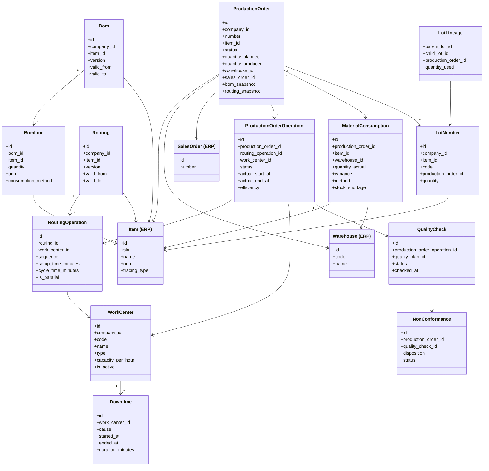
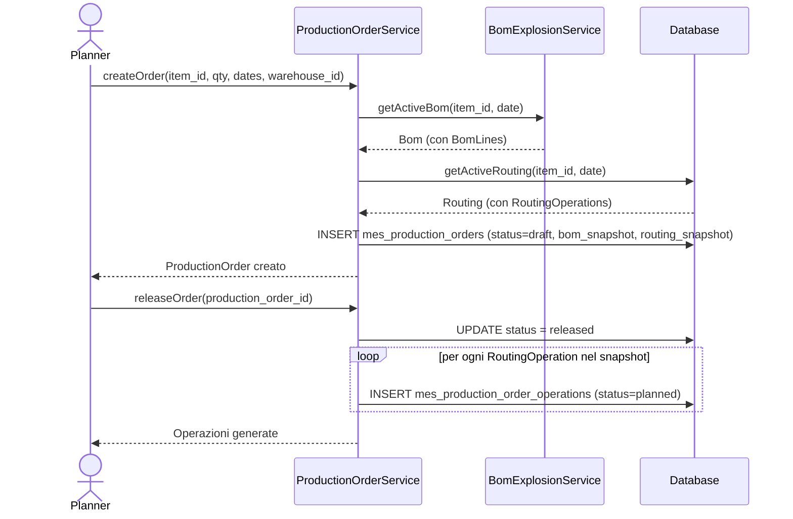
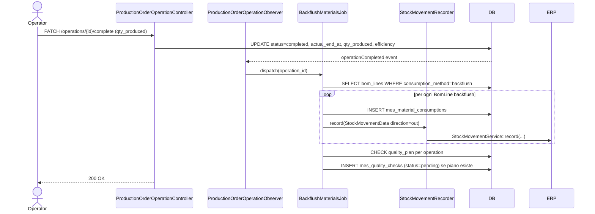
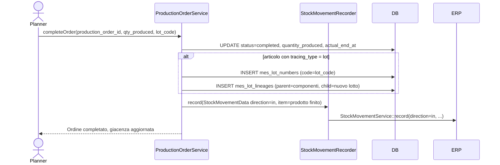

# Design Document — Modulo MES

## Architecture

Il modulo MES (Manufacturing Execution System) è un modulo Laravel che dipende dal modulo ERP come dipendenza dichiarata. Gestisce l'esecuzione della produzione in tempo reale: ordini di produzione, operazioni su work center, consumo materiali, tracciabilità lotti, controllo qualità e scheduling.

Il MES usa direttamente tramite FK Eloquent le tabelle ERP (`items`, `warehouses`, `companies`, `sales_orders`) e delega tramite contratto (`StockMovementRecorder`) la registrazione dei movimenti di magazzino, in modo che la logica FIFO/costing/journal resti incapsulata nell'ERP.

## Components and Interfaces

### Contratto principale

`StockMovementRecorder` — interfaccia definita nel MES, implementata dall'ERP tramite `ErpStockMovementRecorder` che wrappa `StockMovementService`.

### Servizi principali

- `ProductionOrderService` — ciclo di vita degli ordini di produzione
- `BomExplosionService` — esplosione multi-livello BOM e risoluzione versione attiva
- `CapacityService` — calcolo carico work center e scheduling
- `LotTracingService` — tracciabilità bidirezionale lotti
- `OeeCalculatorService` — calcolo OEE per work center

## Data Models

Tutte le tabelle MES usano il prefisso `mes_`. Le FK verso ERP (`items`, `warehouses`, `companies`, `sales_orders`) sono fisiche sul database. Il MES aggiunge tramite propria migration la colonna `tracing_type` alla tabella `items` dell'ERP.

## Overview

Il modulo MES (Manufacturing Execution System) è un modulo Laravel indipendente che dipende dal modulo ERP come dipendenza dichiarata. Gestisce l'esecuzione della produzione in tempo reale: ordini di produzione, operazioni su work center, consumo materiali, tracciabilità lotti, controllo qualità e scheduling.

### Dipendenze tra moduli

```
Core (priority 0)
  └── ERP (priority 1)
        └── MES (priority 2)
```

Il MES usa direttamente tramite FK Eloquent:
- `items` — articoli da produrre e componenti BOM
- `warehouses` — magazzini di prelievo e destinazione
- `companies` — multi-tenancy
- `sales_orders` — collegamento opzionale ordini di vendita

Il MES delega tramite contratto:
- `StockMovementRecorder` — registrazione movimenti magazzino (logica FIFO/costing/journal resta nell'ERP)

---

## Architettura del modulo

```
Modules/MES/
├── app/
│   ├── Contracts/
│   │   └── StockMovementRecorder.php
│   ├── Data/
│   │   └── StockMovementData.php
│   ├── Filament/
│   │   ├── Resources/
│   │   │   ├── WorkCenterResource.php
│   │   │   ├── BomResource.php
│   │   │   ├── RoutingResource.php
│   │   │   ├── ProductionOrderResource.php
│   │   │   ├── QualityCheckResource.php
│   │   │   ├── NonConformanceResource.php
│   │   │   ├── DowntimeResource.php
│   │   │   └── ShiftResource.php
│   │   └── Widgets/
│   │       └── ProductionDashboardWidget.php
│   ├── Http/
│   │   ├── Controllers/Api/V1/
│   │   │   ├── WorkCenterController.php
│   │   │   ├── BomController.php
│   │   │   ├── RoutingController.php
│   │   │   ├── ProductionOrderController.php
│   │   │   ├── ProductionOrderOperationController.php
│   │   │   ├── MaterialConsumptionController.php
│   │   │   ├── LotNumberController.php
│   │   │   ├── QualityCheckController.php
│   │   │   ├── NonConformanceController.php
│   │   │   └── DowntimeController.php
│   │   └── Requests/
│   ├── Jobs/
│   │   ├── BackflushMaterialsJob.php
│   │   └── CreateProductionOrderFromSalesOrderJob.php
│   ├── Listeners/
│   │   └── HandleSalesOrderConfirmedListener.php
│   ├── Models/
│   │   ├── WorkCenter.php
│   │   ├── WorkCenterCalendar.php
│   │   ├── Bom.php
│   │   ├── BomLine.php
│   │   ├── Routing.php
│   │   ├── RoutingOperation.php
│   │   ├── ProductionOrder.php
│   │   ├── ProductionOrderOperation.php
│   │   ├── MaterialConsumption.php
│   │   ├── LotNumber.php
│   │   ├── SerialNumber.php
│   │   ├── LotLineage.php
│   │   ├── QualityPlan.php
│   │   ├── QualityPlanParameter.php
│   │   ├── QualityCheck.php
│   │   ├── QualityCheckMeasurement.php
│   │   ├── NonConformance.php
│   │   ├── Downtime.php
│   │   ├── Shift.php
│   │   ├── ShiftInstance.php
│   │   └── OperatorLog.php
│   ├── Observers/
│   │   ├── ProductionOrderObserver.php
│   │   └── ProductionOrderOperationObserver.php
│   ├── Providers/
│   │   ├── MESServiceProvider.php
│   │   ├── EventServiceProvider.php
│   │   └── RouteServiceProvider.php
│   └── Services/
│       ├── ProductionOrderService.php
│       ├── BomExplosionService.php
│       ├── CapacityService.php
│       ├── LotTracingService.php
│       └── OeeCalculatorService.php
├── config/config.php
├── database/migrations/
├── routes/
│   ├── api.php
│   └── web.php
├── tests/
│   ├── Feature/
│   └── Unit/
├── module.json
└── composer.json
```

---

## Schema del database

Tutte le tabelle MES usano il prefisso `mes_`. Le FK verso ERP sono fisiche sul database.

### Tabelle MES

#### `mes_work_centers`
| Colonna | Tipo | Note |
|---|---|---|
| id | bigint PK | |
| company_id | bigint FK → companies | BelongsToCompany |
| code | varchar(32) | unique per company |
| name | varchar(255) | |
| type | enum(machine, cell, line, manual_station) | |
| capacity_per_hour | decimal(10,4) | |
| capacity_uom | varchar(16) | |
| is_active | boolean | default true |
| created_at, updated_at, deleted_at | timestamps | |

#### `mes_work_center_calendars`
| Colonna | Tipo | Note |
|---|---|---|
| id | bigint PK | |
| work_center_id | bigint FK → mes_work_centers | |
| day_of_week | tinyint | 0=Mon … 6=Sun |
| start_time | time | |
| end_time | time | |

#### `mes_boms`
| Colonna | Tipo | Note |
|---|---|---|
| id | bigint PK | |
| company_id | bigint FK → companies | |
| item_id | bigint FK → items | articolo prodotto |
| version | varchar(32) | |
| valid_from | date | |
| valid_to | date nullable | |
| is_active | boolean | |
| created_at, updated_at, deleted_at | timestamps | |

#### `mes_bom_lines`
| Colonna | Tipo | Note |
|---|---|---|
| id | bigint PK | |
| bom_id | bigint FK → mes_boms | |
| item_id | bigint FK → items | componente |
| quantity | decimal(15,4) | |
| uom | varchar(16) | |
| consumption_method | enum(backflush, manual) | |
| sort_order | int | |

#### `mes_routings`
| Colonna | Tipo | Note |
|---|---|---|
| id | bigint PK | |
| company_id | bigint FK → companies | |
| item_id | bigint FK → items | |
| version | varchar(32) | |
| valid_from | date | |
| valid_to | date nullable | |
| is_active | boolean | |
| created_at, updated_at, deleted_at | timestamps | |

#### `mes_routing_operations`
| Colonna | Tipo | Note |
|---|---|---|
| id | bigint PK | |
| routing_id | bigint FK → mes_routings | |
| work_center_id | bigint FK → mes_work_centers | |
| sequence | int | |
| description | varchar(255) | |
| setup_time_minutes | int | |
| cycle_time_minutes | decimal(10,4) | minuti per unità |
| is_parallel | boolean | default false |

#### `mes_production_orders`
| Colonna | Tipo | Note |
|---|---|---|
| id | bigint PK | |
| company_id | bigint FK → companies | |
| number | varchar(32) | unique per company+year |
| item_id | bigint FK → items | |
| quantity_planned | decimal(15,4) | |
| quantity_produced | decimal(15,4) nullable | |
| quantity_scrapped | decimal(15,4) nullable | |
| uom | varchar(16) | |
| status | enum(draft, released, in_progress, completed, cancelled) | |
| planned_start_at | datetime | |
| planned_end_at | datetime | |
| actual_start_at | datetime nullable | |
| actual_end_at | datetime nullable | |
| warehouse_id | bigint FK → warehouses | magazzino destinazione |
| sales_order_id | bigint FK nullable → sales_orders | |
| bom_snapshot | json | snapshot BOM al momento della creazione |
| routing_snapshot | json | snapshot Routing al momento della creazione |
| created_at, updated_at, deleted_at | timestamps | |

#### `mes_production_order_operations`
| Colonna | Tipo | Note |
|---|---|---|
| id | bigint PK | |
| production_order_id | bigint FK → mes_production_orders | |
| routing_operation_id | bigint FK → mes_routing_operations | |
| work_center_id | bigint FK → mes_work_centers | |
| sequence | int | |
| status | enum(planned, ready, in_progress, completed, skipped) | |
| planned_start_at | datetime nullable | |
| planned_end_at | datetime nullable | |
| actual_start_at | datetime nullable | |
| actual_end_at | datetime nullable | |
| quantity_produced | decimal(15,4) nullable | |
| operator_user_id | bigint FK nullable → users | |
| notes | text nullable | |
| efficiency | decimal(5,2) nullable | % tempo effettivo vs standard |

#### `mes_material_consumptions`
| Colonna | Tipo | Note |
|---|---|---|
| id | bigint PK | |
| production_order_id | bigint FK → mes_production_orders | |
| production_order_operation_id | bigint FK nullable → mes_production_order_operations | |
| item_id | bigint FK → items | |
| warehouse_id | bigint FK → warehouses | |
| lot_number_id | bigint FK nullable → mes_lot_numbers | |
| quantity_theoretical | decimal(15,4) | da BOM |
| quantity_actual | decimal(15,4) | consumo reale |
| uom | varchar(16) | |
| variance | decimal(15,4) | actual - theoretical |
| method | enum(backflush, manual) | |
| stock_shortage | boolean | default false |
| created_at, updated_at | timestamps | |

#### `mes_lot_numbers`
| Colonna | Tipo | Note |
|---|---|---|
| id | bigint PK | |
| company_id | bigint FK → companies | |
| item_id | bigint FK → items | |
| code | varchar(64) | unique per company |
| production_order_id | bigint FK nullable → mes_production_orders | |
| quantity | decimal(15,4) | |
| uom | varchar(16) | |
| produced_at | datetime nullable | |
| expires_at | date nullable | |
| created_at, updated_at | timestamps | |

#### `mes_serial_numbers`
| Colonna | Tipo | Note |
|---|---|---|
| id | bigint PK | |
| company_id | bigint FK → companies | |
| item_id | bigint FK → items | |
| code | varchar(64) | unique per company |
| production_order_id | bigint FK nullable → mes_production_orders | |
| lot_number_id | bigint FK nullable → mes_lot_numbers | |
| produced_at | datetime nullable | |
| created_at, updated_at | timestamps | |

#### `mes_lot_lineages`
| Colonna | Tipo | Note |
|---|---|---|
| id | bigint PK | |
| parent_lot_id | bigint FK → mes_lot_numbers | lotto componente |
| child_lot_id | bigint FK → mes_lot_numbers | lotto prodotto finito |
| production_order_id | bigint FK → mes_production_orders | |
| quantity_used | decimal(15,4) | |

#### `mes_quality_plans`
| Colonna | Tipo | Note |
|---|---|---|
| id | bigint PK | |
| company_id | bigint FK → companies | |
| item_id | bigint FK nullable → items | null = piano per operazione |
| routing_operation_id | bigint FK nullable → mes_routing_operations | |
| name | varchar(255) | |
| is_active | boolean | |
| created_at, updated_at | timestamps | |

#### `mes_quality_plan_parameters`
| Colonna | Tipo | Note |
|---|---|---|
| id | bigint PK | |
| quality_plan_id | bigint FK → mes_quality_plans | |
| name | varchar(255) | |
| uom | varchar(32) nullable | |
| min_value | decimal(15,4) nullable | |
| max_value | decimal(15,4) nullable | |
| is_required | boolean | |

#### `mes_quality_checks`
| Colonna | Tipo | Note |
|---|---|---|
| id | bigint PK | |
| production_order_operation_id | bigint FK → mes_production_order_operations | |
| quality_plan_id | bigint FK → mes_quality_plans | |
| lot_number_id | bigint FK nullable → mes_lot_numbers | |
| operator_user_id | bigint FK nullable → users | |
| status | enum(pending, passed, failed, conditional) | |
| checked_at | datetime nullable | |
| notes | text nullable | |
| created_at, updated_at | timestamps | |

#### `mes_quality_check_measurements`
| Colonna | Tipo | Note |
|---|---|---|
| id | bigint PK | |
| quality_check_id | bigint FK → mes_quality_checks | |
| quality_plan_parameter_id | bigint FK → mes_quality_plan_parameters | |
| value | decimal(15,4) | |
| is_within_limits | boolean | |

#### `mes_non_conformances`
| Colonna | Tipo | Note |
|---|---|---|
| id | bigint PK | |
| company_id | bigint FK → companies | |
| production_order_id | bigint FK → mes_production_orders | |
| quality_check_id | bigint FK nullable → mes_quality_checks | |
| rework_production_order_id | bigint FK nullable → mes_production_orders | |
| description | text | |
| quantity_nonconforming | decimal(15,4) | |
| root_cause | varchar(255) nullable | |
| corrective_action | text nullable | |
| disposition | enum(scrap, rework, use_as_is, return_to_supplier) nullable | |
| status | enum(open, under_review, resolved, closed) | |
| created_at, updated_at | timestamps | |

#### `mes_downtimes`
| Colonna | Tipo | Note |
|---|---|---|
| id | bigint PK | |
| work_center_id | bigint FK → mes_work_centers | |
| cause | enum(breakdown, planned_maintenance, setup, waiting_material, quality_issue, other) | |
| started_at | datetime | |
| ended_at | datetime nullable | |
| duration_minutes | int nullable | calcolato alla chiusura |
| notes | text nullable | |
| created_at, updated_at | timestamps | |

#### `mes_shifts`
| Colonna | Tipo | Note |
|---|---|---|
| id | bigint PK | |
| company_id | bigint FK → companies | |
| name | varchar(255) | |
| start_time | time | |
| end_time | time | |
| days_of_week | json | array [0..6] |
| is_active | boolean | |

#### `mes_shift_work_centers`
| Colonna | Tipo | Note |
|---|---|---|
| shift_id | bigint FK → mes_shifts | |
| work_center_id | bigint FK → mes_work_centers | |

#### `mes_shift_instances`
| Colonna | Tipo | Note |
|---|---|---|
| id | bigint PK | |
| shift_id | bigint FK → mes_shifts | |
| date | date | |
| operator_user_id | bigint FK → users | |
| work_center_id | bigint FK → mes_work_centers | |

#### `mes_operator_logs`
| Colonna | Tipo | Note |
|---|---|---|
| id | bigint PK | |
| production_order_operation_id | bigint FK → mes_production_order_operations | |
| operator_user_id | bigint FK → users | |
| action | enum(started, completed, paused, resumed) | |
| occurred_at | datetime | |

### Migration aggiuntiva su tabella ERP

Il MES aggiunge tramite propria migration la colonna `tracing_type` alla tabella `items`:

```php
Schema::table('items', function (Blueprint $table): void {
    $table->enum('tracing_type', ['none', 'lot', 'serial'])->default('none')->after('uom');
});
```

---

## Diagramma delle entità principali



---

## Contratti e DTO

### `StockMovementRecorder`

```php
// Modules/MES/app/Contracts/StockMovementRecorder.php
namespace Modules\MES\Contracts;

use Modules\MES\Data\StockMovementData;

interface StockMovementRecorder
{
    public function record(StockMovementData $data): void;
}
```

### `StockMovementData`

```php
// Modules/MES/app/Data/StockMovementData.php
namespace Modules\MES\Data;

final readonly class StockMovementData
{
    public function __construct(
        public int $item_id,
        public int $warehouse_id,
        public int $company_id,
        public string $direction,      // 'in' | 'out'
        public int $quantity,
        public string $source_type,    // es. 'mes_production_orders'
        public int $source_id,
        public \DateTimeInterface $occurred_at,
    ) {}
}
```

### Implementazione concreta (nel modulo MES, non nell'ERP)

Il principio è che **solo il MES conosce l'ERP**, mai il contrario. Quindi `ErpStockMovementRecorder` è una classe del modulo MES che importa `StockMovementService` dall'ERP — lecito perché MES dipende da ERP. L'ERP non ha nessun file nuovo e non sa che MES esiste.

```php
// Modules/MES/app/Services/ErpStockMovementRecorder.php
namespace Modules\MES\Services;

use Modules\MES\Contracts\StockMovementRecorder;
use Modules\MES\Data\StockMovementData;
use Modules\ERP\Services\Inventory\StockMovementService; // import ERP: lecito, MES dipende da ERP

final readonly class ErpStockMovementRecorder implements StockMovementRecorder
{
    public function __construct(
        private StockMovementService $stockMovementService,
    ) {}

    public function record(StockMovementData $data): void
    {
        $this->stockMovementService->record(
            itemId: $data->item_id,
            warehouseId: $data->warehouse_id,
            companyId: $data->company_id,
            direction: $data->direction,
            quantity: $data->quantity,
            sourceType: $data->source_type,
            sourceId: $data->source_id,
        );
    }
}
```

Il binding viene registrato nel `MESServiceProvider`, non nell'ERP:

```php
// Modules/MES/app/Providers/MESServiceProvider.php
public function register(): void
{
    // MES conosce ERP → registra qui l'implementazione concreta
    $this->app->singleton(
        StockMovementRecorder::class,
        ErpStockMovementRecorder::class,
    );
}
```

**Direzione delle dipendenze:**
```
MES → ERP    ✓  (MES importa classi ERP — dipendenza dichiarata)
ERP → MES    ✗  (ERP non ha nessun riferimento a MES)
```

---

## Flussi principali

### 1. Creazione e rilascio di un ordine di produzione



### 2. Esecuzione operazione con backflush automatico



### 3. Completamento ordine con resa a magazzino



---

## Servizi

### `ProductionOrderService`
Responsabilità: creazione, rilascio, completamento e cancellazione degli ordini di produzione. Gestisce lo snapshot BOM/Routing e la generazione delle operazioni al rilascio.

### `BomExplosionService`
Responsabilità: esplosione multi-livello della BOM (ricorsiva), calcolo fabbisogno componenti per una quantità data, risoluzione della versione attiva a una data.

### `CapacityService`
Responsabilità: calcolo del CapacityLoad per WorkCenter e periodo, verifica disponibilità prima della pianificazione, calcolo data fine stimata di un ordine.

### `LotTracingService`
Responsabilità: forward tracing (da lotto componente a prodotti finiti) e backward tracing (da lotto prodotto finito a componenti), costruzione dell'albero di tracciabilità.

### `OeeCalculatorService`
Responsabilità: calcolo OEE (Availability × Performance × Quality) per WorkCenter e periodo, aggregando dati da Downtime, ProductionOrderOperation e QualityCheck.

---

## API REST

Tutti gli endpoint sono sotto `/api/v1/mes/` e richiedono autenticazione Sanctum.

| Metodo | Path | Descrizione |
|---|---|---|
| GET | `/work-centers` | Lista work center |
| POST | `/work-centers` | Crea work center |
| GET | `/work-centers/{id}` | Dettaglio work center |
| PATCH | `/work-centers/{id}` | Aggiorna work center |
| POST | `/work-centers/{id}/deactivate` | Disattiva work center |
| GET | `/boms` | Lista BOM |
| POST | `/boms` | Crea BOM |
| GET | `/boms/{id}` | Dettaglio BOM |
| GET | `/boms/{id}/explode` | Esplosione multi-livello |
| GET | `/routings` | Lista routing |
| POST | `/routings` | Crea routing |
| GET | `/routings/{id}` | Dettaglio routing |
| GET | `/production-orders` | Lista ordini di produzione |
| POST | `/production-orders` | Crea ordine |
| GET | `/production-orders/{id}` | Dettaglio ordine |
| POST | `/production-orders/{id}/release` | Rilascia ordine |
| POST | `/production-orders/{id}/complete` | Completa ordine |
| POST | `/production-orders/{id}/cancel` | Cancella ordine |
| GET | `/production-orders/{id}/operations` | Operazioni dell'ordine |
| PATCH | `/operations/{id}/start` | Avvia operazione |
| PATCH | `/operations/{id}/complete` | Completa operazione |
| GET | `/operations/{id}/consumptions` | Consumi dell'operazione |
| POST | `/operations/{id}/consumptions` | Registra consumo manuale |
| GET | `/lot-numbers/{id}/trace/forward` | Forward tracing |
| GET | `/lot-numbers/{id}/trace/backward` | Backward tracing |
| GET | `/quality-checks` | Lista controlli qualità |
| PATCH | `/quality-checks/{id}/execute` | Esegui controllo |
| GET | `/non-conformances` | Lista non conformità |
| PATCH | `/non-conformances/{id}` | Aggiorna non conformità |
| GET | `/schedule` | Piano di produzione |
| GET | `/capacity` | Carico capacità per work center |
| GET | `/downtimes` | Lista fermi macchina |
| POST | `/downtimes` | Registra fermo |
| PATCH | `/downtimes/{id}/close` | Chiudi fermo |
| GET | `/work-centers/{id}/oee` | Metriche OEE |

---

## Pannello Filament

### Resources

- **WorkCenterResource** — CRUD work center con calendario disponibilità inline
- **BomResource** — CRUD BOM con repeater BomLines, selezione articolo da `items` ERP
- **RoutingResource** — CRUD Routing con repeater RoutingOperations
- **ProductionOrderResource** — Lista e dettaglio ordini; pagina view con tab: Operazioni, Consumi, Qualità, Lotti; azioni: Rilascia, Completa, Cancella
- **QualityCheckResource** — Lista controlli in attesa, esecuzione misurazioni
- **NonConformanceResource** — Gestione non conformità con workflow stati
- **DowntimeResource** — Registrazione e chiusura fermi macchina
- **ShiftResource** — Definizione turni e assegnazione operatori

### Widget dashboard

`ProductionDashboardWidget` mostra:
- Ordini in produzione (status = in_progress)
- Work center con downtime attivi
- Controlli qualità in attesa (status = pending)
- OEE medio del giorno corrente

---

## Considerazioni sui test

### Invarianti da verificare con property-based testing

1. **BOM snapshot immutabile**: dopo il rilascio di un ProductionOrder, modifiche alla BOM non alterano il `bom_snapshot` dell'ordine
2. **Bilanciamento consumi**: la somma dei `quantity_actual` dei MaterialConsumption per un ordine completato deve essere ≥ alla quantità teorica da BOM × quantità prodotta (con tolleranza configurabile)
3. **Tracciabilità bidirezionale**: per ogni LotLineage, il forward trace del `parent_lot_id` deve contenere il `child_lot_id`, e il backward trace del `child_lot_id` deve contenere il `parent_lot_id`
4. **OEE bounds**: il valore OEE calcolato deve essere sempre nel range [0.0, 1.0]
5. **Unicità numero ordine**: due ProductionOrder della stessa Company nello stesso anno non possono avere lo stesso `number`
6. **Stato operazioni**: un ProductionOrder non può passare a `completed` se ha operazioni in stato `in_progress`
7. **Capacità work center**: il CapacityLoad calcolato non può essere negativo

### Test feature principali

- Creazione ordine → snapshot BOM/Routing congelato correttamente
- Rilascio ordine → operazioni generate corrispondono al routing snapshot
- Backflush → MaterialConsumption creato e StockMovementRecorder invocato
- Completamento ordine → LotNumber creato se `tracing_type = lot`, StockMovementRecorder invocato con direction=in
- QualityCheck failed → NonConformance creata automaticamente, lotto bloccato
- Forward/backward tracing → albero corretto su più livelli
- OEE calculation → formula Availability × Performance × Quality verificata su dati noti

---

## Correctness Properties

### Property 1: BOM snapshot immutabile

Dopo il rilascio di un `ProductionOrder`, il campo `bom_snapshot` non può essere modificato, indipendentemente da modifiche successive alla BOM originale. Verificabile con PBT: generare N modifiche alla BOM dopo il rilascio e asserire che `bom_snapshot` rimane invariato.

**Validates: Requirements 4.4**

### Property 2: Tracciabilità bidirezionale

Per ogni `LotLineage(parent, child)`, il forward trace di `parent` contiene `child` e il backward trace di `child` contiene `parent`. Verificabile con PBT: generare alberi di lotti casuali e asserire la simmetria forward/backward.

**Validates: Requirements 7.4, 7.5, 7.6**

### Property 3: OEE bounds

`OEE = Availability × Performance × Quality` è sempre nel range `[0.0, 1.0]`. Verificabile con PBT: generare valori casuali di downtime, quantità prodotta e qualità e asserire che OEE ∈ [0, 1].

**Validates: Requirements 11.4**

### Property 4: Unicità numero ordine

Due `ProductionOrder` della stessa `company_id` nello stesso anno non possono avere lo stesso `number`. Verificabile con test di concorrenza: creare N ordini in parallelo e asserire che tutti i numeri sono distinti.

**Validates: Requirements 4.2**

### Property 5: Coerenza stati ordine

Un `ProductionOrder` non può passare a `completed` se ha `ProductionOrderOperation` in stato `in_progress`. Verificabile con PBT: generare sequenze casuali di transizioni di stato e asserire che la transizione a `completed` viene rifiutata se esiste almeno un'operazione `in_progress`.

**Validates: Requirements 4.3, 5.2**

### Property 6: CapacityLoad non negativo

Il carico calcolato per un `WorkCenter` in qualsiasi periodo è sempre ≥ 0. Verificabile con PBT: generare periodi e operazioni casuali e asserire che `getCapacityLoad()` restituisce sempre un valore ≥ 0.

**Validates: Requirements 9.1**

### Property 7: Bilanciamento consumi

La somma dei `quantity_actual` dei `MaterialConsumption` per un ordine completato è ≥ alla quantità teorica da BOM × quantità prodotta (entro tolleranza configurabile). Verificabile con test di integrazione sul ciclo completo di produzione.

**Validates: Requirements 6.4**

---

## Error Handling

- `ItemNotFoundException` — sollevata quando `item_id` non esiste nella tabella `items` ERP
- `BomNotFoundException` — nessuna BOM attiva trovata per l'articolo alla data richiesta
- `RoutingNotFoundException` — nessun Routing attivo trovato per l'articolo alla data richiesta
- `BomLockedException` — tentativo di modifica BOM associata a ordine rilasciato
- `WorkCenterInactiveException` — tentativo di pianificare operazione su work center disattivato
- `StockShortageEvent` — evento applicativo (non eccezione) quando la giacenza è insufficiente al consumo; il consumo viene registrato con `stock_shortage = true` e il responsabile viene notificato

Tutti gli errori di validazione API restituiscono HTTP 422 con dettaglio per campo. Errori di autenticazione restituiscono HTTP 401, errori di autorizzazione HTTP 403.

---

## Testing Strategy

### Property-based testing (PestPHP)

Verificare le invarianti elencate in "Correctness Properties" con generatori di dati casuali:
- Generare BOM con N livelli casuali e verificare che l'esplosione produca sempre il fabbisogno corretto
- Generare sequenze di LotLineage e verificare la bidirezionalità
- Generare dati di downtime/produzione casuali e verificare OEE ∈ [0,1]

### Test di integrazione

Ciclo completo end-to-end: crea BOM → crea Routing → crea ProductionOrder → rilascia → esegui operazioni → backflush automatico → completa ordine → verifica giacenza aggiornata tramite `StockMovementRecorder`.

### Test unitari

Ogni servizio testato in isolamento con mock di `StockMovementRecorder` per verificare che venga invocato con i parametri corretti.
