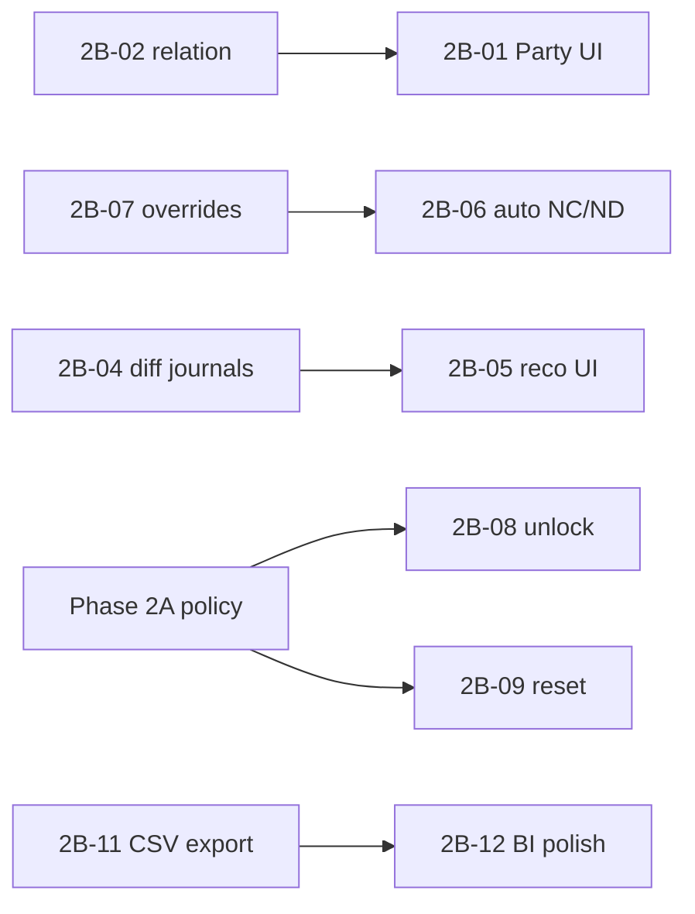

# ERP Spec 2 — Phase 2B Implementation Plan

> **Navigation:** Implements backlog IDs `2B-01`…`2B-12` from
> [`specs/2026-06-30-erp-hardening-spec2-filament-domain-actions-design.md`](../specs/2026-06-30-erp-hardening-spec2-filament-domain-actions-design.md).
> Closes partial item PART-05 (`2B-11`). Deferred from Phase 2A: quotation `unlock`, document sequence `reset`.

> **For agentic workers:** REQUIRED SUB-SKILL: Use superpowers:subagent-driven-development (recommended) or superpowers:executing-plans to implement this plan task-by-task. Steps use checkbox (`- [ ]`) syntax for tracking.

**Status:** In progress — Wave A completed (`2B-02`, `2B-01`); optional `2B-03` completed; Wave B completed (`2B-08`, `2B-09`)
**Prerequisite:** Phase 2A (`plans/2026-06-30-erp-hardening-spec2-phase2a.md`) is complete in ERP `300f9ef`; Wave B can reuse the state-aware policy + seeder pattern.

**Goal:** Complete commercial pricing UX, banking reconciliation depth, returns automation, admin domain actions, and reporting polish — all on `Modules/ERP` with TDD.

**Architecture:** Twelve backlog items grouped in **five waves** by dependency. Service-layer first (bank difference journals, return overrides, parsers), then Filament wiring. Reuse existing patterns: `InvoicePostingActions`, `BankReconciliationService`, `ReturnOrderService`, `FinancialReportCsvExporter`, `ErpCompanySettings`.

**Tech Stack:** PHP 8.5, Laravel 12, Filament 5, Spatie Permission, Pest, DOM/SimpleXML (native, no new Composer deps for CAMT/MT940).

**Conventions:**
- Tests: `php artisan test --compact Modules/ERP/tests/Feature/<File>.php`
- Commits: ERP submodule `master`, one commit per task
- Format: `vendor/bin/pint --dirty` after each task
- Local/private variables: `snake_case`; methods/properties: `camelCase`
- Code/comments: English; chat: Italian

**Out of scope (Phase 2B):**
- PDF export on financial reports (CSV only in 2B-11; PDF → backlog)
- Full FatturaPA (Phase 2C)
- Direct item-specific price lists (Phase 5 / `5-05`)
- Browser click-through E2E (server-side / Livewire smoke only)

---

## Backlog map

| ID | Wave | Item | Depends on |
|----|------|------|------------|
| 2B-02 | A | `Party::price_rules()` relation | Done |
| 2B-01 | A | Party price-rule UI | Done |
| 2B-03 | A (optional) | PriceList Filament resources | Done |
| 2B-08 | B | Quotation `unlock` + policy + seed | Done |
| 2B-09 | B | Document sequence `reset` + policy + seed | Done |
| 2B-07 | C | Return line override contract | — |
| 2B-06 | C | Auto NC/ND on `complete()` | 2B-07 |
| 2B-04 | D | Bank difference journals | — |
| 2B-05 | D | Match-with-difference reco UI | 2B-04 |
| 2B-10 | D | CAMT.053 / MT940 import | — |
| 2B-11 | E | Financial report CSV export (PART-05) | — |
| 2B-12 | E | BI / operational dashboard polish | 2B-11 (export pattern) |



---

## Current truth (verified)

| Area | Exists | Gap |
|------|--------|-----|
| Pricing backend | `PartyPriceRule`, `PriceResolverService`, `Party::price_rules()`, Party Filament relation manager, tests | Optional `PriceList` / `PriceListItem` resources only |
| Price lists | `PriceList`, `PriceListItem`, migrations | No Filament resources |
| Bank reco v1 | `BankReconciliationService` (exact match), `BankReconciliationPage`, CSV import | No difference journal, no CAMT/MT940 |
| Returns v1 | `ReturnOrderService`, manual NC/ND Filament actions | `complete()` does not auto-create notes; no `unit_price` override on lines |
| Quotation locks | `Quotation` uses `HasLocks`; SO confirms lock quotation | No unlock action/permission |
| Document sequences | `DocumentSequence`, `DocumentNumberAllocator` | No controlled reset action |
| Financial CSV | `FinancialReportCsvExporter` (`trialBalance`, `incomeStatement`) | No Filament download; no `balanceSheet()` |
| BI pages | `SalesPipelinePage`, `StockValuationPage` — basic tables | No filters/KPI/export polish |

---

## Task 1: `Party::price_rules()` relation (2B-02) — completed 2026-07-11

**Files:**
- Modify: `Modules/ERP/app/Models/Party.php`
- Modify: `Modules/ERP/tests/Feature/Models/PartyPriceRuleTest.php`

- [ ] **Step 1: Write failing test**

Append to `PartyPriceRuleTest.php`:

```php
it('links party price rules through the party relation', function (): void {
    $company = Company::query()->create([
        'slug' => 'party-rules-rel',
        'name' => 'Party Rules Rel',
        'fiscal_country' => 'IT',
        'default_currency' => 'EUR',
    ]);
    $party = Party::query()->create([
        'company_id' => $company->id,
        'name' => 'Customer A',
        'is_customer' => true,
    ]);
    $item = Item::query()->create([
        'company_id' => $company->id,
        'name' => 'Widget',
        'sku' => 'W-REL',
        'uom' => 'ea',
        'costing_method' => 'weighted_avg',
    ]);

    $rule = PartyPriceRule::query()->create([
        'company_id' => $company->id,
        'party_id' => $party->id,
        'item_id' => $item->id,
        'discount_type' => DiscountType::Percent,
        'discount_value' => '10.0000',
        'priority' => 1,
    ]);

    expect($party->price_rules)->toHaveCount(1)
        ->and($party->price_rules->first()?->is($rule))->toBeTrue();
});
```

Add missing imports (`Party`, `Item`, `DiscountType`, `Company`) at file top.

- [ ] **Step 2: Run test — expect FAIL** (`Call to undefined relationship price_rules`)

Run: `php artisan test --compact Modules/ERP/tests/Feature/Models/PartyPriceRuleTest.php`

- [ ] **Step 3: Add relation to `Party.php`**

```php
    /**
     * @return HasMany<PartyPriceRule, $this>
     */
    public function price_rules(): HasMany
    {
        return $this->hasMany(PartyPriceRule::class);
    }
```

Import `PartyPriceRule`.

- [ ] **Step 4: Run test — expect PASS**

- [ ] **Step 5: Commit**

```bash
vendor/bin/pint --dirty
cd Modules/ERP && git add app/Models/Party.php tests/Feature/Models/PartyPriceRuleTest.php
git commit -m "feat(erp): add Party price_rules relation"
```

---

## Task 2: Party price-rule UI (2B-01) — completed 2026-07-11

**Files:**
- Create: `Modules/ERP/app/Filament/Resources/Parties/RelationManagers/PriceRulesRelationManager.php`
- Modify: `Modules/ERP/app/Filament/Resources/Parties/PartyResource.php` — register relation manager
- Test: extend `Modules/ERP/tests/Feature/Filament/ERPFilamentCommercialResourcesTest.php`

- [ ] **Step 1: Create RelationManager**

Follow Filament 5 `RelationManager` pattern (sibling: check other modules for reference). Schema:

| Field | Component | Notes |
|-------|-----------|-------|
| `item_id` | Select, nullable | `relationship('item', 'name')` |
| `taxonomy_id` | Select, nullable | ERP concrete `Activity` taxonomy via `activity()` relation |
| `discount_type` | Select | `DiscountType::cases()` |
| `discount_value` | TextInput numeric | min 0 |
| `priority` | TextInput integer | default 0 |
| `valid_from` / `valid_to` | DatePicker | from `HasValidity` on model |

`CreateAction::mutateDataUsing`: set `company_id` from owner party. Validation: exactly one of `item_id` / `taxonomy_id` (model `saving` hook already enforces).

- [ ] **Step 2: Register on `PartyResource`**

```php
public static function getRelations(): array
{
    return [
        PriceRulesRelationManager::class,
    ];
}
```

- [ ] **Step 3: Smoke test**

Append to `ERPFilamentCommercialResourcesTest.php`:

```php
it('registers party price rules relation manager', function (): void {
    expect(PartyResource::getRelations())->toContain(
        \Modules\ERP\Filament\Resources\Parties\RelationManagers\PriceRulesRelationManager::class,
    );
});
```

- [ ] **Step 4: Run tests**

`php artisan test --compact Modules/ERP/tests/Feature/Filament/ERPFilamentCommercialResourcesTest.php`

- [ ] **Step 5: Commit**

```bash
vendor/bin/pint --dirty
cd Modules/ERP && git add app/Filament/Resources/Parties/
git commit -m "feat(erp): party price rules Filament relation manager"
```

---

## Task 3: Quotation unlock action (2B-08) — completed 2026-07-11

**Requires:** Phase 2A policy pattern (`allowsDomainAction`) or inline equivalent.

**Files:**
- Modify: `Modules/ERP/database/seeders/ERPDatabaseSeeder.php`
- Modify: `Modules/ERP/app/Policies/ERPModelPolicy.php`
- Create: `Modules/ERP/app/Filament/Resources/Quotations/Actions/QuotationActions.php`
- Modify: `Modules/ERP/app/Filament/Resources/Quotations/Pages/EditQuotation.php`
- Create: `Modules/ERP/tests/Feature/ErpQuotationUnlockTest.php`

- [ ] **Step 1: Failing tests**

```php
<?php

declare(strict_types=1);

use Illuminate\Foundation\Testing\RefreshDatabase;
use Modules\Core\Models\Permission;
use Modules\Core\Models\Role;
use Modules\Core\Models\User;
use Modules\ERP\Models\Company;
use Modules\ERP\Models\Party;
use Modules\ERP\Models\Quotation;
use Modules\ERP\Policies\ERPModelPolicy;

uses(RefreshDatabase::class);

it('seeds quotation unlock permission', function (): void {
    $this->seed(\Modules\ERP\Database\Seeders\ERPDatabaseSeeder::class);

    expect(Permission::query()->where('name', 'default.erp_quotations.unlock')->exists())->toBeTrue();
});

it('denies unlock when quotation is not locked', function (): void {
    $company = Company::query()->create([
        'slug' => 'q-unlock', 'name' => 'Q Unlock', 'fiscal_country' => 'IT', 'default_currency' => 'EUR',
    ]);
    $party = Party::query()->create(['company_id' => $company->id, 'name' => 'P', 'is_customer' => true]);
    $quotation = Quotation::query()->create([
        'company_id' => $company->id, 'party_id' => $party->id, 'currency' => 'EUR',
    ]);

    $user = User::factory()->create();
    Permission::findOrCreate('default.erp_quotations.unlock', 'web');
    $user->givePermissionTo('default.erp_quotations.unlock');

    expect(app(ERPModelPolicy::class)->unlock($user, $quotation))->toBeFalse();
});

it('allows unlock when quotation is locked and user has permission', function (): void {
    $company = Company::query()->create([
        'slug' => 'q-unlock-2', 'name' => 'Q Unlock 2', 'fiscal_country' => 'IT', 'default_currency' => 'EUR',
    ]);
    $party = Party::query()->create(['company_id' => $company->id, 'name' => 'P', 'is_customer' => true]);
    $quotation = Quotation::query()->create([
        'company_id' => $company->id, 'party_id' => $party->id, 'currency' => 'EUR',
    ]);
    $quotation->lock();

    $user = User::factory()->create();
    Permission::findOrCreate('default.erp_quotations.unlock', 'web');
    $user->givePermissionTo('default.erp_quotations.unlock');

    expect(app(ERPModelPolicy::class)->unlock($user, $quotation))->toBeTrue();
});
```

- [ ] **Step 2: Seed permission**

In `domainPermissions()`, add `Quotation::class` to entities loop **or** append after loop:

```php
$quotation = new ReflectionClass(Quotation::class)->newInstanceWithoutConstructor();
$q_conn = $quotation->getConnectionName() ?? 'default';
$q_table = $quotation->getTable();
$permissions[] = "{$q_conn}.{$q_table}.unlock";
```

Import `Quotation`.

- [ ] **Step 3: Policy method**

```php
    public function unlock(User $user, Model $record): bool
    {
        return $this->allowsDomainAction($user, $record, 'unlock', function (Model $record): bool {
            if (! $record instanceof Quotation) {
                return false;
            }

            return $record->isLocked();
        });
    }
```

Ensure `Quotation` is in `ERPServiceProvider::policyModels()` (already is).

- [ ] **Step 4: `QuotationActions::unlock()`**

```php
<?php

declare(strict_types=1);

namespace Modules\ERP\Filament\Resources\Quotations\Actions;

use Filament\Actions\Action;
use Filament\Notifications\Notification;
use Filament\Support\Icons\Heroicon;
use Modules\ERP\Models\Quotation;

final class QuotationActions
{
    public static function unlock(): Action
    {
        return Action::make('unlock')
            ->label('Unlock')
            ->icon(Heroicon::OutlinedLockOpen)
            ->color('warning')
            ->requiresConfirmation()
            ->authorize(static fn (Quotation $record): bool => auth()->user()?->can('unlock', $record) ?? false)
            ->visible(static fn (Quotation $record): bool => $record->isLocked())
            ->action(static function (Quotation $record): void {
                $record->unlock();

                Notification::make()->title('Quotation unlocked')->success()->send();
            });
    }
}
```

Wire in `EditQuotation::getHeaderActions()`.

- [ ] **Step 5: Run tests + commit**

```bash
php artisan test --compact Modules/ERP/tests/Feature/ErpQuotationUnlockTest.php
vendor/bin/pint --dirty
cd Modules/ERP && git commit -m "feat(erp): quotation unlock action and permission"
```

---

## Task 4: Document sequence reset (2B-09) — completed 2026-07-11

**Files:**
- Create: `Modules/ERP/app/Services/Accounting/DocumentSequenceResetService.php`
- Create: `Modules/ERP/app/Filament/Resources/DocumentSequences/Actions/DocumentSequenceActions.php`
- Modify: `Modules/ERP/app/Policies/ERPModelPolicy.php`
- Modify: `Modules/ERP/database/seeders/ERPDatabaseSeeder.php`
- Modify: `Modules/ERP/app/Filament/Resources/DocumentSequences/Pages/EditDocumentSequence.php`
- Create: `Modules/ERP/tests/Feature/DocumentSequenceResetTest.php`

- [ ] **Step 1: Failing service test**

```php
<?php

declare(strict_types=1);

use Illuminate\Foundation\Testing\RefreshDatabase;
use Modules\ERP\Casts\DocumentType;
use Modules\ERP\Models\Company;
use Modules\ERP\Models\DocumentSequence;
use Modules\ERP\Services\Accounting\DocumentNumberAllocator;
use Modules\ERP\Services\Accounting\DocumentSequenceResetService;

uses(RefreshDatabase::class);

it('resets last_number and next allocation uses the new counter', function (): void {
    $company = Company::query()->create([
        'slug' => 'seq-reset', 'name' => 'Seq Reset', 'fiscal_country' => 'IT', 'default_currency' => 'EUR',
    ]);
    $sequence = DocumentSequence::query()->create([
        'company_id' => $company->id,
        'document_type' => DocumentType::SalesOrder->value,
        'fiscal_year' => 2026,
        'last_number' => 42,
        'prefix' => 'SO-',
        'padding' => 4,
        'suffix' => '',
    ]);

    resolve(DocumentSequenceResetService::class)->reset($sequence, 0);

    $sequence->refresh();
    expect($sequence->last_number)->toBe(0);

    $next = resolve(DocumentNumberAllocator::class)->next($company, DocumentType::SalesOrder, 2026);
    expect($next)->toEndWith('0001');
});
```

- [ ] **Step 2: Implement `DocumentSequenceResetService`**

```php
<?php

declare(strict_types=1);

namespace Modules\ERP\Services\Accounting;

use Illuminate\Support\Facades\DB;
use Illuminate\Validation\ValidationException;
use Modules\ERP\Models\DocumentSequence;

final class DocumentSequenceResetService
{
    public function reset(DocumentSequence $sequence, int $last_number): void
    {
        if ($last_number < 0) {
            throw ValidationException::withMessages([
                'last_number' => ['Last number cannot be negative.'],
            ]);
        }

        DB::transaction(function () use ($sequence, $last_number): void {
            $locked = DocumentSequence::query()->lockForUpdate()->whereKey($sequence->id)->firstOrFail();
            $locked->last_number = $last_number;
            $locked->save();
        });
    }
}
```

Register singleton in `ERPServiceProvider` if other services are singletons.

- [ ] **Step 3: Policy + seed + Filament action**

- Seed `default.erp_document_sequences.reset`
- `ERPModelPolicy::reset()` — always allow state-wise (or deny when `last_number` would break in-flight docs — keep simple: permission only for v1)
- `DocumentSequenceActions::reset()` — modal with `TextInput::make('last_number')->numeric()->minValue(0)->required()->default(0)`, strong confirmation text

- [ ] **Step 4: Run tests + commit**

```bash
php artisan test --compact Modules/ERP/tests/Feature/DocumentSequenceResetTest.php
vendor/bin/pint --dirty
cd Modules/ERP && git commit -m "feat(erp): document sequence reset service and action"
```

---

## Task 5: Return line override contract (2B-07)

**Files:**
- Create migration: `add_unit_price_to_return_lines_tables`
- Create: `Modules/ERP/app/Data/Returns/ReturnLineCreditOverride.php` (readonly DTO)
- Modify: `Modules/ERP/app/Services/Returns/ReturnOrderService.php`
- Modify: `Modules/ERP/app/Services/Returns/SupplierReturnService.php` (mirror for debit notes)
- Modify: `Modules/ERP/app/Filament/Resources/ReturnOrders/Schemas/ReturnOrderForm.php`
- Modify: `Modules/ERP/app/Filament/Resources/SupplierReturns/Schemas/SupplierReturnForm.php` (if exists)
- Create: `Modules/ERP/tests/Feature/ReturnLineOverrideTest.php`

- [ ] **Step 1: Migration**

```php
Schema::table(ERPTables::ReturnOrderLines->value, function (Blueprint $table): void {
    $table->decimal('unit_price', 16, 4)->nullable()->after('quantity');
});
Schema::table(ERPTables::SupplierReturnLines->value, function (Blueprint $table): void {
    $table->decimal('unit_price', 16, 4)->nullable()->after('quantity');
});
```

Add `unit_price` to model `$fillable` and casts `decimal:4`.

- [ ] **Step 2: DTO + public builder**

```php
<?php

declare(strict_types=1);

namespace Modules\ERP\Data\Returns;

/**
 * Commercial override for credit/debit note line generation from a return line.
 */
final readonly class ReturnLineCreditOverride
{
    /**
     * @param  numeric-string  $quantity
     * @param  numeric-string  $unit_price
     */
    public function __construct(
        public int $source_line_id,
        public string $quantity,
        public string $unit_price,
    ) {}
}
```

Expose `ReturnOrderService::buildCreditOverrides(ReturnOrder $return_order): array` (move logic from private `creditNoteLineOverrides`, use `$line->unit_price ?? $invoice_line->unit_price`).

- [ ] **Step 3: Failing test — override price used in NC**

Create return with `invoice_line_id`, `quantity`, `unit_price` override different from invoice line; call `createCreditNote()`; assert credit note line `unit_price` matches override.

- [ ] **Step 4: Extend `ReturnOrderForm` repeater**

Add fields:
- `Select::make('invoice_line_id')` — filtered by parent `invoice_id` (live)
- `TextInput::make('unit_price')` — optional, helper “defaults to invoice line price”

- [ ] **Step 5: Run tests + commit**

```bash
php artisan test --compact Modules/ERP/tests/Feature/ReturnLineOverrideTest.php
vendor/bin/pint --dirty
cd Modules/ERP && git commit -m "feat(erp): return line unit_price override for credit notes"
```

---

## Task 6: Automatic NC/ND on `complete()` (2B-06)

**Files:**
- Modify: `Modules/ERP/app/Services/Company/ErpCompanySettings.php`
- Modify: `Modules/ERP/app/Services/Returns/ReturnOrderService.php`
- Modify: `Modules/ERP/app/Services/Returns/SupplierReturnService.php`
- Modify: `Modules/ERP/tests/Feature/Services/ReturnOrderServiceTest.php`
- Modify: `Modules/ERP/tests/Feature/Services/SupplierReturnServiceTest.php`

- [ ] **Step 1: Company setting**

Add to `defaultSettings()` and `globalSettingDefinitions()`:

```php
'returns' => [
    'auto_create_notes_on_complete' => false,
],
```

Constant: `AUTO_CREATE_NOTES_ON_COMPLETE = 'erp.returns.auto_create_notes_on_complete'`

Accessor: `autoCreateNotesOnComplete(Company $company): bool`

- [ ] **Step 2: Failing test**

When setting `true`, `complete()` on processed return with `invoice_id` creates credit note and sets `credit_note_invoice_id`. When `false`, behavior unchanged (manual action only).

- [ ] **Step 3: Hook in `complete()`**

After `receipt_service->receive()` / `shipment_service->ship()`:

```php
if ($this->erp_company_settings->autoCreateNotesOnComplete($company)
    && $locked->credit_note_invoice_id === null
    && $locked->invoice_id !== null) {
    $this->createCreditNote($locked);
}
```

Mirror for supplier debit note when `purchase_order_id` or linked purchase invoice exists (follow `SupplierReturnService::createDebitNote()` preconditions).

**Decision:** auto-create runs in **same transaction** as complete when possible; on validation failure, let `complete()` throw (fail-safe, no partial processed-without-note).

- [ ] **Step 4: Run tests + commit**

```bash
php artisan test --compact Modules/ERP/tests/Feature/Services/ReturnOrderServiceTest.php Modules/ERP/tests/Feature/Services/SupplierReturnServiceTest.php
vendor/bin/pint --dirty
cd Modules/ERP && git commit -m "feat(erp): optional auto credit/debit notes on return complete"
```

---

## Task 7: Bank difference journals (2B-04)

**Files:**
- Create migration: `add_difference_journal_entry_id_to_bank_statement_lines`
- Create: `Modules/ERP/app/Services/Banking/BankDifferenceJournalService.php`
- Modify: `Modules/ERP/app/Services/Banking/BankReconciliationService.php`
- Modify: `Modules/ERP/app/Services/Company/ErpCompanySettings.php` (optional default expense account role)
- Create: `Modules/ERP/tests/Feature/Services/BankDifferenceJournalTest.php`

- [ ] **Step 1: Migration**

```php
$table->foreignId('difference_journal_entry_id')
    ->nullable()
    ->constrained(ERPTables::JournalEntries->value)
    ->nullOnDelete();
```

Update `BankStatementLine` model (`fillable`, `BelongsTo` `difference_journal_entry`).

- [ ] **Step 2: Failing test**

Line amount `100.50`, payment `100.00`, difference `0.50` → `matchPaymentWithDifference()`:
- sets `matched_payment_id`
- creates balanced journal (bank cash + expense)
- stores `difference_journal_entry_id`

Use `findAccountByRole` pattern: roles `bank_cash` and `bank_reconciliation_difference` (seed in `ItalianCoaProvider` / chart installer if missing).

- [ ] **Step 3: `BankDifferenceJournalService`**

```php
public function postDifference(
    Company $company,
    BankStatementLine $line,
    Payment $payment,
    string $difference_amount_doc,
    int $expense_account_id,
    int $bank_account_id,
): JournalEntry
```

Journal lines:
- Bank GL: difference amount (sign aligned with line direction)
- Expense GL: negated difference

Use `JournalPostingService::post()` with resolved fiscal period from `line->booked_at`.

- [ ] **Step 4: `BankReconciliationService::matchPaymentWithDifference()`**

```php
public function matchPaymentWithDifference(
    BankStatementLine $line,
    Payment $payment,
    int $expense_account_id,
): BankStatementLine
```

Relax amount check: allow `abs(abs(line) - payment) > 0.0001` when difference journal is posted. Reject if difference is zero (delegate to `matchPayment()`).

- [ ] **Step 5: Run tests + commit**

```bash
php artisan test --compact Modules/ERP/tests/Feature/Services/BankDifferenceJournalTest.php
vendor/bin/pint --dirty
cd Modules/ERP && git commit -m "feat(erp): bank reconciliation difference journals"
```

---

## Task 8: Match-with-difference reco UI (2B-05)

**Files:**
- Modify: `Modules/ERP/app/Filament/Pages/BankReconciliationPage.php`
- Modify: `Modules/ERP/resources/views/filament/pages/bank-reconciliation.blade.php`
- Create: `Modules/ERP/tests/Feature/Filament/BankReconciliationDifferenceTest.php` (Livewire-level)

- [ ] **Step 1: Extend form**

Add:
- `TextInput::make('difference_amount')` — read-only, computed in `updatedPaymentId` / `updatedBankStatementLineId`
- `Select::make('expense_account_id')` — company accounts (`Account::query()->where('company_id', ...)`)

- [ ] **Step 2: New page action `matchWithDifference()`**

```php
public function matchWithDifference(): void
{
    $state = $this->form->getState();
    $line = BankStatementLine::query()->findOrFail((int) $state['bank_statement_line_id']);
    $payment = Payment::query()->findOrFail((int) $state['payment_id']);
    $expense_account_id = (int) $state['expense_account_id'];

    app(BankReconciliationService::class)->matchPaymentWithDifference($line, $payment, $expense_account_id);

    Notification::make()->title('Matched with difference')->success()->send();
    $this->form->fill();
}
```

- [ ] **Step 3: Blade — show computed difference + button** (disabled when difference is 0 or accounts missing)

- [ ] **Step 4: Test** — assert `matchPaymentWithDifference` called when difference non-zero (mock or integration with seeded COA)

- [ ] **Step 5: Commit**

```bash
vendor/bin/pint --dirty
cd Modules/ERP && git commit -m "feat(erp): bank reco match-with-difference UI"
```

---

## Task 9: CAMT.053 / MT940 import (2B-10)

**Files:**
- Create: `Modules/ERP/app/Contracts/BankStatementParser.php`
- Create: `Modules/ERP/app/Services/Banking/BankStatementLineData.php` (readonly DTO)
- Create: `Modules/ERP/app/Services/Banking/Camt053Parser.php`
- Create: `Modules/ERP/app/Services/Banking/Mt940Parser.php`
- Create: `Modules/ERP/app/Services/Banking/BankStatementImportService.php` (shared persist)
- Refactor: `BankStatementCsvImporter` to use import service for line creation
- Modify: `Modules/ERP/app/Filament/Resources/BankStatements/Pages/EditBankStatement.php`
- Create: `Modules/ERP/tests/Stubs/banking/minimal.camt.xml`, `minimal.mt940.sta`
- Create: `Modules/ERP/tests/Feature/Services/BankStatementParserTest.php`

- [ ] **Step 1: Contract**

```php
<?php

declare(strict_types=1);

namespace Modules\ERP\Contracts;

interface BankStatementParser
{
    public function supports(string $path, string $contents): bool;

    /**
     * @return list<BankStatementLineData>
     */
    public function parse(string $contents): array;
}
```

- [ ] **Step 2: Failing parser tests** — minimal fixtures → expected line count, amounts, dates

- [ ] **Step 3: Implement parsers** (native XML for CAMT, line regex for MT940 `:61:` / `:86:`)

- [ ] **Step 4: `BankStatementImportService::importFile(BankStatement $statement, string $path): int`**

Auto-detect parser; persist lines like CSV importer (`raw_payload`, statuses).

- [ ] **Step 5: Filament action on `EditBankStatement`**

```php
Action::make('import_file')
    ->form([
        FileUpload::make('file')->required(),
        Select::make('format')->options(['auto' => 'Auto-detect', 'camt053' => 'CAMT.053', 'mt940' => 'MT940', 'csv' => 'CSV']),
    ])
```

- [ ] **Step 6: Run tests + commit**

```bash
php artisan test --compact Modules/ERP/tests/Feature/Services/BankStatementParserTest.php Modules/ERP/tests/Feature/Services/BankStatementImportServiceTest.php
vendor/bin/pint --dirty
cd Modules/ERP && git commit -m "feat(erp): CAMT.053 and MT940 bank statement import"
```

---

## Task 10: Financial report CSV export (2B-11, PART-05)

**Files:**
- Modify: `Modules/ERP/app/Services/Reporting/FinancialReportCsvExporter.php` — add `balanceSheet()`
- Modify: `Modules/ERP/app/Filament/Pages/TrialBalancePage.php`
- Modify: `Modules/ERP/app/Filament/Pages/IncomeStatementPage.php`
- Modify: `Modules/ERP/app/Filament/Pages/BalanceSheetPage.php`
- Modify: `Modules/ERP/tests/Feature/FinancialStatementsTest.php`

- [ ] **Step 1: Add `balanceSheet()` to exporter** — mirror `incomeStatement()` shape from `BalanceSheetService::generate()` output (inspect service return type first).

- [ ] **Step 2: Add `exportCsv()` on each page**

```php
public function exportCsv(): StreamedResponse
{
    if ($this->report_data === []) {
        $this->generate();
    }

    $csv = resolve(FinancialReportCsvExporter::class)->trialBalance($this->report_data);

    return response()->streamDownload(
        static fn () => print ($csv),
        'trial-balance.csv',
        ['Content-Type' => 'text/csv'],
    );
}
```

Use correct exporter method per page.

- [ ] **Step 3: Blade — add “Export CSV” button** calling `wire:click="exportCsv"` on each report view.

- [ ] **Step 4: Extend `FinancialStatementsTest.php`**

Assert exporter methods return non-empty CSV for golden fixture data.

- [ ] **Step 5: Commit**

```bash
php artisan test --compact Modules/ERP/tests/Feature/FinancialStatementsTest.php
vendor/bin/pint --dirty
cd Modules/ERP && git commit -m "feat(erp): financial report CSV export from Filament pages"
```

**Note:** PDF export explicitly deferred.

---

## Task 11: BI / operational dashboard polish (2B-12)

**Files:**
- Modify: `Modules/ERP/app/Services/Reporting/SalesPipelineService.php`
- Modify: `Modules/ERP/app/Services/Reporting/StockValuationService.php`
- Modify: `Modules/ERP/app/Filament/Pages/SalesPipelinePage.php`
- Modify: `Modules/ERP/app/Filament/Pages/StockValuationPage.php`
- Modify: `Modules/ERP/resources/views/filament/pages/sales-pipeline.blade.php`
- Modify: `Modules/ERP/resources/views/filament/pages/stock-valuation.blade.php`
- Create: `Modules/ERP/app/Services/Reporting/OperationalReportCsvExporter.php` (thin wrappers)
- Modify: `Modules/ERP/tests/Feature/OperationalReportingServicesTest.php`

**Concrete deliverables (not open-ended “polish”):**

| Page | Enhancement |
|------|-------------|
| Sales Pipeline | `won_from` / `won_to` date filters; KPI row: total pipeline, won value, lost count |
| Stock Valuation | `warehouse_id` optional filter; KPI: total quantity, total value |
| Both | Empty state when `report_data` empty; **Export CSV** button |
| Both | Consistent header layout matching financial report pages |

- [ ] **Step 1: Extend services** — add optional filter params without breaking existing `generate(int $company_id)` (add overload or optional array `$filters = []`).

- [ ] **Step 2: Failing tests** — warehouse filter reduces rows; date filter excludes old opportunities.

- [ ] **Step 3: Update pages + blades**

- [ ] **Step 4: Run tests + commit**

```bash
php artisan test --compact Modules/ERP/tests/Feature/OperationalReportingServicesTest.php Modules/ERP/tests/Feature/Filament/ERPFilamentRouteSmokeTest.php
vendor/bin/pint --dirty
cd Modules/ERP && git commit -m "feat(erp): operational dashboard filters KPIs and CSV export"
```

---

## Task 12 (optional): PriceList Filament resources (2B-03) — completed 2026-07-11

Implemented because the user explicitly requested it during Phase 2B implementation.

**Files:**
- Create: `Modules/ERP/app/Filament/Resources/PriceLists/PriceListResource.php` (+ Pages, Form, Table)
- Nested repeater for `PriceListItem` on edit (pattern: `SalesOrderForm` line repeater)
- Smoke test in `ERPFilamentCommercialResourcesTest.php`

Mirror `TaxCodeResource` / `PaymentTermResource` structure. No new migrations.

---

## Task 13: Phase 2B verification & backlog update

- [ ] **Run Phase 2B test subset**

```bash
php artisan test --compact \
  Modules/ERP/tests/Feature/Models/PartyPriceRuleTest.php \
  Modules/ERP/tests/Feature/ErpQuotationUnlockTest.php \
  Modules/ERP/tests/Feature/DocumentSequenceResetTest.php \
  Modules/ERP/tests/Feature/ReturnLineOverrideTest.php \
  Modules/ERP/tests/Feature/Services/ReturnOrderServiceTest.php \
  Modules/ERP/tests/Feature/Services/BankDifferenceJournalTest.php \
  Modules/ERP/tests/Feature/Services/BankStatementParserTest.php \
  Modules/ERP/tests/Feature/FinancialStatementsTest.php \
  Modules/ERP/tests/Feature/OperationalReportingServicesTest.php
```

- [ ] **Full ERP feature suite**

```bash
php artisan test --compact Modules/ERP/tests/Feature
```

Baseline: `299 passed, 1 skipped` — no regressions.

- [ ] **Update spec backlog** — move `2B-01`…`2B-12` to § Completed; clear PART-05.

- [ ] **Version bump** — ask user before `cd Modules/ERP && composer version:patch`

---

## Self-review checklist

| Spec ID | Task | Covered |
|---------|------|---------|
| 2B-01 | Task 2 | ✓ |
| 2B-02 | Task 1 | ✓ |
| 2B-03 | Task 12 optional | ✓ |
| 2B-04 | Task 7 | ✓ |
| 2B-05 | Task 8 | ✓ |
| 2B-06 | Task 6 | ✓ |
| 2B-07 | Task 5 | ✓ |
| 2B-08 | Task 3 | ✓ |
| 2B-09 | Task 4 | ✓ |
| 2B-10 | Task 9 | ✓ |
| 2B-11 | Task 10 | ✓ |
| 2B-12 | Task 11 | ✓ |
| PART-05 | Task 10 | ✓ |

---

## Execution handoff

Plan saved to `docs/superpowers/plans/2026-06-30-erp-hardening-spec2-phase2b.md`.

**Recommended order:** Wave A → B (after 2A) → C → D → E. Task 12 only if needed.

**Two execution options:**

1. **Subagent-Driven** — one subagent per task, review between tasks  
2. **Inline Execution** — implement wave-by-wave in this session

Which approach?
