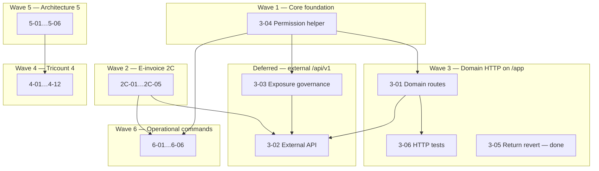

# ERP Spec 2 — Phase 2C + Phase 3+ Remaining Backlog Implementation Plan

> **Navigation:** Implements **all backlog remaining after Phase 2A + 2B** — IDs `2C-01`…`2C-05`, `3-01`…`3-06`, `4-01`…`4-13`, `5-01`…`5-06`, `6-01`…`6-06` (36 items) from
> [`specs/2026-06-30-erp-hardening-spec2-filament-domain-actions-design.md`](../specs/2026-06-30-erp-hardening-spec2-filament-domain-actions-design.md).

> **For agentic workers:** REQUIRED SUB-SKILL: Use superpowers:subagent-driven-development (recommended) or superpowers:executing-plans. Steps use checkbox (`- [ ]`) syntax.

**Status:** Point 0 reconciled 2026-08-03. Mandatory non-API ERP work and the internal `/app` action surface are complete. External `/api/v1` governance is deferred; `4-08` and `4-13` are optional and unapproved; `4-09` importers are tracked separately and excluded from this baseline.

**Phase 3 is split by surface, not deferred as a whole:**

| Half | IDs | State |
|------|-----|-------|
| Internal `/app` | `3-01`, `3-04`, `3-06` | **implemented 2026-08-01** — see [`plans/2026-07-31-domain-action-http-routes.md`](2026-07-31-domain-action-http-routes.md) |
| External `/api/v1` | `3-02`, `3-03` | deferred — no consumer yet, and `3-03` governs external exposure |

The split exists because the two surfaces have different consumers. `/app` is session-based and is
what Laraplate UI talks to; `/api/v1` is the opt-in headless API. Domain actions belong to `/app`
and are not blocked by the API decision. Design:
[`specs/2026-07-31-domain-action-http-routes-design.md`](../specs/2026-07-31-domain-action-http-routes-design.md).

**Prerequisite:** Phase 2A + Phase 2B completed and green (`Modules/ERP` feature suite).

**Current slice:** no active implementation slice. This plan is retained as completed implementation history. A new scope requires explicit approval. ERP external-source importers (`4-09`) remain independent in [`2026-07-22-erp-external-source-importers.md`](2026-07-22-erp-external-source-importers.md) and are outside Point 0.

**Goal:** Close the entire ERP master backlog: production e-invoice, Core domain-action HTTP layer + API governance, Tricount/commercial depth, operational console commands, and long-term architecture (FX, Money VO, dimensions, events).

**Architecture:** Seven implementation waves. **Phase 3 is the spine** for domain HTTP/API exposure (Core contracts + routes + exposure toggles). Phase 6 adds operational console commands as thin wrappers over existing ERP services; commands are for batch, diagnostics, polling, and scheduled work, not for bypassing domain actions that require user confirmation. Touch **Core + ERP** where noted; default submodule commits per module per task.

**Tech Stack:** PHP 8.5, Laravel 12, Filament 5, Sanctum, Pest, Core CRUD (`CrudController` / `CrudService`), Spatie Permission.

**Conventions:**
- Tests: `php artisan test --compact Modules/{Core|ERP}/tests/Feature/<File>.php`
- Format: `vendor/bin/pint --dirty`
- Code/comments: English; chat: Italian
- Optional backlog IDs may be skipped with user approval (marked **optional** below)

---

## Backlog coverage

| Phase | IDs | Count | Plan wave |
|-------|-----|------:|-----------|
| 2C | `2C-01`…`2C-05` | 5 | Wave 2 |
| 3 | `3-01`…`3-06` | 6 | Wave 1 (foundation) + Wave 3 (HTTP) |
| 4 | `4-01`…`4-13` | 13 | Wave 4 |
| 5 | `5-01`…`5-06` | 6 | Wave 5 |
| 6 | `6-01`…`6-06` | 6 | Wave 6 |
| **Total** | | **36** | |

**Not in this plan:** Phase 2A (`2A-01`…`2A-09`) and Phase 2B (`2B-01`…`2B-12`) — separate plans.

---

## Dependency overview



**Current execution order:** none. Task 1 (`3-04`), Task 8 (`3-01`), and Task 9 (`3-06`) completed on 2026-08-01. `3-03` governs only external `/api/v1` exposure and remains deferred with `3-02`.

**Phase 2C task order:** Task 3 (`2C-05`, done) → Task 4 (`2C-02`, done) → Task 5 (`2C-01`, done) → Task 6 (`2C-03`, done) → Task 7 (`2C-04`, done).

## ERP console command policy

ERP commands are allowed when they solve an operational or batch problem. They must stay thin and call existing services rather than duplicating business logic.

Use commands for:
- diagnostics and installation readiness;
- idempotent audits;
- scheduled provider polling;
- batch file imports/exports;
- batch computation with dry-run support.

Do not use commands for:
- normal invoice posting/unposting;
- document sequence reset/reservation;
- period close/reopen when an operator must approve it in UI;
- ad hoc mutations that bypass policies, model state guards, or domain-action services.

Default command contract:
- Mutating commands include `--dry-run` and write no data when it is present.
- Batch commands include `--company=`, `--limit=`, and deterministic logging.
- Commands return non-zero exit code for failed checks/imports.
- Every command has a Feature test using `$this->artisan(...)`.
- Command discovery follows `Modules\Core\Overrides\ModuleServiceProvider`, which `ERPServiceProvider` now extends.

---

## Wave 1 — Core foundation (Phase 3 prep)

### Task 1: Centralize permission-name construction (3-04) — completed 2026-08-01

**Modules:** Core (+ ERP consumer updates)  
**Backlog:** `3-04`

**Files:**
- Create: `Modules/Core/app/Support/PermissionName.php`
- Modify: `Modules/Core/app/Services/Crud/AuthorizationService.php` (or equivalent)
- Modify: `Modules/ERP/app/Policies/ERPModelPolicy.php`
- Modify: `Modules/ERP/database/seeders/ERPDatabaseSeeder.php`
- Create: `Modules/Core/tests/Feature/Support/PermissionNameTest.php`
- Modify: `Modules/ERP/tests/Feature/ErpModelPolicyTest.php` — use shared helper

- [x] **Step 1: Failing test**

```php
<?php

declare(strict_types=1);

use Illuminate\Database\Eloquent\Model;
use Modules\Core\Support\PermissionName;
use Modules\ERP\Models\Invoice;

it('builds stable permission names from model connection and table', function (): void {
    $invoice = new Invoice();

    expect(PermissionName::forModel($invoice, 'post'))
        ->toBe('default.erp_invoices.post');
});

it('accepts explicit connection override', function (): void {
    expect(PermissionName::build('tenant_a', 'erp_invoices', 'update'))
        ->toBe('tenant_a.erp_invoices.update');
});
```

- [x] **Step 2: Implement**

```php
<?php

declare(strict_types=1);

namespace Modules\Core\Support;

use Illuminate\Database\Eloquent\Model;

final class PermissionName
{
    public static function forModel(Model $model, string $operation): string
    {
        return self::build(
            $model->getConnectionName() ?? 'default',
            $model->getTable(),
            $operation,
        );
    }

    public static function build(string $connection, string $table, string $operation): string
    {
        return "{$connection}.{$table}.{$operation}";
    }
}
```

- [x] **Step 3:** Replaced duplicated permission-name construction in Core and ERP consumers.

- [x] **Step 4: Run tests + commit** (Core then ERP)

```bash
php artisan test --compact Modules/Core/tests/Feature/Support/PermissionNameTest.php
php artisan test --compact Modules/ERP/tests/Feature/ErpModelPolicyTest.php
```

---

### Task 2: Per-model CRUD/API exposure governance (3-03) — deferred

**Point 0 decision:** do not implement until an external `/api/v1` consumer and its permitted entity/operation matrix are approved. The unchecked steps below describe the candidate implementation, not active work.

**Modules:** Core  
**Backlog:** `3-03`  
**Spec reference:** Spec 1 Fix 6 follow-up — settings-driven toggles extending `core.expose_crud_api`

**Files:**
- Create: `Modules/Core/app/Contracts/ExposesCrudApi.php`
- Create: `Modules/Core/app/Services/Crud/CrudExposureRegistry.php`
- Modify: `Modules/Core/app/Services/Crud/CrudService.php` — gate **read + write** before resolve
- Modify: `Modules/Core/app/Http/Middleware/EnsureCrudApiAreEnabled.php` or new `EnsureModelCrudExposed`
- Modify: `Modules/Core/config/config.php` — document `expose_crud_api` + per-entity overrides
- Create: `Modules/Core/tests/Feature/Services/CrudExposureRegistryTest.php`
- Modify: `Modules/ERP/app/Models/JournalEntry.php` (+ other immutable models) — implement exposure contract

- [ ] **Step 1: Contract**

```php
<?php

declare(strict_types=1);

namespace Modules\Core\Contracts;

/**
 * Models may opt out of generic CRUD API exposure (read or write) beyond RestrictsCrudWrites.
 */
interface ExposesCrudApi
{
    /**
     * @return list<'select'|'insert'|'update'|'delete'|'restore'|'forceDelete'>
     */
    public static function allowedCrudOperations(): array;
}
```

Default: if not implemented, all standard CRUD ops allowed when global `expose_crud_api` is true.

- [ ] **Step 2: Registry** — resolves `{module}.{entity}` → model class; checks:
  1. Global `config('core.expose_crud_api')`
  2. Optional setting `core.crud_exposure.{module}.{entity}` (allowlist/denylist)
  3. Model `allowedCrudOperations()` if `ExposesCrudApi`

- [ ] **Step 3: Integrate in `CrudService`** — before `list`/`detail`/`insert`/etc., call `CrudExposureRegistry::assertAllowed($model, $operation)`.

**CMS safety:** gate at service entry (CrudService), not by removing routes — `ContentsController` extending `CrudController` for CMS-specific paths must not call blocked operations on ERP entities.

- [ ] **Step 4: ERP models**

| Model | Allowed via CRUD API |
|-------|---------------------|
| `JournalEntry`, `JournalEntryLine`, `VatRegisterEntry`, `StockMovement`, `StockCostLayer`, `StockLevel` | `select` only (or none) |
| Draft `Invoice`, `Party`, `Quotation`, etc. | full CRUD per permissions |

- [ ] **Step 5: Tests** — superadmin cannot `insert` on `JournalEntry` when exposure denies; `select` still works if allowed.

- [ ] **Step 6: Commit** Core `feat(core): per-model CRUD API exposure governance`

---

## Wave 2 — E-invoice production (Phase 2C)

### Task 3: FatturaPA schema columns (2C-05)

**Status:** Done

**Prerequisite for 2C-01/02.**  
**Modules:** ERP

- [x] Migration: extend `companies`, `parties`, `invoices` with SDI fields (PEC, codice destinatario, regime fiscale, REA, cap sociale, etc.) — inventory from FatturaPA v1.2.2 anagrafica minima.
- [x] Update model `$fillable`, `getRules()`, Filament forms (`PartyForm`, `Company` settings, `InvoiceForm` transmitter block).
- [x] Test: validation rejects sale e-invoice submit when mandatory SDI fields missing.

---

### Task 4: Complete SDI party/company mapping (2C-02)

**Status:** Done

**Backlog:** `2C-02`

- [x] Create: `Modules/ERP/app/Services/EInvoice/FatturaPaAnagraphicMapper.php`
- [x] Map `Company` + `Party` + `Invoice` → neutral `EInvoicePayload` extended with FatturaPA-shaped arrays (no XML yet).
- [x] Tests with fixture company/party/invoice → expected array keys (codice fiscale, partita IVA, indirizzo, regime).

---

### Task 5: Full FatturaPA XML + XSD validation (2C-01)

**Status:** Done

**Backlog:** `2C-01`

**Files:**
- Created: `Modules/ERP/app/Services/EInvoice/FatturaPaXmlBuilder.php`
- Created: `Modules/ERP/app/Services/EInvoice/FatturaPaEInvoiceProvider.php`
- Created: `Modules/ERP/resources/xsd/fatturapa/` — official FPR12 v1.2.3 XSD vendored from `fatturapa.gov.it`, with local XMLDSIG dependency for offline validation
- Modified: `Modules/ERP/app/Contracts/EInvoiceProvider.php` — `validateXml(string $xml): void`
- Created: `Modules/ERP/tests/Feature/Services/FatturaPaXmlBuilderTest.php`
- Fixture: `tests/Stubs/einvoice/golden-sale-invoice.xml`

- [x] **Step 1:** Test builds XML from posted sale invoice fixture; DOM load succeeds.
- [x] **Step 2:** `FatturaPaXmlBuilder::build(Invoice $invoice): string` using mapper from Task 4.
- [x] **Step 3:** XSD validate via `DOMDocument::schemaValidate()` in test; golden fixture added.
- [x] **Step 4:** Wire into `EInvoiceSubmissionService::submit()` when driver = `fatturapa` through `FatturaPaEInvoiceProvider`.

**No new Composer dependency** — native DOM/XSD.

Evidence: ERP `2cdcdb8`; targeted subset `21 passed, 63 assertions`.

---

### Task 6: Production provider — Aruba stub (2C-03)

**Status:** Done

**Backlog:** `2C-03`

- [x] Create: `Modules/ERP/app/Services/EInvoice/ArubaEInvoiceProvider.php` implementing `EInvoiceProvider`
- [x] Config: `config/erp.php` — `einvoice.driver` = `stub|aruba|fatturapa`; credentials via `config()` only
- [x] HTTP client: Laravel `Http::` with configurable base URL, auth base URL, upload path, notifications path, token or username/password auth; maps upload result and SDI notification outcomes
- [x] Callback route: `POST /api/v1/erp/einvoice/aruba/callbacks` with optional static API key header validation
- [x] Polling command: `erp:einvoice:refresh-statuses --company=1 --limit=50 --dry-run`
- [x] Persistence: polling payloads, callbacks, Aruba SDI identifiers, and conservation availability metadata in `EInvoiceSubmission.response_payload`
- [x] Test: `Http::fake()` — upload returns external id; refresh maps notifications; callback and command tests cover operational flow
- [x] **Production secrets:** never in repo; env via config file only

Evidence: ERP `8e0bd9e` for initial adapter; hardened 2026-07-16 with `ArubaEInvoiceProviderTest` callback/command coverage. Targeted subset after hardening: `30 passed, 71 assertions`.

**Boundary:** implementation follows Aruba v2-style upload/auth/notifications/callback concepts. Before production go-live, verify the actual contracted Aruba tenant, callback accreditation/IP allowlist, retention contract, credentials, and sandbox/prod endpoint selection.

---

### Task 7: Extended admin policies (2C-04)

**Status:** Done

**Backlog:** `2C-04`

- [x] Seed domain permissions: `default.erp_tax_codes.supersede`, `default.erp_companies.switch_context`, and `default.erp_document_sequences.reserve`
- [x] Policies on `TaxCode`, `Company` context switch, and `DocumentSequence` reservation with model state guards
- [x] Filament audit: no company switcher or tax-code supersession action exists yet; existing document-sequence reset action was already gated by policy
- [x] Tests: non-superadmin denied without explicit permission; granted users allowed; wrong model types denied

Evidence: ERP `604c53c`; targeted test subset `14 passed, 41 assertions`.

---

## Wave 3 — Domain HTTP actions & API (Phase 3)

### Task 8: Domain action registry + internal routes (3-01) — completed 2026-08-01

**Modules:** Core + ERP  
**Backlog:** `3-01`  
**Design:** [`specs/2026-07-31-domain-action-http-routes-design.md`](../specs/2026-07-31-domain-action-http-routes-design.md) — read before starting; it supersedes the sketch previously held in this task.

**Route:**

```
POST /app/crud/{action}/{module}/{entity}      id + action payload in body
```

Declared at the **end** of Core's `crud` group in `routes/web.php`, after every literal verb, so
the literals keep winning. Internal-only by construction: `routes/web.php` is not required by
`mapApiRoutes()`, so nothing reaches `/api/v1`.

**Prerequisite already in place:** Core defers its web/API route registration to
`$this->app->booted()`, so Core registers after every module and module-declared overrides win.
Verify with `php artisan route:check <url> --method=POST`.

**Files:**
- Create: `Modules/Core/app/Contracts/ExposesDomainActions.php`
- Create: `Modules/Core/app/Contracts/OverridesGenericCrudActions.php`
- Create: `Modules/Core/app/Services/Crud/DomainActionRegistry.php`
- Create: `Modules/Core/app/Services/Crud/DomainActionDispatcher.php`
- Create: `Modules/Core/app/Http/Requests/DomainActionRequest.php`
- Modify: `Modules/Core/app/Http/Controllers/CrudController.php` — `domainAction()`
- Modify: `Modules/Core/routes/web.php` — catch-all last in the group
- Create: `Modules/ERP/app/Services/DomainActions/ErpDomainActionRegistrar.php`
- Modify: `Modules/ERP/app/Providers/ERPServiceProvider.php` — register at boot
- Modify: `Modules/ERP/app/Models/ReturnOrder.php`, `SupplierReturn.php` — declare `['approve']`
- Create: `Modules/Core/tests/Feature/Http/DomainActionRouteTest.php`
- Create: `Modules/ERP/tests/Feature/Http/ErpDomainActionRouteTest.php`

- [x] **Step 1: Registry + contracts** — `{module}/{entity}/{action}` → handler. The registry, not
  the route table, decides what exists.

- [x] **Step 2: Boot-time collision guard** — registration fails when a model both declares an
  overridden verb and uses the trait giving that verb its generic meaning (`approve`/`disapprove`
  vs `HasApprovals`). Fails at application start, not on record instantiation. Write the failing
  case first.

- [x] **Step 3: Dispatcher** — authorize through `Gate`, not `ensurePermission`: the state guard is
  intrinsic to the action and `ERPModelPolicy::allowsDomainAction()` already implements it.

```php
public function dispatch(Model $record, string $action, User $user, array $payload = []): mixed
{
    if (! $user->can($this->policyMethodFor($action), $record)) {   // force_post -> forcePost
        throw new AuthorizationException();
    }

    return ($this->registry->resolve($record::class, $action))($record, $payload, $user);
}
```

- [x] **Step 4: ERP registrar** — mapped supported actions to existing services:

| Entity | Actions | Handler |
|--------|---------|---------|
| `Invoice` | `post`, `unpost`, `force_post`, `submitEInvoice`, `refreshEInvoice` | `InvoicePostingService` / `EInvoiceSubmissionService` |
| `DeliveryNote` | `post`, `unpost` | `posted_at` update |
| `FiscalPeriod` | `close`, `reopen` | `FiscalPeriodCloser` |
| `FiscalYear` | `close` | `FiscalPeriodCloser::closeYear` |
| `JournalEntry` | `reverse` | `JournalPostingService::reverse` |
| `SalesOrder` | `amend` | `SalesOrderAmendmentService` |
| `DocumentSequence` | `reset`, `reserve` | `DocumentSequenceResetService` |
| `TaxCode` | `supersede` | tax code supersession |
| `Company` | `switch_context` | company context switch |
| `ReturnOrder` | `approve`\*, `cancel`, `complete`, `reverse_processed`, `create_credit_note` | `ReturnOrderService` |
| `SupplierReturn` | `approve`\*, `cancel`, `complete`, `reverse_processed`, `create_debit_note` | `SupplierReturnService` |
| `Quotation` | `create_revision` | `QuotationRevisionService` |
| `PartnerPool` | `allocate_expense`, `settle_up` | `PartnerPoolSettlementService` |
| `PaymentRequest` | `send` | `PaymentRequestService` |
| `VatSettlement` | `compute_settlement` | `VatSettlementService` |

\* overridden generic verb — declared via `OverridesGenericCrudActions`.

**Not registered:** `unlock` on `Quotation`. It is behaviourally identical to Core's generic
`unlock` (both call `HasLocks::unlock()`), so the generic route serves it and lock/unlock stay
uniform across all classes. See the design's D6 for the permission divergence this leaves open.

**File actions are in scope on `/app`** — the UIs need them:

| Entity | Actions | Handler |
|--------|---------|---------|
| `PaymentRun` | `export_sepa`, `export_cbi_bonifici` | `SepaPain001Exporter` / `CbiBonificiExporter` |
| `Task` | `export_ics` | `TaskIcsExporter` |
| `BankStatement` | `import_file` | `BankStatementImportService` |

- [x] **Step 5: Response + error mapping** — return through `CrudResult`/`ResponseBuilder`. Added
  mappings for `ValidationException` and `DomainException`, which domain services raise and
  `handleServiceCall()` would otherwise turn into 500.

- [x] **Step 6: Binary response kind** — if a handler returns a
  `Symfony\Component\HttpFoundation\Response`, return it unchanged; otherwise wrap in a
  `CrudResult`. One rule covers streamed exports and the `multipart/form-data` import.
  Authorization and state guards must run **before** the first byte is streamed: once streaming
  starts the JSON error envelope is gone. Test both — a refused export returns a normal JSON 403,
  a permitted one returns the stream.

- [x] **Step 7: HTTP test** — authenticated user with `post` permission POSTs the action →
  200 + side effect.

- [x] **Step 8: Commit** Core + ERP

---

### Task 9: HTTP tests for domain actions (3-06) — completed 2026-08-01

**Backlog:** `3-06`  
**Depends:** Task 8

- [x] Created `Modules/ERP/tests/Feature/Http/ErpDomainActionsHttpTest.php`.
- [x] Covered authorized, missing-permission, invalid-state, unknown-action, and missing-record behavior.
- [x] Covered `force_three_way_match` as a guarded `post` payload rather than a second action.
- [x] Ran focused ERP HTTP and policy coverage during implementation.

```bash
php artisan test --compact Modules/ERP/tests/Feature/Http/
php artisan test --compact Modules/Core/tests/Feature/Http/DomainActionRouteTest.php
```

---

### Task 10: Revert/reverse processed return (3-05) — completed 2026-07-16

**Backlog:** `3-05`  
**Modules:** ERP

**Implemented truth:** processed customer/supplier returns can be reversed before any linked fiscal note exists. The implementation is intentionally conservative: linked credit/debit notes block reverse rather than being deleted or unlinked automatically.

**Files:**
- Modified: `Modules/ERP/app/Services/Returns/ReturnOrderService.php` — `reverseProcessed()`
- Modified: `Modules/ERP/app/Services/Returns/SupplierReturnService.php` — `reverseProcessed()`
- Modified: `Modules/ERP/app/Filament/Resources/ReturnOrders/Pages/EditReturnOrder.php`
- Modified: `Modules/ERP/app/Filament/Resources/SupplierReturns/Pages/EditSupplierReturn.php`
- Modified: `Modules/ERP/tests/Feature/Services/ReturnOrderServiceTest.php`
- Modified: `Modules/ERP/tests/Feature/Services/SupplierReturnServiceTest.php`

- [x] **Step 1: Failing tests** — customer and supplier processed-return reverse restores stock/returned quantities; linked NC/ND blocks reverse.
- [x] **Step 2: Implement transaction** — lock return, block linked fiscal note, unpost generated DDT through existing inventory observer/service, restore source `qty_returned`, clear `processed_at`, set status back to `Approved`.
- [x] **Step 3: Filament actions** — `reverse_processed` header actions on customer/supplier return edit pages, visible only for processed returns without linked NC/ND.
- [x] **Step 4: Verification** — `php artisan test --compact Modules/ERP/tests/Feature/Services/ReturnOrderServiceTest.php Modules/ERP/tests/Feature/Services/SupplierReturnServiceTest.php` passes.

---

### Task 11: Opt-in external API + versioning (3-02) — deferred

**Point 0 decision:** do not implement until a concrete external client contract defines authentication, versioning, rate limits, idempotency, and the required domain actions. The unchecked items below are retained design notes.

**Backlog:** `3-02`  
**Modules:** Core (+ ERP route group)

- [ ] Enable Sanctum token auth for domain-action + read-only CRUD subset
- [ ] Routes: `Route::prefix('api/v1/erp')->middleware(['auth:sanctum', 'ensure.crud.api'])`
- [ ] Reuse `DomainActionDispatcher` + `CrudExposureRegistry` — no duplicate logic
- [ ] Version header `Accept: application/vnd.laraplate.v1+json` — 406 if unsupported
- [ ] Rate limiting: `throttle:api`
- [ ] Test: token without permission → 403; with permission → domain action works
- [ ] **Default:** `expose_crud_api=false` in production config; document enablement in `Modules/Core/docs/CRUD_SYSTEM.md`

---

## Wave 4 — Tricount & commercial depth (Phase 4)

### Task 12: Movement → JournalEntry refactor (4-01) — completed 2026-07-21

**Backlog:** `4-01`  
**Nebula:** M2 accounting refactor

- [x] Expanded the original `erp_movements` migration with positive document amount, date/type, document/local currency snapshots, explicit counterparty account, and unique nullable `posted_journal_entry_id` FK.
- [x] Defined professional posting rules: income requires an active Revenue counterparty and posts bank debit/revenue credit; expense requires Expense and posts expense debit/bank credit.
- [x] Added locked/idempotent `MovementPostingService` through `JournalPostingService`, with dated FX conversion and frozen local amount/rate.
- [x] Added `CashBalanceService`, deriving balance only from posted `bank_cash` journal lines.
- [x] Added idempotent `erp:migrate-movements-to-journal` with company filter, dry-run, and per-row failure reporting.
- [x] Added focused tests for balanced signs, account-kind validation, idempotency, derived balance, dry-run, and command reruns; retained accounting golden-master regressions.

**Boundary:** the historical movement table was an empty structural stub and never stored amount/type/account data. The command therefore migrates complete unlinked rows created with the finalized schema; it cannot infer financial data that never existed. Partner allocations and settle-up remain `4-05`.

---

### Task 13: Tricount UX on journal-only writes (4-02) — completed 2026-07-21

**Backlog:** `4-02`  
**Depends:** Task 12

- [x] Added `MovementResource` with list, transactional create, and read-only detail pages; no edit route exists for posted movements.
- [x] Added company/type-aware Revenue/Expense account selection and displayed frozen document/local amounts plus linked journal.
- [x] UI creation writes only through `MovementPostingService` in the same transaction; no parallel balance table update exists.
- [x] Added Filament form/table/page smoke coverage and retained `MovementPostingService` integration tests.

**Plan correction:** pool/split UI cannot precede the `PartnerPool`/allocation model planned in `4-05`. This task closes the journal-only cash movement UX; pool allocation and settle-up UI remain explicitly owned by `4-05` rather than inventing premature persistence here.

---

### Task 14: Quote revisions + project bind locks (4-03) — completed 2026-07-21

**Backlog:** `4-03`

- [x] Added unique nullable self-FK `revises_quotation_id` in the original quotation migration and predecessor/successor relations.
- [x] Added transactional `QuotationRevisionService`: source lock, linear-chain guard, draft successor, incremented version, validity/header snapshot, and copied lines.
- [x] Added Filament **Create revision** action for locked/non-draft latest quotations.
- [x] Added project lock columns in the original migration, `HasLocks`, ORM update/delete guards, and Filament edit/delete gates.
- [x] Operational sales-order states now lock both linked quotation and project.
- [x] Corrected pre-existing nullable-FK declaration order for optional project quotation and quotation-item price-list references, preserving SQLite and cross-driver intent.
- [x] Added revision-chain, copied-line, project-lock, model-guard, resource-gate, action smoke, and commercial regression tests.

**Boundary:** this task introduced portable application enforcement. Raw-SQL defense was subsequently completed by `4-04` for MySQL/MariaDB and PostgreSQL.

---

### Task 15: DB lock-chain triggers (4-04) — completed 2026-07-21

**Backlog:** `4-04` — **D5 nebula**

- [x] MySQL/MariaDB and PostgreSQL triggers guard locked quotation, sales-order and project headers against raw update/delete.
- [x] Operational sales-order states lock linked quotation/project at DB level as defense in depth.
- [x] Creating or relinking a DDT line locks the referenced sales-order line.
- [x] Locked sales-order lines reject commercial-field changes and deletion while allowing delivery/invoice/return counters and operational status.
- [x] SQLite and Oracle use equivalent model guards for the same business contract.
- [x] Focused integration coverage proves DDT linkage, rejected commercial updates/deletion, and permitted operational progression.

**Verification:** `LockChainGuardTest`, `SalesOrderLineTest`, `SalesOrderSchemaTest`, `DeliveryNoteInventoryServiceTest`, and `InvoicePostingServiceTest` pass; `vendor/bin/pint --dirty` passes.

**Boundary:** native raw-SQL trigger enforcement is installed on MySQL/MariaDB and PostgreSQL. SQLite and Oracle rely on Eloquent guards for this specific rule; direct SQL on those engines is outside this defense.

---

### Task 16: Settlements / pool / settle-up (4-05) — completed 2026-07-21

**Backlog:** `4-05`

- [x] Added company/currency-scoped `PartnerPool`, first-class `PartnerPoolHasUser` pivot, `MovementAllocation`, and `PoolTransaction`.
- [x] Expense allocations store exact owed and paid amounts; both aggregate totals must equal the source `Movement` amount.
- [x] `PartnerPoolSettlementService` uses transactions and pessimistic locks, derives balances without mutable balance persistence, suggests debtor-to-creditor transfers, and records bounded settle-up transfers.
- [x] Added Partner Pools Filament resource with membership, expense split, and settle-up actions.
- [x] Added model/database non-negative validation, currency/company/member checks, and focused rollback/over-settlement tests.

**Verification:** `PartnerPoolSettlementServiceTest`, `ERPFilamentResourcesTest`, and `MovementPostingServiceTest` pass (`25 passed`, `130 assertions`); `vendor/bin/pint --dirty` passes.

**Boundary:** pool balances are an internal memorandum subledger derived from allocations/transfers. They do not replace journal-derived company cash, and settle-up records an internal confirmed reimbursement rather than submitting an external bank payment. External provider requests belong to `4-06`.

---

### Task 17: PaymentRequest stub + providers (4-06) — completed 2026-07-22

**Backlog:** `4-06`

- [x] Added `PaymentRequestProvider`, checkout result DTO, and deterministic no-I/O stub provider.
- [x] Added `PaymentRequest` model/schema/status lifecycle with exactly one Party or Core-user recipient and optional pool/settlement linkage.
- [x] Added transactional `PaymentRequestService` for draft send and authenticated callback application with terminal-state idempotency.
- [x] Added external `POST /api/v1/erp/payment-requests/{provider}/callbacks`; it is disabled without a provider callback key and requires Bearer authentication.
- [x] Added Filament create/list/edit plus **Send** action and checkout URL visibility.
- [x] Added provider binding, callback, recipient-invariant, terminal-state, migration, and Filament smoke tests.

**Verification:** `PaymentRequestServiceTest`, `ERPFilamentResourcesTest`, and `PartnerPoolSettlementServiceTest` pass; focused PaymentRequest coverage is `3 passed`, `13 assertions`; `vendor/bin/pint --dirty` passes.

**Boundary:** the stub URL cannot move money. A callback updates only `PaymentRequest`; it does not create `Payment`, `JournalEntry`, or `PoolTransaction`. Real provider adapters, signature/IP validation, refunds, disputes, and accounting reconciliation remain provider/go-live work.

---

### Task 18: Calendar ICS export (4-07) — completed 2026-07-22

**Backlog:** `4-07`

- [x] Added dependency-free RFC 5545 `TaskIcsExporter` with stable UID, UTC dates, text escaping, CRLF, and 75-byte folding.
- [x] Added Task Filament resource and streamed **Export calendar** action.
- [x] `SUMMARY` resolves from Activity/project fallback and `LOCATION` from canonical `Site -> Core Place` postal fields.
- [x] Added explicit immutable Task validity casts and corrected original nullable project/site FK declaration order for cross-driver behavior.
- [x] Added integrated ICS and Filament tests covering DTSTART/DTEND, SUMMARY, LOCATION, UID, line endings/folding, and Site/Place regression.

**Verification:** `TaskIcsExporterTest`, `ERPFilamentResourcesTest`, and `SitePlaceTest` pass; focused ICS coverage is `1 passed`, `7 assertions`; `vendor/bin/pint --dirty` passes.

**Boundary:** this produces an importable single-event file. Calendar subscriptions, attendees, alarms, recurrence, provider APIs, and bidirectional synchronization are outside `4-07`.

---

### Task 19: ERP sites.place_id + ICS (4-10) — completed 2026-07-22

**Backlog:** `4-10`

- [x] Verified the original `erp_sites.place_id` required FK to canonical Core `places` and existing `Site::place()` relation/validation.
- [x] Added `HasValidity` to align Site with its original validity columns.
- [x] Added Site Filament resource with company, canonical Place selector, validity fields, and address/city list columns.
- [x] Added database relation and Filament configuration tests.

**Verification:** `SitePlaceTest` and `ERPFilamentResourcesTest` pass (`22 passed`, `122 assertions`); `vendor/bin/pint --dirty` passes.

**Boundary:** Core owns postal/geographic fields. ERP stores only `place_id`; task ICS `LOCATION` formatting is completed by `4-07`.

---

### Task 20: Hide version-strategy settings for DIFF models (4-11) — completed 2026-07-22

**Backlog:** `4-11`  
**Modules:** Core + ERP

- [x] Added Core `ForcedVersionStrategySettings` discovery for concrete models declaring class-level `VersionStrategy::DIFF` across active/inactive modules.
- [x] Filtered matching historical rows from `SettingResource`, tab counts, and group options; form validation rejects recreating those names.
- [x] Kept stale database rows intact for audit/manual cleanup while removing misleading administrative controls.
- [x] Added coverage proving ERP `Account` is discovered and a historical setting is hidden while normal settings remain visible.

**Verification:** `ForcedVersionStrategySettingsTest`, `SettingResourceTest`, `ResourceConfigurationTest`, and `ForcedModelConfigurationTest` pass; focused resolver coverage is `1 passed`, `4 assertions`; `vendor/bin/pint --dirty` passes.

**Boundary:** this hides only class-forced DIFF version settings. It does not delete stale rows or generalize UI hiding to unrelated forced soft-delete/locking/translation flags.

---

### Task 21: Concurrency stress tests (4-12) — completed 2026-07-22

**Backlog:** `4-12`

- [x] Added `Modules/ERP/tests/Stress/DocumentNumberConcurrencyStressTest.php` in group `stress`, skipped by default unless `RUN_ERP_STRESS_TESTS=1` is set.
- [x] Added a reusable process harness that synchronizes 50 `pcntl` workers on an isolated temporary SQLite WAL database without touching the configured application database.
- [x] Verified 50 parallel `DocumentNumberAllocator::next()` calls produce exactly 50 unique contiguous numbers, one sequence row, and `last_number = 50`.
- [x] Documented the explicit run command in ERP developer, user, and RAG documentation: `RUN_ERP_STRESS_TESTS=1 php artisan test --group=stress`.

**Verification:** default invocation is `1 skipped`; opt-in invocation is `1 passed`, `7 assertions`; the existing 8-worker `DocumentNumberConcurrencyTest` remains `1 passed`, `7 assertions`; `vendor/bin/pint --dirty` passes.

**Boundary:** this is an application-level stress regression on isolated SQLite WAL. Production database engine load, latency, failover, and infrastructure capacity remain deployment-specific performance tests.

---

### Task 22: Optional Gantt/API mobile; separate ERP importers (4-08, 4-09, 4-13)

**Point 0:** skip `4-08` and `4-13` unless explicitly approved. `4-09` is excluded from this plan's active backlog and remains in its dedicated importer plan.

| ID | Deliverable if approved |
|----|-------------------------|
| 4-08 | `PlanningActivity` model + Filament read-only Gantt view |
| 4-09 | `erp:import` plus external legacy Symfony SQL, SPLID Excel, and supported Tricount ERP adapters; Core/CMS framework already complete |
| 4-13 | Sanctum mobile routes subset on Task 11 API |

---

## Wave 5 — Architecture (Phase 5)

### Task 23: Money value object (5-02) — completed 2026-07-16

**Backlog:** `5-02` — **do before 5-01**

- [x] Created immutable `Modules/ERP/app/ValueObjects/Money.php` on top of normalized `Decimal` arithmetic.
- [x] Added construction from decimal amount/currency, same-currency arithmetic, multiplication, sign operations, equality, zero checks, and allocation with deterministic rounding remainder.
- [x] Added focused `MoneyTest` coverage and retained existing decimal/golden-master behavior.

**Boundary:** replacing every legacy decimal/float call site is an incremental refactor, not a prerequisite for using the value object in new domain code.

---

### Task 24: Multi-currency + FX + revaluation (5-01) — completed 2026-07-16

**Backlog:** `5-01`  
**Depends:** Task 23

- [x] Replaced `NoopCurrencyConverter` binding with database-backed `DatabaseCurrencyConverter`.
- [x] Added dated `ExchangeRate` rows with source, direct lookup, and inverse conversion.
- [x] Added `FxRevaluationService` for balanced period-end unrealized gain/loss journals on open foreign-currency schedules.
- [x] Added focused conversion/revaluation tests.

**Boundary:** external FX feed import and realized FX differences during settlement remain separate enhancements.

---

### Task 25: Analytic dimensions on journal lines (5-03) — completed 2026-07-16

**Backlog:** `5-03`

- [x] Added company-owned analytic dimensions and dimension values instead of fixed project/cost-center columns.
- [x] Added first-class journal-line pivot with allocation percentage, timestamps, and soft-delete support.
- [x] Added model relations and persistence tests.

**Boundary:** automatic propagation/allocation engines and analytic reporting cubes remain future enhancements.

---

### Task 26: Integration outbox / domain events (5-04) — completed 2026-07-21

**Backlog:** `5-04`

- [x] Added generic Core `OutboxEvent`, `core_outbox_events` migration, and transactional `OutboxRecorder`.
- [x] Added ERP events for invoice posting, exact/difference payment matching, and customer/supplier return completion.
- [x] Added unique queued `PublishOutboxEventJob`, replaceable `OutboxPublisher`, and default no-I/O `StubOutboxPublisher`.
- [x] Added Core persistence/publication/rollback tests and ERP integration assertions for all three business-flow families.

**Boundary:** the default stub marks rows published without external I/O. Broker/webhook delivery, transport retries beyond the queue policy, replay tooling, and dead-letter operations require an application-specific publisher/operations slice.

---

### Task 27: Direct item-specific price lists (5-05) — completed 2026-07-21

**Backlog:** `5-05`

- [x] Added nullable `price_list_items.item_id` and made `taxonomy_id` optional in the original price-list migration; the original item migration adds the portable FK after `erp_items` exists.
- [x] Enforced exactly one item or taxonomy target in the model and Filament form.
- [x] Updated `PriceResolverService` cascade: direct item price → taxonomy fallback → party rules.
- [x] Added focused resolver/model/resource coverage, including direct precedence, items without taxonomy, and invalid ambiguous/untargeted rows.

**Boundary:** the cross-field XOR is enforced by model and UI validation. A portable corrective `ALTER TABLE ... CHECK` was intentionally avoided because supported database engines differ, especially SQLite; fresh installs still receive the item FK through the original migrations.

---

### Task 28: ERP vision meta / pluggable narrative (5-06) — completed 2026-07-21

**Backlog:** `5-06` — **optional / documentation**

- [x] Added `Modules/ERP/docs/VISION.md` with module boundaries, invariants, supported bindings, stable integration events, deferred work, and implementation checklist.
- [x] Documented the actual `ERPServiceProvider` extension surface in README/user/developer RAG: chart-of-accounts, currency, e-invoice, and Core outbox contracts.
- [x] Audited tagged hooks: none exist today. Parser/export services are workflow-selected and must not be described as auto-discovered plugins.

**Boundary:** payment provider discovery and generic tagged registries are not implemented. Introduce them only with a concrete independently installed provider requirement and focused lifecycle/configuration tests.

---

## Wave 6 — Operational console commands (Phase 6)

These commands are not a replacement for Filament/domain actions. They provide operator tooling for diagnostics, scheduled polling, imports, and controlled batch computations.

### Task 29: ERP health-check command (6-01) — completed 2026-07-19

**Status:** Done  
**Backlog:** `6-01`  
**Modules:** ERP

**Command:** `php artisan erp:health-check`

**Files:**
- Created: `Modules/ERP/app/Console/HealthCheckCommand.php`
- Created: `Modules/ERP/app/Services/Diagnostics/ErpHealthCheckService.php`
- Command discovery is provided by the Core module service-provider override already used by ERP; no duplicate manual command registry is required.
- Created: `Modules/ERP/tests/Feature/Console/HealthCheckCommandTest.php`
- Updated: module README, user/developer RAG, glossary, plan, and master specification.

**Checks:**
- default company exists;
- chart of accounts has rows for default company;
- current fiscal year and periods exist;
- required domain permissions exist (`post`, `unpost`, e-invoice, sequence/admin permissions);
- at least one document sequence exists for the current year;
- e-invoice driver config is internally valid (`stub`, `fatturapa`, `aruba`; Aruba requires base URL/token when selected);
- command reports warning, failure, and success counts.

- [x] **Step 1: Failure test** — `--format=json` returns non-zero and reports missing prerequisites.
- [x] **Step 2: Implement command/service** — all checks are read-only and missing tables/configuration become diagnostic failures rather than uncaught exceptions.
- [x] **Step 3: Happy-path test** — seeded company/accounting/permissions plus current sequence returns success.
- [x] **Step 4: Verify discovery** — command is auto-discovered through the Core module provider override.
- [x] **Step 5: Docs + verification** — `4 passed (12 assertions)`; Pint passes.

```bash
php artisan test --compact Modules/ERP/tests/Feature/Console/HealthCheckCommandTest.php
git -C Modules/ERP commit -m "feat(erp): add health check command"
```

---

### Task 30: Document sequence audit command (6-02) — completed 2026-07-19

**Status:** Done  
**Backlog:** `6-02`  
**Modules:** ERP

**Command:** `php artisan erp:sequences:audit --company=1 --year=2026`

**Files:**
- Created: `Modules/ERP/app/Console/DocumentSequencesAuditCommand.php`
- Created: `Modules/ERP/app/Services/Accounting/DocumentSequenceAuditService.php`
- Created: `Modules/ERP/tests/Feature/Console/DocumentSequencesAuditCommandTest.php`
- Created: `Modules/ERP/tests/Feature/Services/DocumentSequenceAuditServiceTest.php`

**Audit scope:**
- compare `DocumentSequence.last_number` against max posted document reference per document type where references are parseable;
- warn when a required sequence is missing for a document type used in the selected year;
- warn on duplicate formatted numbers;
- report gaps only when `gap_allowed=false` and reliable posted-document data exists.

**No mutation:** this command is read-only. Sequence repair remains a deliberate UI/domain action because it is operationally dangerous.

- [x] **Step 1: Service test** — aligned invoice references produce a consistent result.
- [x] **Step 2: Mismatch/duplicate/gap tests** — counter behind documents and duplicate references fail; gap-free stream holes warn; audit does not mutate sequence state.
- [x] **Step 3: Command test** — JSON output and non-zero exit code cover hard inconsistencies.
- [x] **Step 4: Implement service + command** — supports default/explicit company, current/explicit year, table/JSON output, and clean database error handling.
- [x] **Step 5: Docs + verification** — combined command diagnostics subset: `9 passed (22 assertions)`; Pint passes.

**Audit boundary:** invoices and sales/purchase orders have reliable persisted references. `Quotation` and `InternalJournal` sequence rows are reported as non-auditable because those models do not persist an equivalent generated reference; no fragile inference is attempted.

```bash
php artisan test --compact Modules/ERP/tests/Feature/Services/DocumentSequenceAuditServiceTest.php Modules/ERP/tests/Feature/Console/DocumentSequencesAuditCommandTest.php
git -C Modules/ERP commit -m "feat(erp): add document sequence audit command"
```

---

### Task 31: E-invoice status polling command (6-03)

**Status:** Done 2026-07-16  
**Backlog:** `6-03`  
**Modules:** ERP

**Command:** `php artisan erp:einvoice:refresh-statuses --company=1 --limit=50 --dry-run`

**Files:**
- Created: `Modules/ERP/app/Console/EInvoiceRefreshStatusesCommand.php`
- Modified: `Modules/ERP/app/Services/EInvoice/EInvoiceSubmissionService.php`
- Covered by: `Modules/ERP/tests/Feature/Services/ArubaEInvoiceProviderTest.php`

**Implemented behavior:**
- processes open submissions only (`queued` / `submitted`);
- filters by company, provider code, and limit;
- calls `EInvoiceSubmissionService::refresh()` per row;
- continues after a single-row provider failure and reports failures at the end;
- supports `--dry-run` by listing candidates without contacting the provider;
- intended scheduler cadence remains host-app policy, not hardcoded in ERP.

Verification: `php artisan test --compact Modules/ERP/tests/Feature/Services/ArubaEInvoiceProviderTest.php` -> `9 passed, 26 assertions`; e-invoice/provider subset -> `30 passed, 71 assertions`.


---

### Task 32: Bank statement batch import command (6-04) — completed 2026-07-19

**Status:** Done  
**Backlog:** `6-04`  
**Modules:** ERP

**Command:** `php artisan erp:bank-statements:import --bank-account=1 --format=camt053 --path=storage/app/erp-bank-imports --dry-run`

**Files:**
- Created: `Modules/ERP/app/Console/BankStatementsImportCommand.php`
- Created: `Modules/ERP/app/Services/Banking/BankStatementBatchImportService.php`
- Created: `Modules/ERP/tests/Feature/Console/BankStatementsImportCommandTest.php`
- Created: `Modules/ERP/tests/Feature/Services/BankStatementBatchImportServiceTest.php`
- Modified: original bank-statement migration/model with per-account SHA-256 source checksum.
- Modified: existing CSV and structured import services to expose side-effect-free parsing.

**Batch behavior:**
- import all supported files from a directory (`csv`, `camt053`, `mt940`) or one explicit file path;
- create or reuse a `BankStatement` per file/import batch;
- delegate parsing to `BankStatementImportService` / `BankStatementCsvImporter`;
- support `--dry-run` by parsing and reporting counts without creating statements/lines;
- move successfully imported files only if an explicit `--archive-path=` is supplied;
- never auto-confirm reconciliation matches.

- [x] **Step 1: Dry-run test** — CAMT fixture reports two lines and creates no statement/line rows.
- [x] **Step 2: Import test** — CAMT/MT940/CSV delegate to existing parsers/import service and derive statement period boundaries.
- [x] **Step 3: Duplicate file test** — per-bank-account SHA-256 checksum skips repeated imports independent of file name/path.
- [x] **Step 4: Implement service + command** — file/directory input, auto/explicit format, per-file continuation, table/JSON output, and explicit optional archive path.
- [x] **Step 5: Docs + verification** — batch and existing importer/parser suites: `16 passed (78 assertions)`; Pint passes.

**Safety boundary:** the command never auto-confirms reconciliation matches. `--dry-run` never writes or moves files. Source files move only when `--archive-path` is explicitly supplied after successful persistence; retries remain checksum-idempotent.

```bash
php artisan test --compact Modules/ERP/tests/Feature/Services/BankStatementBatchImportServiceTest.php Modules/ERP/tests/Feature/Console/BankStatementsImportCommandTest.php
git -C Modules/ERP commit -m "feat(erp): add bank statement import command"
```

---

### Task 33: VAT settlement compute command (6-05) — completed 2026-07-21

**Status:** Done  
**Backlog:** `6-05`  
**Modules:** ERP

**Command:** `php artisan erp:vat-settlements:compute --company=1 --year=2026 --period=2026-03 --dry-run`

**Files:**
- Created: `Modules/ERP/app/Console/VatSettlementsComputeCommand.php`
- Created: `Modules/ERP/app/Services/Accounting/VatSettlementBatchService.php`
- Created: `Modules/ERP/tests/Feature/Console/VatSettlementsComputeCommandTest.php`
- Created: `Modules/ERP/tests/Feature/Services/VatSettlementBatchServiceTest.php`
- Modified: `VatSettlementService` with shared side-effect-free `preview()` calculation and company/period ownership validation.

**Batch behavior:**
- compute one period or all open periods in a fiscal year;
- delegate calculation to `VatSettlementService`;
- never modify confirmed settlements;
- support `--dry-run` by returning computed amounts without persisting;
- no payment/F24 submission; this is accounting computation only.

- [x] **Step 1: Dry-run test** — open periods return calculated previews and create no settlement rows.
- [x] **Step 2: Persist test** — non-dry runs create/update draft settlements only.
- [x] **Step 3: Confirmed/closed guard** — confirmed settlements and closed periods are skipped and never modified.
- [x] **Step 4: Implement service + command** — default/explicit company, fiscal year, optional `YYYY-N` period, table/JSON output, and per-period continuation.
- [x] **Step 5: Docs + verification** — batch, command, service, VAT register, and accounting golden-master subset: `24 passed (99 assertions)`; Pint passes.

**Safety boundary:** this command computes drafts only. It never confirms settlements and never performs payment or F24 submission.

```bash
php artisan test --compact Modules/ERP/tests/Feature/Services/VatSettlementBatchServiceTest.php Modules/ERP/tests/Feature/Console/VatSettlementsComputeCommandTest.php
git -C Modules/ERP commit -m "feat(erp): add vat settlement compute command"
```

---

### Task 34: Report snapshot/export command (6-06) — completed 2026-07-16

**Status:** Done  
**Backlog:** `6-06`  
**Modules:** ERP

**Command:** `php artisan erp:reports:snapshot --company=1 --from=… --to=… --dry-run`

**Delivered instead of the sketch below.** The work was implemented as Task 36 with a wider
scope: rather than writing timestamped CSV files to a disk, it persists an immutable archive
row per snapshot (report key, parameters, JSON payload, CSV content, base64 PDF, content hash).
The immutable archive table, listed here as "a separate future feature", was built as part of it.

- [x] Created: `Modules/ERP/app/Console/ReportSnapshotCommand.php`
- [x] Created: `Modules/ERP/app/Services/Reporting/ReportSnapshotService.php`
- [x] Created: `Modules/ERP/app/Services/Reporting/ReportPdfExporter.php`
- [x] Created: `Modules/ERP/app/Models/ReportSnapshot.php` + migration
- [x] Created: `Modules/ERP/tests/Feature/Services/ReportSnapshotServiceTest.php`
- [x] Supports `trial_balance`, `income_statement`, `balance_sheet` with `--company`, `--from`, `--to`, `--dry-run`

**Deviation from the original sketch:** `sales-pipeline` and `stock-valuation` are not covered by
the command; they remain available as Filament CSV exports from `2B-12`. Report keys use
underscores (`trial_balance`), not hyphens. The class is `ReportSnapshotCommand`, not
`ReportsSnapshotCommand`.

Verification: `php artisan test --compact Modules/ERP/tests/Feature/Services/ReportSnapshotServiceTest.php Modules/ERP/tests/Feature/FinancialStatementsTest.php` -> `16 passed, 48 assertions`.

---

> **Tasks 35–38 are enterprise follow-ups recorded outside the `2C`/`3`/`4`/`5`/`6` numbering.**
> They were originally numbered 33–36, colliding with the Wave 6 tasks below. Tasks 37 and 38
> duplicate work already tracked as Tasks 24, 23 and 25; they are kept for their evidence and
> cross-referenced rather than deleted.

### Task 35: Italian bank file exports beyond SEPA SCT

**Status:** Done 2026-07-16  
**Modules:** ERP

**Implemented files:**
- `Modules/ERP/app/Services/Payments/CbiBonificiExporter.php`
- `Modules/ERP/app/Services/Payments/ItalianReceivableBankFileExporter.php`
- `Modules/ERP/app/Casts/PaymentRunFormat.php`
- `Modules/ERP/app/Models/PartyBankAccount.php`
- `Modules/ERP/database/migrations/2026_07_11_150000_create_party_bank_accounts_table.php`
- `Modules/ERP/app/Filament/Resources/PaymentRuns/Actions/PaymentRunActions.php`

**Scope:**
- CBI bonifici is integrated with approved supplier `PaymentRun` export and stores export file name/checksum like SEPA.
- Ri.Ba and SDD CORE are generated from customer receivable `PaymentScheduleLine` rows; SDD requires mandate reference/date on the customer `PartyBankAccount`.
- No direct bank submission is performed.
- Bank-specific certification/proprietary profile variants remain go-live tasks.

Verification: `php artisan test --compact Modules/ERP/tests/Feature/Services/SepaPain001ExporterTest.php Modules/ERP/tests/Feature/Services/ItalianReceivableBankFileExporterTest.php Modules/ERP/tests/Feature/Services/PaymentRunBuilderServiceTest.php Modules/ERP/tests/Feature/Filament/PaymentRunResourceTest.php` -> `14 passed, 55 assertions`.


---

### Task 36: Immutable financial report snapshots and PDF archives

**Status:** Done 2026-07-16  
**Modules:** ERP

**Implemented files:**
- `Modules/ERP/database/migrations/2026_07_16_120000_create_report_snapshots_table.php`
- `Modules/ERP/app/Models/ReportSnapshot.php`
- `Modules/ERP/app/Services/Reporting/ReportPdfExporter.php`
- `Modules/ERP/app/Services/Reporting/ReportSnapshotService.php`
- `Modules/ERP/app/Console/ReportSnapshotCommand.php`
- `Modules/ERP/tests/Feature/Services/ReportSnapshotServiceTest.php`

**Scope:**
- Immutable archive table stores report key, parameters, JSON payload, CSV content, base64 PDF content, generated timestamp, and content hash.
- Model blocks updates/deletes for immutable rows.
- `erp:reports:snapshot` supports `trial_balance`, `income_statement`, and `balance_sheet`, with `--company`, `--from`, `--to`, and `--dry-run`.
- PDF renderer is dependency-free and intentionally simple; richer paginated/report-design PDF rendering remains an enhancement.

Verification: `php artisan test --compact Modules/ERP/tests/Feature/Services/ReportSnapshotServiceTest.php Modules/ERP/tests/Feature/FinancialStatementsTest.php` -> `16 passed, 48 assertions`.


---

### Task 37: Multi-currency FX rates and unrealized revaluation (same work as Task 24 / `5-01`)

**Status:** Done 2026-07-16  
**Modules:** ERP

**Implemented files:**
- `Modules/ERP/database/migrations/2026_07_16_130000_create_exchange_rates_table.php`
- `Modules/ERP/app/Models/ExchangeRate.php`
- `Modules/ERP/app/Services/Currency/DatabaseCurrencyConverter.php`
- `Modules/ERP/app/Services/Currency/FxRevaluationService.php`
- `Modules/ERP/tests/Feature/Services/FxRevaluationServiceTest.php`

**Scope:**
- Historical FX rates with source and date.
- Converter resolves identity, latest direct rates, and inverse rates.
- ERP service binding now uses `DatabaseCurrencyConverter`.
- Unrealized FX revaluation posts balanced journal entries for open foreign-currency payment schedules using caller-supplied balance/gain/loss accounts.

**Still future:** external provider feed imports, realized FX differences during settlement, and full close automation.

Verification: `php artisan test --compact Modules/ERP/tests/Feature/Services/FxRevaluationServiceTest.php Modules/ERP/tests/Feature/Providers/ERPServiceProviderTest.php` -> `6 passed, 16 assertions`.


---

### Task 38: Money value object and analytic dimensions (same work as Tasks 23 + 25 / `5-02`, `5-03`)

**Status:** Done 2026-07-16  
**Modules:** ERP

**Implemented files:**
- `Modules/ERP/app/ValueObjects/Money.php`
- `Modules/ERP/database/migrations/2026_07_16_140000_create_analytic_dimensions_tables.php`
- `Modules/ERP/app/Models/AnalyticDimension.php`
- `Modules/ERP/app/Models/AnalyticDimensionValue.php`
- `Modules/ERP/app/Models/Pivot/JournalEntryLineHasAnalyticDimensionValue.php`
- `Modules/ERP/app/Models/JournalEntryLine.php`
- `Modules/ERP/tests/Feature/Support/MoneyTest.php`
- `Modules/ERP/tests/Feature/Models/AnalyticDimensionTest.php`

**Scope:**
- `Money` is immutable and supports normalized amount/currency, same-currency arithmetic, negate/abs, equality, and allocation with rounding remainder.
- Analytic dimensions are modeled as company dimensions and values.
- Journal entry lines can attach analytic values through a first-class pivot with `allocation_percent` and timestamps.

**Still future:** refactor every legacy float helper to `Money`, analytic reporting cubes, allocation engines, and automatic propagation from operational documents.

Verification: `php artisan test --compact Modules/ERP/tests/Feature/Support/MoneyTest.php Modules/ERP/tests/Feature/Models/AnalyticDimensionTest.php Modules/ERP/tests/Feature/Support/DecimalTest.php` -> `9 passed, 31 assertions`.

---

---

## Future release verification

These commands are release gates, not open ERP feature tasks. Run them after any newly approved implementation slice.

- [ ] **Run targeted suites**

```bash
php artisan test --compact Modules/Core/tests/Feature
php artisan test --compact Modules/ERP/tests/Feature
```

- [ ] **Accounting golden master** — must stay green after Waves 4–5:

```bash
php artisan test --compact Modules/ERP/tests/Feature/AccountingGoldenMasterTest.php
```

- [ ] **Update spec master** — move completed IDs from § Open to § Completed with commit SHAs

- [ ] **Version bumps** — evaluate Core + ERP per `08-versioning.mdc`; ask user before `composer version:*`

---

## Self-review checklist

| Phase | IDs | Tasks |
|-------|-----|-------|
| 2C | 2C-01…05 | 3–7 |
| 3 | 3-01…06 | 1–2, 8–11 |
| 4 | 4-01…07, 4-10…12 | 12–21 |
| 4 opt | 4-08, 4-09, 4-13 | 22 |
| 5 | 5-01…06 | 23–28 |
| 6 | 6-01…06 | 29–34 |

**Cross-cutting resolved:**
- Spec 1 → Spec 3 exposure governance: Task 2
- Permission prefix centralization: Task 1
- Domain HTTP routes: Task 8
- Return cancel/revert gap: Task 10
- Operational console command gap: Tasks 29–34
- PDF export (deferred from 2B): not in scope — add to backlog or 2C follow-up if needed

---

## Point 0 handoff

Plan saved to `docs/superpowers/plans/2026-06-30-erp-hardening-spec2-phase3-remaining.md`.

No implementation wave is active. Select one of the four tracked but inactive rows (`3-02`, `3-03`, `4-08`, `4-13`) only after approving its consumer and scope. Importers remain outside this Point 0 handoff.
