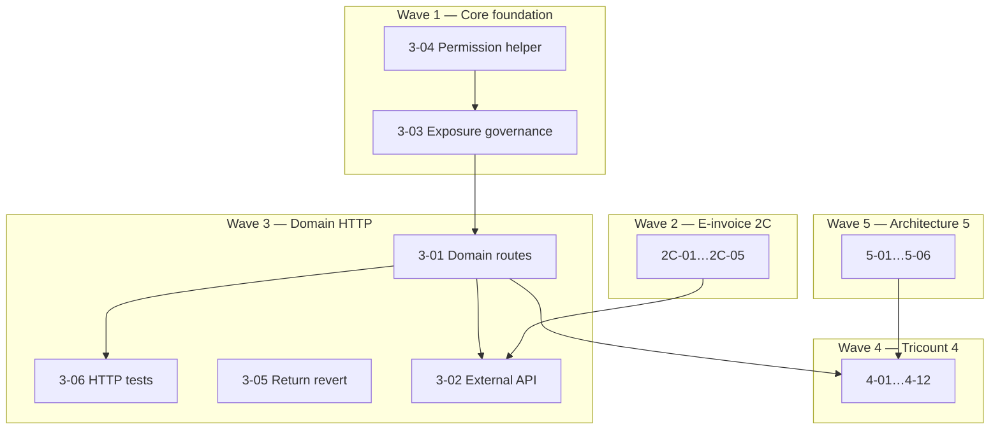

# ERP Spec 2 — Phase 2C + Phase 3+ Remaining Backlog Implementation Plan

> **Navigation:** Implements **all backlog remaining after Phase 2A + 2B** — IDs `2C-01`…`2C-05`, `3-01`…`3-06`, `4-01`…`4-13`, `5-01`…`5-06` (30 items) from
> [`specs/2026-06-30-erp-hardening-spec2-filament-domain-actions-design.md`](../specs/2026-06-30-erp-hardening-spec2-filament-domain-actions-design.md).

> **For agentic workers:** REQUIRED SUB-SKILL: Use superpowers:subagent-driven-development (recommended) or superpowers:executing-plans. Steps use checkbox (`- [ ]`) syntax.

**Status:** Active — Phase 2C selected as the current implementation slice after Phase 2B closure  
**Prerequisite:** Phase 2A + Phase 2B completed and green (`Modules/ERP` feature suite).

**Current slice:** Phase 2C / Wave 2. Tasks 3 (`2C-05`) and 4 (`2C-02`) are complete; continue with Task 5 (`2C-01`) to build and validate FatturaPA XML from the mapped payload.

**Goal:** Close the entire ERP master backlog: production e-invoice, Core domain-action HTTP layer + API governance, Tricount/commercial depth, and long-term architecture (FX, Money VO, dimensions, events).

**Architecture:** Six implementation waves. **Phase 3 is the spine** for domain HTTP/API exposure (Core contracts + routes + exposure toggles). Phase 2C can proceed independently for the e-invoice production path because it is driven by ERP invoice data, provider contracts, XML generation, and admin permissions. Touch **Core + ERP** where noted; default submodule commits per module per task.

**Tech Stack:** PHP 8.5, Laravel 12, Filament 5, Sanctum, Pest, Core CRUD (`CrudController` / `CrudService`), Spatie Permission.

**Conventions:**
- Tests: `php artisan test --compact Modules/{Core|ERP}/tests/Feature/<File>.php`
- Format: `vendor/bin/pint --dirty`
- Code/comments: English; chat: Italian
- Optional backlog IDs may be skipped with user approval (marked **optional** below)

---

## Backlog coverage

| Phase | IDs | Count | Plan wave |
|-------|-----|------:|-----------|
| 2C | `2C-01`…`2C-05` | 5 | Wave 2 |
| 3 | `3-01`…`3-06` | 6 | Wave 1 (foundation) + Wave 3 (HTTP) |
| 4 | `4-01`…`4-13` | 13 | Wave 4 |
| 5 | `5-01`…`5-06` | 6 | Wave 5 |
| **Total** | | **30** | |

**Not in this plan:** Phase 2A (`2A-01`…`2A-09`) and Phase 2B (`2B-01`…`2B-12`) — separate plans.

---

## Dependency overview



**Current execution order:** Wave 2 / Phase 2C now → Wave 1 → Wave 3 → Wave 4 → Wave 5.

**Phase 2C task order:** Task 3 (`2C-05`, done) → Task 4 (`2C-02`, done) → Task 5 (`2C-01`, next) → Task 6 (`2C-03`) → Task 7 (`2C-04`).

---

## Wave 1 — Core foundation (Phase 3 prep)

### Task 1: Centralize permission-name construction (3-04)

**Modules:** Core (+ ERP consumer updates)  
**Backlog:** `3-04`

**Files:**
- Create: `Modules/Core/app/Support/PermissionName.php`
- Modify: `Modules/Core/app/Services/Crud/AuthorizationService.php` (or equivalent)
- Modify: `Modules/ERP/app/Policies/ERPModelPolicy.php`
- Modify: `Modules/ERP/database/seeders/ERPDatabaseSeeder.php`
- Create: `Modules/Core/tests/Feature/Support/PermissionNameTest.php`
- Modify: `Modules/ERP/tests/Feature/ErpModelPolicyTest.php` — use shared helper

- [ ] **Step 1: Failing test**

```php
<?php

declare(strict_types=1);

use Illuminate\Database\Eloquent\Model;
use Modules\Core\Support\PermissionName;
use Modules\ERP\Models\Invoice;

it('builds stable permission names from model connection and table', function (): void {
    $invoice = new Invoice();

    expect(PermissionName::forModel($invoice, 'post'))
        ->toBe('default.erp_invoices.post');
});

it('accepts explicit connection override', function (): void {
    expect(PermissionName::build('tenant_a', 'erp_invoices', 'update'))
        ->toBe('tenant_a.erp_invoices.update');
});
```

- [ ] **Step 2: Implement**

```php
<?php

declare(strict_types=1);

namespace Modules\Core\Support;

use Illuminate\Database\Eloquent\Model;

final class PermissionName
{
    public static function forModel(Model $model, string $operation): string
    {
        return self::build(
            $model->getConnectionName() ?? 'default',
            $model->getTable(),
            $operation,
        );
    }

    public static function build(string $connection, string $table, string $operation): string
    {
        return "{$connection}.{$table}.{$operation}";
    }
}
```

- [ ] **Step 3:** Replace duplicated `sprintf('%s.%s.%s', ...)` in `ERPModelPolicy`, seeders, and `AuthorizationService` permission resolution.

- [ ] **Step 4: Run tests + commit** (Core then ERP)

```bash
php artisan test --compact Modules/Core/tests/Feature/Support/PermissionNameTest.php
php artisan test --compact Modules/ERP/tests/Feature/ErpModelPolicyTest.php
```

---

### Task 2: Per-model CRUD/API exposure governance (3-03)

**Modules:** Core  
**Backlog:** `3-03`  
**Spec reference:** Spec 1 Fix 6 follow-up — settings-driven toggles extending `core.expose_crud_api`

**Files:**
- Create: `Modules/Core/app/Contracts/ExposesCrudApi.php`
- Create: `Modules/Core/app/Services/Crud/CrudExposureRegistry.php`
- Modify: `Modules/Core/app/Services/Crud/CrudService.php` — gate **read + write** before resolve
- Modify: `Modules/Core/app/Http/Middleware/EnsureCrudApiAreEnabled.php` or new `EnsureModelCrudExposed`
- Modify: `Modules/Core/config/config.php` — document `expose_crud_api` + per-entity overrides
- Create: `Modules/Core/tests/Feature/Services/CrudExposureRegistryTest.php`
- Modify: `Modules/ERP/app/Models/JournalEntry.php` (+ other immutable models) — implement exposure contract

- [ ] **Step 1: Contract**

```php
<?php

declare(strict_types=1);

namespace Modules\Core\Contracts;

/**
 * Models may opt out of generic CRUD API exposure (read or write) beyond RestrictsCrudWrites.
 */
interface ExposesCrudApi
{
    /**
     * @return list<'select'|'insert'|'update'|'delete'|'restore'|'forceDelete'>
     */
    public static function allowedCrudOperations(): array;
}
```

Default: if not implemented, all standard CRUD ops allowed when global `expose_crud_api` is true.

- [ ] **Step 2: Registry** — resolves `{module}.{entity}` → model class; checks:
  1. Global `config('core.expose_crud_api')`
  2. Optional setting `core.crud_exposure.{module}.{entity}` (allowlist/denylist)
  3. Model `allowedCrudOperations()` if `ExposesCrudApi`

- [ ] **Step 3: Integrate in `CrudService`** — before `list`/`detail`/`insert`/etc., call `CrudExposureRegistry::assertAllowed($model, $operation)`.

**CMS safety:** gate at service entry (CrudService), not by removing routes — `ContentsController` extending `CrudController` for CMS-specific paths must not call blocked operations on ERP entities.

- [ ] **Step 4: ERP models**

| Model | Allowed via CRUD API |
|-------|---------------------|
| `JournalEntry`, `JournalEntryLine`, `VatRegisterEntry`, `StockMovement`, `StockCostLayer`, `StockLevel` | `select` only (or none) |
| Draft `Invoice`, `Party`, `Quotation`, etc. | full CRUD per permissions |

- [ ] **Step 5: Tests** — superadmin cannot `insert` on `JournalEntry` when exposure denies; `select` still works if allowed.

- [ ] **Step 6: Commit** Core `feat(core): per-model CRUD API exposure governance`

---

## Wave 2 — E-invoice production (Phase 2C)

### Task 3: FatturaPA schema columns (2C-05)

**Status:** Done

**Prerequisite for 2C-01/02.**  
**Modules:** ERP

- [x] Migration: extend `companies`, `parties`, `invoices` with SDI fields (PEC, codice destinatario, regime fiscale, REA, cap sociale, etc.) — inventory from FatturaPA v1.2.2 anagrafica minima.
- [x] Update model `$fillable`, `getRules()`, Filament forms (`PartyForm`, `Company` settings, `InvoiceForm` transmitter block).
- [x] Test: validation rejects sale e-invoice submit when mandatory SDI fields missing.

---

### Task 4: Complete SDI party/company mapping (2C-02)

**Status:** Done

**Backlog:** `2C-02`

- [x] Create: `Modules/ERP/app/Services/EInvoice/FatturaPaAnagraphicMapper.php`
- [x] Map `Company` + `Party` + `Invoice` → neutral `EInvoicePayload` extended with FatturaPA-shaped arrays (no XML yet).
- [x] Tests with fixture company/party/invoice → expected array keys (codice fiscale, partita IVA, indirizzo, regime).

---

### Task 5: Full FatturaPA XML + XSD validation (2C-01)

**Status:** Next

**Backlog:** `2C-01`

**Files:**
- Create: `Modules/ERP/app/Services/EInvoice/FatturaPaXmlBuilder.php`
- Create: `Modules/ERP/resources/xsd/fatturapa/` — official XSD subset (vendored, no runtime download)
- Modify: `Modules/ERP/app/Contracts/EInvoiceProvider.php` — optional `validateXml(string $xml): void`
- Create: `Modules/ERP/tests/Feature/Services/EInvoice/FatturaPaXmlBuilderTest.php`
- Fixture: `tests/Stubs/einvoice/golden-sale-invoice.xml`

- [ ] **Step 1:** Test builds XML from posted sale invoice fixture; DOM load succeeds.
- [ ] **Step 2:** `FatturaPaXmlBuilder::build(Invoice $invoice): string` using mapper from Task 4.
- [ ] **Step 3:** XSD validate via `DOMDocument::schemaValidate()` in test; fail test on invalid fixture.
- [ ] **Step 4:** Wire into `EInvoiceSubmissionService::submit()` when driver = `fatturapa`.

**No new Composer dependency** — native DOM/XSD.

---

### Task 6: Production provider — Aruba stub (2C-03)

**Backlog:** `2C-03`

- [ ] Create: `Modules/ERP/app/Services/EInvoice/ArubaEInvoiceProvider.php` implementing `EInvoiceProvider`
- [ ] Config: `config/erp.php` — `einvoice.driver` = `stub|aruba|fatturapa`; credentials via `config()` only
- [ ] HTTP client: Laravel `Http::` with sandbox base URL; map submit/remoteStatus to Aruba API shape (document from Aruba dev docs)
- [ ] Test: `Http::fake()` — submit returns external id; refresh maps status
- [ ] **Production secrets:** never in repo; env via config file only

---

### Task 7: Extended admin policies (2C-04)

**Backlog:** `2C-04`

- [ ] Seed domain permissions: `tax_codes.supersede`, `companies.switch_context` (if multi-company UI), document sequence admin ops beyond `reset`
- [ ] Policies on `TaxCode`, `Company` (context switch), `DocumentSequence` — use `PermissionName` + state guards where applicable
- [ ] Filament: gate company switcher / dangerous tax code actions on permissions
- [ ] Tests: non-superadmin denied without explicit permission

---

## Wave 3 — Domain HTTP actions & API (Phase 3)

### Task 8: Domain action registry + internal routes (3-01)

**Modules:** Core + ERP  
**Backlog:** `3-01`

**Design:** Mirror existing CRUD routes (`Modules/Core/routes/crud.php`) — add:

```
POST /crud/action/{module}/{entity}/{id}/{action}
```

**Files:**
- Create: `Modules/Core/app/Contracts/ExposesDomainActions.php`
- Create: `Modules/Core/app/Services/Crud/DomainActionDispatcher.php`
- Create: `Modules/Core/app/Http/Requests/DomainActionRequest.php`
- Modify: `Modules/Core/app/Http/Controllers/CrudController.php` — `domainAction()`
- Modify: `Modules/Core/routes/web.php`
- Create: `Modules/ERP/app/Services/DomainActions/ErpDomainActionRegistrar.php`
- Modify: `Modules/ERP/app/Providers/ERPServiceProvider.php` — register ERP actions at boot
- Create: `Modules/Core/tests/Feature/Http/DomainActionRouteTest.php`
- Create: `Modules/ERP/tests/Feature/Http/ErpDomainActionRouteTest.php`

- [ ] **Step 1: Core contract**

```php
<?php

declare(strict_types=1);

namespace Modules\Core\Contracts;

use Illuminate\Database\Eloquent\Model;
use Modules\Core\Models\User;

interface ExposesDomainActions
{
    /**
     * @return list<string>
     */
    public static function exposedDomainActions(): array;
}
```

- [ ] **Step 2: Dispatcher**

```php
public function dispatch(
    Model $record,
    string $action,
    User $user,
    array $payload = [],
): mixed {
    $policy_method = $this->policyMethodFor($action); // force_post -> forcePost
    if (! $user->can($policy_method, $record)) {
        throw new AuthorizationException();
    }
    $handler = $this->registry->resolve($record::class, $action);
    return $handler($record, $payload, $user);
}
```

- [ ] **Step 3: ERP registrar** — map actions to existing services (post-2A):

| Entity | Actions | Handler |
|--------|---------|---------|
| `Invoice` | `post`, `unpost`, `submitEInvoice`, `refreshEInvoice` | `InvoicePostingService` / `EInvoiceSubmissionService` |
| `DeliveryNote` | `post`, `unpost` | `posted_at` update |
| `FiscalPeriod` | `close`, `reopen` | `FiscalPeriodCloser` |
| `FiscalYear` | `close` | `FiscalPeriodCloser::closeYear` |
| `JournalEntry` | `reverse` | `JournalPostingService::reverse` |
| `SalesOrder` | `amend` | `SalesOrderAmendmentService` |
| `Quotation` | `unlock` | `$record->unlock()` |
| `DocumentSequence` | `reset` | `DocumentSequenceResetService` |
| `ReturnOrder` | `revert` | Task 10 service |

- [ ] **Step 4: Failing HTTP test** — authenticated user with `post` permission POSTs action → 200 + side effect.

- [ ] **Step 5: Commit** Core + ERP

---

### Task 9: HTTP tests for domain actions (3-06)

**Backlog:** `3-06`  
**Depends:** Task 8

- [ ] Create: `Modules/ERP/tests/Feature/Http/ErpDomainActionsHttpTest.php`
- [ ] Cover matrix: authorized → 200, missing permission → 403, invalid state → 403, unknown action → 404
- [ ] Cover: `force_post` payload on purchase invoice post action
- [ ] Run full ERP HTTP + policy subset

```bash
php artisan test --compact Modules/ERP/tests/Feature/Http/
php artisan test --compact Modules/Core/tests/Feature/Http/DomainActionRouteTest.php
```

---

### Task 10: Revert/reverse processed return (3-05)

**Backlog:** `3-05`  
**Modules:** ERP

**Current gap:** `ReturnOrderService::cancel()` only allows Draft/Approved; processed returns with DDT cannot be reverted.

**Files:**
- Create: `Modules/ERP/app/Services/Returns/ReturnOrderRevertService.php`
- Create: `Modules/ERP/app/Services/Returns/SupplierReturnRevertService.php`
- Modify: `ReturnOrderService` / `SupplierReturnService` — delegate or expose `revert()`
- Register domain action `revert` in Task 8 registrar
- Filament: optional `ReturnOrderActions::revert()` on `EditReturnOrder` (visible when `Processed` and no posted credit note)
- Test: `ReturnOrderRevertTest.php`

- [ ] **Step 1: Failing test** — processed return with inbound DDT → `revert()` unposts DDT (via `posted_at = null`), restores `qty_returned` on source lines, sets status `Cancelled` or new `Reverted` status (prefer `Cancelled` + audit fields).

- [ ] **Step 2: Implement transaction**

```php
public function revert(ReturnOrder $return_order): ReturnOrder
{
    return DB::transaction(function () use ($return_order): void {
        $locked = ReturnOrder::query()->with(['lines', 'delivery_note'])->lockForUpdate()->findOrFail(...);
        // deny if credit_note_invoice_id posted
        // unpost delivery note if posted
        // reverse qty_returned on invoice/SO lines
        // clear delivery_note_id, processed_at
        // status -> Cancelled
    });
}
```

- [ ] **Step 3:** Policy `revert` — state: `Processed` only; permission `default.erp_return_orders.revert` (seed).

- [ ] **Step 4: Commit**

---

### Task 11: Opt-in external API + versioning (3-02)

**Backlog:** `3-02`  
**Modules:** Core (+ ERP route group)

- [ ] Enable Sanctum token auth for domain-action + read-only CRUD subset
- [ ] Routes: `Route::prefix('api/v1/erp')->middleware(['auth:sanctum', 'ensure.crud.api'])`
- [ ] Reuse `DomainActionDispatcher` + `CrudExposureRegistry` — no duplicate logic
- [ ] Version header `Accept: application/vnd.laraplate.v1+json` — 406 if unsupported
- [ ] Rate limiting: `throttle:api`
- [ ] Test: token without permission → 403; with permission → domain action works
- [ ] **Default:** `expose_crud_api=false` in production config; document enablement in `Modules/Core/docs/CRUD_SYSTEM.md`

---

## Wave 4 — Tricount & commercial depth (Phase 4)

### Task 12: Movement → JournalEntry refactor (4-01)

**Backlog:** `4-01`  
**Nebula:** M2 accounting refactor

- [ ] Migration: `movements.posted_journal_entry_id` nullable FK
- [ ] Define `MovementType` income/expense posting rules → COA roles (`bank_cash`, expense/income accounts)
- [ ] Create: `Modules/ERP/app/Services/Cash/MovementPostingService.php` — posts via `JournalPostingService`
- [ ] Tricount balance = derived from journal lines (view or `CashBalanceService`)
- [ ] Data migration command: `erp:migrate-movements-to-journal` (idempotent)
- [ ] Test: movement create → journal balanced; balance query matches

---

### Task 13: Tricount UX on journal-only writes (4-02)

**Backlog:** `4-02`  
**Depends:** Task 12

- [ ] Filament/Livewire pages for pool/split (reuse nebula `settlements-quotes-lines` intent)
- [ ] UI writes only through `MovementPostingService` — no parallel balance table updates
- [ ] Test: Filament smoke + service integration

---

### Task 14: Quote revisions + project bind locks (4-03)

**Backlog:** `4-03`

- [ ] `QuotationRevisionService` — snapshot + new version with parent `revises_quotation_id`
- [ ] Lock `Project` when bound to confirmed SO (model events or DB trigger companion to 4-04)
- [ ] Filament actions: "Create revision"
- [ ] Tests: revision chain; project edit blocked when locked

---

### Task 15: DB lock-chain triggers (4-04)

**Backlog:** `4-04` — **D5 nebula**

- [ ] PostgreSQL triggers (or portable equivalent if SQLite tests require PHP fallback):
  - SO confirm → quotation locked (defense in depth beyond app layer)
  - DDT line qty → SO line lock
- [ ] Integration test: attempt violating update → DB exception or app guard

---

### Task 16: Settlements / pool / settle-up (4-05)

**Backlog:** `4-05`

- [ ] Models: `PartnerPool`, `PoolTransaction` (if not present) or extend `Movement` allocations
- [ ] `SettlementService::suggestSettleUp(partner_pool)` + `settle()`
- [ ] Filament page under ERP Cash group
- [ ] Tests: split lines sum to movement amount

---

### Task 17: PaymentRequest stub + providers (4-06)

**Backlog:** `4-06`

- [ ] Contract `PaymentRequestProvider` (Stripe/PayPal stub)
- [ ] Model `PaymentRequest` + status enum
- [ ] Filament create/list; webhook route placeholder
- [ ] Test: stub provider returns checkout URL

---

### Task 18: Calendar ICS export (4-07)

**Backlog:** `4-07`

- [ ] `Modules/ERP/app/Services/Calendar/TaskIcsExporter.php`
- [ ] Filament action on `Task` resource / project page — download `.ics`
- [ ] LOCATION from `Site` → Core `Place` when `sites.place_id` exists (coordinate with 4-10)
- [ ] Test: ICS contains DTSTART, SUMMARY, LOCATION

---

### Task 19: ERP sites.place_id + ICS (4-10)

**Backlog:** `4-10`

- [ ] Migration: `erp_sites.place_id` FK → `core.places`
- [ ] `Site` model relation; Filament Select
- [ ] Test: site with place → ICS location populated

---

### Task 20: Hide version-strategy settings for DIFF models (4-11)

**Backlog:** `4-11`  
**Modules:** Core + ERP

- [ ] `SchemaInspector` or Filament settings UI: hide `version_strategy_{table}` when model has hardcoded `VersionStrategy::DIFF`
- [ ] Test: accounting model setting row not exposed in generated settings form

---

### Task 21: Concurrency stress tests (4-12)

**Backlog:** `4-12`

- [ ] Create: `Modules/ERP/tests/Stress/DocumentNumberConcurrencyStressTest.php` (group `stress`, skipped in CI by default)
- [ ] 50 parallel `DocumentNumberAllocator::next()` → 50 unique numbers
- [ ] Document run command in plan README comment: `php artisan test --group=stress`

---

### Task 22: Optional — Gantt, ETL, API mobile (4-08, 4-09, 4-13)

**Skip unless user approves.**

| ID | Deliverable if approved |
|----|-------------------------|
| 4-08 | `PlanningActivity` model + Filament read-only Gantt view |
| 4-09 | `Modules/ERP/app/Console/ImportLegacySymfonyCommand.php` + mapping doc |
| 4-13 | Sanctum mobile routes subset on Task 11 API |

---

## Wave 5 — Architecture (Phase 5)

### Task 23: Full Money value object (5-02)

**Backlog:** `5-02` — **do before 5-01**

- [ ] Create: `Modules/ERP/app/Support/Money.php` (amount minor units + currency, immutable)
- [ ] Bridge: `Money::fromDecimal(string $amount, string $currency): self`
- [ ] Refactor `Decimal` monetary paths incrementally (invoice line totals first)
- [ ] Test: rounding HALF_UP matches current golden master

---

### Task 24: Real multi-currency + FX + revaluation (5-01)

**Backlog:** `5-01`  
**Depends:** Task 23

- [ ] Replace `NoopCurrencyConverter` with `EcbCurrencyConverter` or configurable provider
- [ ] `FxRate` model + daily rate import command
- [ ] `RevaluationService` — period-end unrealized gain/loss journal
- [ ] Test: invoice in USD → balanced `amount_local` at posting date rate

---

### Task 25: Analytic dimensions on journal lines (5-03)

**Backlog:** `5-03`

- [ ] Migration: `journal_entry_lines.project_id`, `cost_center_id` (nullable FKs)
- [ ] `JournalPostingService` accepts optional dimension on each line
- [ ] Reporting: trial balance by project filter
- [ ] Test: post with dimension → persisted on lines

---

### Task 26: Integration outbox / domain events (5-04)

**Backlog:** `5-04`

- [ ] Create: `Modules/Core/app/Models/OutboxEvent.php` + migration
- [ ] Dispatch on: invoice posted, payment matched, return completed
- [ ] Job: `PublishOutboxEventJob` (stub publisher)
- [ ] Test: posting invoice creates outbox row

---

### Task 27: Direct item-specific price lists (5-05)

**Backlog:** `5-05`

- [ ] Migration: `price_list_items.item_id` nullable FK (alongside `taxonomy_id`)
- [ ] Update `PriceResolverService` cascade: item → taxonomy → party rules
- [ ] Tests: item-specific price beats taxonomy

---

### Task 28: ERP vision meta / pluggable narrative (5-06)

**Backlog:** `5-06` — **optional / documentation**

- [ ] `Modules/ERP/docs/VISION.md` — module boundaries, extension points (domain actions, e-invoice providers, payment providers)
- [ ] `ERPServiceProvider` tagged hooks document in README

---

## Final verification (all phases)

- [ ] **Run targeted suites**

```bash
php artisan test --compact Modules/Core/tests/Feature
php artisan test --compact Modules/ERP/tests/Feature
```

- [ ] **Accounting golden master** — must stay green after Waves 4–5:

```bash
php artisan test --compact Modules/ERP/tests/Feature/AccountingGoldenMasterTest.php
```

- [ ] **Update spec master** — move completed IDs from § Open to § Completed with commit SHAs

- [ ] **Version bumps** — evaluate Core + ERP per `08-versioning.mdc`; ask user before `composer version:*`

---

## Self-review checklist

| Phase | IDs | Tasks |
|-------|-----|-------|
| 2C | 2C-01…05 | 3–7 |
| 3 | 3-01…06 | 1–2, 8–11 |
| 4 | 4-01…07, 4-10…12 | 12–21 |
| 4 opt | 4-08, 4-09, 4-13 | 22 |
| 5 | 5-01…06 | 23–28 |

**Cross-cutting resolved:**
- Spec 1 → Spec 3 exposure governance: Task 2
- Permission prefix centralization: Task 1
- Domain HTTP routes: Task 8
- Return cancel/revert gap: Task 10
- PDF export (deferred from 2B): not in scope — add to backlog or 2C follow-up if needed

---

## Execution handoff

Plan saved to `docs/superpowers/plans/2026-06-30-erp-hardening-spec2-phase3-remaining.md`.

**Recommended:** Wave 1 → Wave 3 → Wave 2 ∥ Wave 4 (after 3-01) → Wave 5.

**Two execution options:**

1. **Subagent-Driven** — one subagent per task, review between tasks  
2. **Inline Execution** — wave-by-wave with checkpoints

Which approach?
