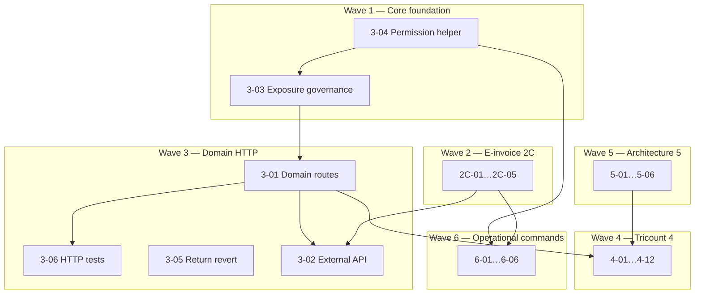

# ERP Spec 2 — Phase 2C + Phase 3+ Remaining Backlog Implementation Plan

> **Navigation:** Implements **all backlog remaining after Phase 2A + 2B** — IDs `2C-01`…`2C-05`, `3-01`…`3-06`, `4-01`…`4-13`, `5-01`…`5-06`, `6-01`…`6-06` (36 items) from
> [`specs/2026-06-30-erp-hardening-spec2-filament-domain-actions-design.md`](../specs/2026-06-30-erp-hardening-spec2-filament-domain-actions-design.md).

> **For agentic workers:** REQUIRED SUB-SKILL: Use superpowers:subagent-driven-development (recommended) or superpowers:executing-plans. Steps use checkbox (`- [ ]`) syntax.

**Status:** Backlog ready — Phase 2C completed; Phase 3+ remains open enterprise/future work. Task `3-05` processed-return reverse is implemented.  
**Prerequisite:** Phase 2A + Phase 2B completed and green (`Modules/ERP` feature suite).

**Next candidate slice:** Phase 3 / Wave 1. Phase 2C / Wave 2 is complete; if Phase 3 is approved, start with Task 1 (`3-04`) for shared permission-name construction, then Task 2 (`3-03`) for CRUD/API exposure governance.

**Goal:** Close the entire ERP master backlog: production e-invoice, Core domain-action HTTP layer + API governance, Tricount/commercial depth, operational console commands, and long-term architecture (FX, Money VO, dimensions, events).

**Architecture:** Seven implementation waves. **Phase 3 is the spine** for domain HTTP/API exposure (Core contracts + routes + exposure toggles). Phase 6 adds operational console commands as thin wrappers over existing ERP services; commands are for batch, diagnostics, polling, and scheduled work, not for bypassing domain actions that require user confirmation. Touch **Core + ERP** where noted; default submodule commits per module per task.

**Tech Stack:** PHP 8.5, Laravel 12, Filament 5, Sanctum, Pest, Core CRUD (`CrudController` / `CrudService`), Spatie Permission.

**Conventions:**
- Tests: `php artisan test --compact Modules/{Core|ERP}/tests/Feature/<File>.php`
- Format: `vendor/bin/pint --dirty`
- Code/comments: English; chat: Italian
- Optional backlog IDs may be skipped with user approval (marked **optional** below)

---

## Backlog coverage

| Phase | IDs | Count | Plan wave |
|-------|-----|------:|-----------|
| 2C | `2C-01`…`2C-05` | 5 | Wave 2 |
| 3 | `3-01`…`3-06` | 6 | Wave 1 (foundation) + Wave 3 (HTTP) |
| 4 | `4-01`…`4-13` | 13 | Wave 4 |
| 5 | `5-01`…`5-06` | 6 | Wave 5 |
| 6 | `6-01`…`6-06` | 6 | Wave 6 |
| **Total** | | **36** | |

**Not in this plan:** Phase 2A (`2A-01`…`2A-09`) and Phase 2B (`2B-01`…`2B-12`) — separate plans.

---

## Dependency overview



**Current execution order:** Wave 1 / Phase 3 foundation now → Wave 3 → Wave 4 → Wave 5. Wave 6 can be pulled forward after Task 1 when operational automation is prioritized; `6-03` depends on Phase 2C e-invoice services, already done.

**Phase 2C task order:** Task 3 (`2C-05`, done) → Task 4 (`2C-02`, done) → Task 5 (`2C-01`, done) → Task 6 (`2C-03`, done) → Task 7 (`2C-04`, done).

## ERP console command policy

ERP commands are allowed when they solve an operational or batch problem. They must stay thin and call existing services rather than duplicating business logic.

Use commands for:
- diagnostics and installation readiness;
- idempotent audits;
- scheduled provider polling;
- batch file imports/exports;
- batch computation with dry-run support.

Do not use commands for:
- normal invoice posting/unposting;
- document sequence reset/reservation;
- period close/reopen when an operator must approve it in UI;
- ad hoc mutations that bypass policies, model state guards, or domain-action services.

Default command contract:
- Mutating commands include `--dry-run` and write no data when it is present.
- Batch commands include `--company=`, `--limit=`, and deterministic logging.
- Commands return non-zero exit code for failed checks/imports.
- Every command has a Feature test using `$this->artisan(...)`.
- Command registration is explicit in `ERPServiceProvider` because the ERP provider currently extends Nwidart directly, not Core's auto-scanning provider.

---

## Wave 1 — Core foundation (Phase 3 prep)

### Task 1: Centralize permission-name construction (3-04)

**Modules:** Core (+ ERP consumer updates)  
**Backlog:** `3-04`

**Files:**
- Create: `Modules/Core/app/Support/PermissionName.php`
- Modify: `Modules/Core/app/Services/Crud/AuthorizationService.php` (or equivalent)
- Modify: `Modules/ERP/app/Policies/ERPModelPolicy.php`
- Modify: `Modules/ERP/database/seeders/ERPDatabaseSeeder.php`
- Create: `Modules/Core/tests/Feature/Support/PermissionNameTest.php`
- Modify: `Modules/ERP/tests/Feature/ErpModelPolicyTest.php` — use shared helper

- [ ] **Step 1: Failing test**

```php
<?php

declare(strict_types=1);

use Illuminate\Database\Eloquent\Model;
use Modules\Core\Support\PermissionName;
use Modules\ERP\Models\Invoice;

it('builds stable permission names from model connection and table', function (): void {
    $invoice = new Invoice();

    expect(PermissionName::forModel($invoice, 'post'))
        ->toBe('default.erp_invoices.post');
});

it('accepts explicit connection override', function (): void {
    expect(PermissionName::build('tenant_a', 'erp_invoices', 'update'))
        ->toBe('tenant_a.erp_invoices.update');
});
```

- [ ] **Step 2: Implement**

```php
<?php

declare(strict_types=1);

namespace Modules\Core\Support;

use Illuminate\Database\Eloquent\Model;

final class PermissionName
{
    public static function forModel(Model $model, string $operation): string
    {
        return self::build(
            $model->getConnectionName() ?? 'default',
            $model->getTable(),
            $operation,
        );
    }

    public static function build(string $connection, string $table, string $operation): string
    {
        return "{$connection}.{$table}.{$operation}";
    }
}
```

- [ ] **Step 3:** Replace duplicated `sprintf('%s.%s.%s', ...)` in `ERPModelPolicy`, seeders, and `AuthorizationService` permission resolution.

- [ ] **Step 4: Run tests + commit** (Core then ERP)

```bash
php artisan test --compact Modules/Core/tests/Feature/Support/PermissionNameTest.php
php artisan test --compact Modules/ERP/tests/Feature/ErpModelPolicyTest.php
```

---

### Task 2: Per-model CRUD/API exposure governance (3-03)

**Modules:** Core  
**Backlog:** `3-03`  
**Spec reference:** Spec 1 Fix 6 follow-up — settings-driven toggles extending `core.expose_crud_api`

**Files:**
- Create: `Modules/Core/app/Contracts/ExposesCrudApi.php`
- Create: `Modules/Core/app/Services/Crud/CrudExposureRegistry.php`
- Modify: `Modules/Core/app/Services/Crud/CrudService.php` — gate **read + write** before resolve
- Modify: `Modules/Core/app/Http/Middleware/EnsureCrudApiAreEnabled.php` or new `EnsureModelCrudExposed`
- Modify: `Modules/Core/config/config.php` — document `expose_crud_api` + per-entity overrides
- Create: `Modules/Core/tests/Feature/Services/CrudExposureRegistryTest.php`
- Modify: `Modules/ERP/app/Models/JournalEntry.php` (+ other immutable models) — implement exposure contract

- [ ] **Step 1: Contract**

```php
<?php

declare(strict_types=1);

namespace Modules\Core\Contracts;

/**
 * Models may opt out of generic CRUD API exposure (read or write) beyond RestrictsCrudWrites.
 */
interface ExposesCrudApi
{
    /**
     * @return list<'select'|'insert'|'update'|'delete'|'restore'|'forceDelete'>
     */
    public static function allowedCrudOperations(): array;
}
```

Default: if not implemented, all standard CRUD ops allowed when global `expose_crud_api` is true.

- [ ] **Step 2: Registry** — resolves `{module}.{entity}` → model class; checks:
  1. Global `config('core.expose_crud_api')`
  2. Optional setting `core.crud_exposure.{module}.{entity}` (allowlist/denylist)
  3. Model `allowedCrudOperations()` if `ExposesCrudApi`

- [ ] **Step 3: Integrate in `CrudService`** — before `list`/`detail`/`insert`/etc., call `CrudExposureRegistry::assertAllowed($model, $operation)`.

**CMS safety:** gate at service entry (CrudService), not by removing routes — `ContentsController` extending `CrudController` for CMS-specific paths must not call blocked operations on ERP entities.

- [ ] **Step 4: ERP models**

| Model | Allowed via CRUD API |
|-------|---------------------|
| `JournalEntry`, `JournalEntryLine`, `VatRegisterEntry`, `StockMovement`, `StockCostLayer`, `StockLevel` | `select` only (or none) |
| Draft `Invoice`, `Party`, `Quotation`, etc. | full CRUD per permissions |

- [ ] **Step 5: Tests** — superadmin cannot `insert` on `JournalEntry` when exposure denies; `select` still works if allowed.

- [ ] **Step 6: Commit** Core `feat(core): per-model CRUD API exposure governance`

---

## Wave 2 — E-invoice production (Phase 2C)

### Task 3: FatturaPA schema columns (2C-05)

**Status:** Done

**Prerequisite for 2C-01/02.**  
**Modules:** ERP

- [x] Migration: extend `companies`, `parties`, `invoices` with SDI fields (PEC, codice destinatario, regime fiscale, REA, cap sociale, etc.) — inventory from FatturaPA v1.2.2 anagrafica minima.
- [x] Update model `$fillable`, `getRules()`, Filament forms (`PartyForm`, `Company` settings, `InvoiceForm` transmitter block).
- [x] Test: validation rejects sale e-invoice submit when mandatory SDI fields missing.

---

### Task 4: Complete SDI party/company mapping (2C-02)

**Status:** Done

**Backlog:** `2C-02`

- [x] Create: `Modules/ERP/app/Services/EInvoice/FatturaPaAnagraphicMapper.php`
- [x] Map `Company` + `Party` + `Invoice` → neutral `EInvoicePayload` extended with FatturaPA-shaped arrays (no XML yet).
- [x] Tests with fixture company/party/invoice → expected array keys (codice fiscale, partita IVA, indirizzo, regime).

---

### Task 5: Full FatturaPA XML + XSD validation (2C-01)

**Status:** Done

**Backlog:** `2C-01`

**Files:**
- Created: `Modules/ERP/app/Services/EInvoice/FatturaPaXmlBuilder.php`
- Created: `Modules/ERP/app/Services/EInvoice/FatturaPaEInvoiceProvider.php`
- Created: `Modules/ERP/resources/xsd/fatturapa/` — official FPR12 v1.2.3 XSD vendored from `fatturapa.gov.it`, with local XMLDSIG dependency for offline validation
- Modified: `Modules/ERP/app/Contracts/EInvoiceProvider.php` — `validateXml(string $xml): void`
- Created: `Modules/ERP/tests/Feature/Services/FatturaPaXmlBuilderTest.php`
- Fixture: `tests/Stubs/einvoice/golden-sale-invoice.xml`

- [x] **Step 1:** Test builds XML from posted sale invoice fixture; DOM load succeeds.
- [x] **Step 2:** `FatturaPaXmlBuilder::build(Invoice $invoice): string` using mapper from Task 4.
- [x] **Step 3:** XSD validate via `DOMDocument::schemaValidate()` in test; golden fixture added.
- [x] **Step 4:** Wire into `EInvoiceSubmissionService::submit()` when driver = `fatturapa` through `FatturaPaEInvoiceProvider`.

**No new Composer dependency** — native DOM/XSD.

Evidence: ERP `2cdcdb8`; targeted subset `21 passed, 63 assertions`.

---

### Task 6: Production provider — Aruba stub (2C-03)

**Status:** Done

**Backlog:** `2C-03`

- [x] Create: `Modules/ERP/app/Services/EInvoice/ArubaEInvoiceProvider.php` implementing `EInvoiceProvider`
- [x] Config: `config/erp.php` — `einvoice.driver` = `stub|aruba|fatturapa`; credentials via `config()` only
- [x] HTTP client: Laravel `Http::` with configurable base URL, auth base URL, upload path, notifications path, token or username/password auth; maps upload result and SDI notification outcomes
- [x] Callback route: `POST /api/v1/erp/einvoice/aruba/callbacks` with optional static API key header validation
- [x] Polling command: `erp:einvoice:refresh-statuses --company=1 --limit=50 --dry-run`
- [x] Persistence: polling payloads, callbacks, Aruba SDI identifiers, and conservation availability metadata in `EInvoiceSubmission.response_payload`
- [x] Test: `Http::fake()` — upload returns external id; refresh maps notifications; callback and command tests cover operational flow
- [x] **Production secrets:** never in repo; env via config file only

Evidence: ERP `8e0bd9e` for initial adapter; hardened 2026-07-16 with `ArubaEInvoiceProviderTest` callback/command coverage. Targeted subset after hardening: `30 passed, 71 assertions`.

**Boundary:** implementation follows Aruba v2-style upload/auth/notifications/callback concepts. Before production go-live, verify the actual contracted Aruba tenant, callback accreditation/IP allowlist, retention contract, credentials, and sandbox/prod endpoint selection.

---

### Task 7: Extended admin policies (2C-04)

**Status:** Done

**Backlog:** `2C-04`

- [x] Seed domain permissions: `default.erp_tax_codes.supersede`, `default.erp_companies.switch_context`, and `default.erp_document_sequences.reserve`
- [x] Policies on `TaxCode`, `Company` context switch, and `DocumentSequence` reservation with model state guards
- [x] Filament audit: no company switcher or tax-code supersession action exists yet; existing document-sequence reset action was already gated by policy
- [x] Tests: non-superadmin denied without explicit permission; granted users allowed; wrong model types denied

Evidence: ERP `604c53c`; targeted test subset `14 passed, 41 assertions`.

---

## Wave 3 — Domain HTTP actions & API (Phase 3)

### Task 8: Domain action registry + internal routes (3-01)

**Modules:** Core + ERP  
**Backlog:** `3-01`

**Design:** Mirror existing CRUD routes (`Modules/Core/routes/crud.php`) — add:

```
POST /crud/action/{module}/{entity}/{id}/{action}
```

**Files:**
- Create: `Modules/Core/app/Contracts/ExposesDomainActions.php`
- Create: `Modules/Core/app/Services/Crud/DomainActionDispatcher.php`
- Create: `Modules/Core/app/Http/Requests/DomainActionRequest.php`
- Modify: `Modules/Core/app/Http/Controllers/CrudController.php` — `domainAction()`
- Modify: `Modules/Core/routes/web.php`
- Create: `Modules/ERP/app/Services/DomainActions/ErpDomainActionRegistrar.php`
- Modify: `Modules/ERP/app/Providers/ERPServiceProvider.php` — register ERP actions at boot
- Create: `Modules/Core/tests/Feature/Http/DomainActionRouteTest.php`
- Create: `Modules/ERP/tests/Feature/Http/ErpDomainActionRouteTest.php`

- [ ] **Step 1: Core contract**

```php
<?php

declare(strict_types=1);

namespace Modules\Core\Contracts;

use Illuminate\Database\Eloquent\Model;
use Modules\Core\Models\User;

interface ExposesDomainActions
{
    /**
     * @return list<string>
     */
    public static function exposedDomainActions(): array;
}
```

- [ ] **Step 2: Dispatcher**

```php
public function dispatch(
    Model $record,
    string $action,
    User $user,
    array $payload = [],
): mixed {
    $policy_method = $this->policyMethodFor($action); // force_post -> forcePost
    if (! $user->can($policy_method, $record)) {
        throw new AuthorizationException();
    }
    $handler = $this->registry->resolve($record::class, $action);
    return $handler($record, $payload, $user);
}
```

- [ ] **Step 3: ERP registrar** — map actions to existing services (post-2A):

| Entity | Actions | Handler |
|--------|---------|---------|
| `Invoice` | `post`, `unpost`, `submitEInvoice`, `refreshEInvoice` | `InvoicePostingService` / `EInvoiceSubmissionService` |
| `DeliveryNote` | `post`, `unpost` | `posted_at` update |
| `FiscalPeriod` | `close`, `reopen` | `FiscalPeriodCloser` |
| `FiscalYear` | `close` | `FiscalPeriodCloser::closeYear` |
| `JournalEntry` | `reverse` | `JournalPostingService::reverse` |
| `SalesOrder` | `amend` | `SalesOrderAmendmentService` |
| `Quotation` | `unlock` | `$record->unlock()` |
| `DocumentSequence` | `reset` | `DocumentSequenceResetService` |
| `ReturnOrder` | `revert` | Task 10 service |

- [ ] **Step 4: Failing HTTP test** — authenticated user with `post` permission POSTs action → 200 + side effect.

- [ ] **Step 5: Commit** Core + ERP

---

### Task 9: HTTP tests for domain actions (3-06)

**Backlog:** `3-06`  
**Depends:** Task 8

- [ ] Create: `Modules/ERP/tests/Feature/Http/ErpDomainActionsHttpTest.php`
- [ ] Cover matrix: authorized → 200, missing permission → 403, invalid state → 403, unknown action → 404
- [ ] Cover: `force_post` payload on purchase invoice post action
- [ ] Run full ERP HTTP + policy subset

```bash
php artisan test --compact Modules/ERP/tests/Feature/Http/
php artisan test --compact Modules/Core/tests/Feature/Http/DomainActionRouteTest.php
```

---

### Task 10: Revert/reverse processed return (3-05) — completed 2026-07-16

**Backlog:** `3-05`  
**Modules:** ERP

**Implemented truth:** processed customer/supplier returns can be reversed before any linked fiscal note exists. The implementation is intentionally conservative: linked credit/debit notes block reverse rather than being deleted or unlinked automatically.

**Files:**
- Modified: `Modules/ERP/app/Services/Returns/ReturnOrderService.php` — `reverseProcessed()`
- Modified: `Modules/ERP/app/Services/Returns/SupplierReturnService.php` — `reverseProcessed()`
- Modified: `Modules/ERP/app/Filament/Resources/ReturnOrders/Pages/EditReturnOrder.php`
- Modified: `Modules/ERP/app/Filament/Resources/SupplierReturns/Pages/EditSupplierReturn.php`
- Modified: `Modules/ERP/tests/Feature/Services/ReturnOrderServiceTest.php`
- Modified: `Modules/ERP/tests/Feature/Services/SupplierReturnServiceTest.php`

- [x] **Step 1: Failing tests** — customer and supplier processed-return reverse restores stock/returned quantities; linked NC/ND blocks reverse.
- [x] **Step 2: Implement transaction** — lock return, block linked fiscal note, unpost generated DDT through existing inventory observer/service, restore source `qty_returned`, clear `processed_at`, set status back to `Approved`.
- [x] **Step 3: Filament actions** — `reverse_processed` header actions on customer/supplier return edit pages, visible only for processed returns without linked NC/ND.
- [x] **Step 4: Verification** — `php artisan test --compact Modules/ERP/tests/Feature/Services/ReturnOrderServiceTest.php Modules/ERP/tests/Feature/Services/SupplierReturnServiceTest.php` passes.

---

### Task 11: Opt-in external API + versioning (3-02)

**Backlog:** `3-02`  
**Modules:** Core (+ ERP route group)

- [ ] Enable Sanctum token auth for domain-action + read-only CRUD subset
- [ ] Routes: `Route::prefix('api/v1/erp')->middleware(['auth:sanctum', 'ensure.crud.api'])`
- [ ] Reuse `DomainActionDispatcher` + `CrudExposureRegistry` — no duplicate logic
- [ ] Version header `Accept: application/vnd.laraplate.v1+json` — 406 if unsupported
- [ ] Rate limiting: `throttle:api`
- [ ] Test: token without permission → 403; with permission → domain action works
- [ ] **Default:** `expose_crud_api=false` in production config; document enablement in `Modules/Core/docs/CRUD_SYSTEM.md`

---

## Wave 4 — Tricount & commercial depth (Phase 4)

### Task 12: Movement → JournalEntry refactor (4-01)

**Backlog:** `4-01`  
**Nebula:** M2 accounting refactor

- [ ] Migration: `movements.posted_journal_entry_id` nullable FK
- [ ] Define `MovementType` income/expense posting rules → COA roles (`bank_cash`, expense/income accounts)
- [ ] Create: `Modules/ERP/app/Services/Cash/MovementPostingService.php` — posts via `JournalPostingService`
- [ ] Tricount balance = derived from journal lines (view or `CashBalanceService`)
- [ ] Data migration command: `erp:migrate-movements-to-journal` (idempotent)
- [ ] Test: movement create → journal balanced; balance query matches

---

### Task 13: Tricount UX on journal-only writes (4-02)

**Backlog:** `4-02`  
**Depends:** Task 12

- [ ] Filament/Livewire pages for pool/split (reuse nebula `settlements-quotes-lines` intent)
- [ ] UI writes only through `MovementPostingService` — no parallel balance table updates
- [ ] Test: Filament smoke + service integration

---

### Task 14: Quote revisions + project bind locks (4-03)

**Backlog:** `4-03`

- [ ] `QuotationRevisionService` — snapshot + new version with parent `revises_quotation_id`
- [ ] Lock `Project` when bound to confirmed SO (model events or DB trigger companion to 4-04)
- [ ] Filament actions: "Create revision"
- [ ] Tests: revision chain; project edit blocked when locked

---

### Task 15: DB lock-chain triggers (4-04)

**Backlog:** `4-04` — **D5 nebula**

- [ ] PostgreSQL triggers (or portable equivalent if SQLite tests require PHP fallback):
  - SO confirm → quotation locked (defense in depth beyond app layer)
  - DDT line qty → SO line lock
- [ ] Integration test: attempt violating update → DB exception or app guard

---

### Task 16: Settlements / pool / settle-up (4-05)

**Backlog:** `4-05`

- [ ] Models: `PartnerPool`, `PoolTransaction` (if not present) or extend `Movement` allocations
- [ ] `SettlementService::suggestSettleUp(partner_pool)` + `settle()`
- [ ] Filament page under ERP Cash group
- [ ] Tests: split lines sum to movement amount

---

### Task 17: PaymentRequest stub + providers (4-06)

**Backlog:** `4-06`

- [ ] Contract `PaymentRequestProvider` (Stripe/PayPal stub)
- [ ] Model `PaymentRequest` + status enum
- [ ] Filament create/list; webhook route placeholder
- [ ] Test: stub provider returns checkout URL

---

### Task 18: Calendar ICS export (4-07)

**Backlog:** `4-07`

- [ ] `Modules/ERP/app/Services/Calendar/TaskIcsExporter.php`
- [ ] Filament action on `Task` resource / project page — download `.ics`
- [ ] LOCATION from `Site` → Core `Place` when `sites.place_id` exists (coordinate with 4-10)
- [ ] Test: ICS contains DTSTART, SUMMARY, LOCATION

---

### Task 19: ERP sites.place_id + ICS (4-10)

**Backlog:** `4-10`

- [ ] Migration: `erp_sites.place_id` FK → `core.places`
- [ ] `Site` model relation; Filament Select
- [ ] Test: site with place → ICS location populated

---

### Task 20: Hide version-strategy settings for DIFF models (4-11)

**Backlog:** `4-11`  
**Modules:** Core + ERP

- [ ] `SchemaInspector` or Filament settings UI: hide `version_strategy_{table}` when model has hardcoded `VersionStrategy::DIFF`
- [ ] Test: accounting model setting row not exposed in generated settings form

---

### Task 21: Concurrency stress tests (4-12)

**Backlog:** `4-12`

- [ ] Create: `Modules/ERP/tests/Stress/DocumentNumberConcurrencyStressTest.php` (group `stress`, skipped in CI by default)
- [ ] 50 parallel `DocumentNumberAllocator::next()` → 50 unique numbers
- [ ] Document run command in plan README comment: `php artisan test --group=stress`

---

### Task 22: Optional — Gantt, ETL, API mobile (4-08, 4-09, 4-13)

**Skip unless user approves.**

| ID | Deliverable if approved |
|----|-------------------------|
| 4-08 | `PlanningActivity` model + Filament read-only Gantt view |
| 4-09 | `Modules/ERP/app/Console/ImportLegacySymfonyCommand.php` + mapping doc |
| 4-13 | Sanctum mobile routes subset on Task 11 API |

---

## Wave 5 — Architecture (Phase 5)

### Task 23: Full Money value object (5-02)

**Backlog:** `5-02` — **do before 5-01**

- [ ] Create: `Modules/ERP/app/Support/Money.php` (amount minor units + currency, immutable)
- [ ] Bridge: `Money::fromDecimal(string $amount, string $currency): self`
- [ ] Refactor `Decimal` monetary paths incrementally (invoice line totals first)
- [ ] Test: rounding HALF_UP matches current golden master

---

### Task 24: Real multi-currency + FX + revaluation (5-01)

**Backlog:** `5-01`  
**Depends:** Task 23

- [ ] Replace `NoopCurrencyConverter` with `EcbCurrencyConverter` or configurable provider
- [ ] `FxRate` model + daily rate import command
- [ ] `RevaluationService` — period-end unrealized gain/loss journal
- [ ] Test: invoice in USD → balanced `amount_local` at posting date rate

---

### Task 25: Analytic dimensions on journal lines (5-03)

**Backlog:** `5-03`

- [ ] Migration: `journal_entry_lines.project_id`, `cost_center_id` (nullable FKs)
- [ ] `JournalPostingService` accepts optional dimension on each line
- [ ] Reporting: trial balance by project filter
- [ ] Test: post with dimension → persisted on lines

---

### Task 26: Integration outbox / domain events (5-04)

**Backlog:** `5-04`

- [ ] Create: `Modules/Core/app/Models/OutboxEvent.php` + migration
- [ ] Dispatch on: invoice posted, payment matched, return completed
- [ ] Job: `PublishOutboxEventJob` (stub publisher)
- [ ] Test: posting invoice creates outbox row

---

### Task 27: Direct item-specific price lists (5-05)

**Backlog:** `5-05`

- [ ] Migration: `price_list_items.item_id` nullable FK (alongside `taxonomy_id`)
- [ ] Update `PriceResolverService` cascade: item → taxonomy → party rules
- [ ] Tests: item-specific price beats taxonomy

---

### Task 28: ERP vision meta / pluggable narrative (5-06)

**Backlog:** `5-06` — **optional / documentation**

- [ ] `Modules/ERP/docs/VISION.md` — module boundaries, extension points (domain actions, e-invoice providers, payment providers)
- [ ] `ERPServiceProvider` tagged hooks document in README

---

## Wave 6 — Operational console commands (Phase 6)

These commands are not a replacement for Filament/domain actions. They provide operator tooling for diagnostics, scheduled polling, imports, and controlled batch computations.

### Task 29: ERP health-check command (6-01)

**Backlog:** `6-01`  
**Modules:** ERP

**Command:** `php artisan erp:health-check`

**Files:**
- Create: `Modules/ERP/app/Console/HealthCheckCommand.php`
- Modify: `Modules/ERP/app/Providers/ERPServiceProvider.php` — register ERP console commands explicitly with `$this->commands([...])` when running in console
- Create: `Modules/ERP/tests/Feature/Console/HealthCheckCommandTest.php`
- Modify: `Modules/ERP/README.md`
- Modify: `Modules/ERP/docs/rag/MODULE.md`

**Checks:**
- default company exists;
- chart of accounts has rows for default company;
- current fiscal year and periods exist;
- required domain permissions exist (`post`, `unpost`, e-invoice, sequence/admin permissions);
- at least one document sequence exists for the current year;
- e-invoice driver config is internally valid (`stub`, `fatturapa`, `aruba`; Aruba requires base URL/token when selected);
- command reports warning, failure, and success counts.

- [ ] **Step 1: Failing command test** — assert `erp:health-check --format=json` returns non-zero and reports missing prerequisites on an empty ERP database.
- [ ] **Step 2: Implement command** — use read-only Eloquent/service checks; do not create or repair data.
- [ ] **Step 3: Add happy-path test** — seed `ERPDatabaseSeeder`, create minimal sequences, run command, assert exit code `0`.
- [ ] **Step 4: Register command** — keep registration local to `ERPServiceProvider`.
- [ ] **Step 5: Docs + commit**

```bash
php artisan test --compact Modules/ERP/tests/Feature/Console/HealthCheckCommandTest.php
git -C Modules/ERP commit -m "feat(erp): add health check command"
```

---

### Task 30: Document sequence audit command (6-02)

**Backlog:** `6-02`  
**Modules:** ERP

**Command:** `php artisan erp:sequences:audit --company=1 --year=2026`

**Files:**
- Create: `Modules/ERP/app/Console/DocumentSequencesAuditCommand.php`
- Create: `Modules/ERP/app/Services/Accounting/DocumentSequenceAuditService.php`
- Create: `Modules/ERP/tests/Feature/Console/DocumentSequencesAuditCommandTest.php`
- Create: `Modules/ERP/tests/Feature/Services/DocumentSequenceAuditServiceTest.php`

**Audit scope:**
- compare `DocumentSequence.last_number` against max posted document reference per document type where references are parseable;
- warn when a required sequence is missing for a document type used in the selected year;
- warn on duplicate formatted numbers;
- report gaps only when `gap_allowed=false` and reliable posted-document data exists.

**No mutation:** this command is read-only. Sequence repair remains a deliberate UI/domain action because it is operationally dangerous.

- [ ] **Step 1: Service test** — create sequence and posted invoices with references; assert no issues.
- [ ] **Step 2: Service test for mismatch** — set `last_number` below posted max; assert a failure issue.
- [ ] **Step 3: Command test** — run with `--format=json`, assert issue count and non-zero exit when failures exist.
- [ ] **Step 4: Implement service + command**
- [ ] **Step 5: Docs + commit**

```bash
php artisan test --compact Modules/ERP/tests/Feature/Services/DocumentSequenceAuditServiceTest.php Modules/ERP/tests/Feature/Console/DocumentSequencesAuditCommandTest.php
git -C Modules/ERP commit -m "feat(erp): add document sequence audit command"
```

---

### Task 31: E-invoice status polling command (6-03)

**Status:** Done 2026-07-16  
**Backlog:** `6-03`  
**Modules:** ERP

**Command:** `php artisan erp:einvoice:refresh-statuses --company=1 --limit=50 --dry-run`

**Files:**
- Created: `Modules/ERP/app/Console/EInvoiceRefreshStatusesCommand.php`
- Modified: `Modules/ERP/app/Services/EInvoice/EInvoiceSubmissionService.php`
- Covered by: `Modules/ERP/tests/Feature/Services/ArubaEInvoiceProviderTest.php`

**Implemented behavior:**
- processes open submissions only (`queued` / `submitted`);
- filters by company, provider code, and limit;
- calls `EInvoiceSubmissionService::refresh()` per row;
- continues after a single-row provider failure and reports failures at the end;
- supports `--dry-run` by listing candidates without contacting the provider;
- intended scheduler cadence remains host-app policy, not hardcoded in ERP.

Verification: `php artisan test --compact Modules/ERP/tests/Feature/Services/ArubaEInvoiceProviderTest.php` -> `9 passed, 26 assertions`; e-invoice/provider subset -> `30 passed, 71 assertions`.


---

### Task 33: Italian bank file exports beyond SEPA SCT

**Status:** Done 2026-07-16  
**Modules:** ERP

**Implemented files:**
- `Modules/ERP/app/Services/Payments/CbiBonificiExporter.php`
- `Modules/ERP/app/Services/Payments/ItalianReceivableBankFileExporter.php`
- `Modules/ERP/app/Casts/PaymentRunFormat.php`
- `Modules/ERP/app/Models/PartyBankAccount.php`
- `Modules/ERP/database/migrations/2026_07_11_150000_create_party_bank_accounts_table.php`
- `Modules/ERP/app/Filament/Resources/PaymentRuns/Actions/PaymentRunActions.php`

**Scope:**
- CBI bonifici is integrated with approved supplier `PaymentRun` export and stores export file name/checksum like SEPA.
- Ri.Ba and SDD CORE are generated from customer receivable `PaymentScheduleLine` rows; SDD requires mandate reference/date on the customer `PartyBankAccount`.
- No direct bank submission is performed.
- Bank-specific certification/proprietary profile variants remain go-live tasks.

Verification: `php artisan test --compact Modules/ERP/tests/Feature/Services/SepaPain001ExporterTest.php Modules/ERP/tests/Feature/Services/ItalianReceivableBankFileExporterTest.php Modules/ERP/tests/Feature/Services/PaymentRunBuilderServiceTest.php Modules/ERP/tests/Feature/Filament/PaymentRunResourceTest.php` -> `14 passed, 55 assertions`.


---

### Task 34: Immutable financial report snapshots and PDF archives

**Status:** Done 2026-07-16  
**Modules:** ERP

**Implemented files:**
- `Modules/ERP/database/migrations/2026_07_16_120000_create_report_snapshots_table.php`
- `Modules/ERP/app/Models/ReportSnapshot.php`
- `Modules/ERP/app/Services/Reporting/ReportPdfExporter.php`
- `Modules/ERP/app/Services/Reporting/ReportSnapshotService.php`
- `Modules/ERP/app/Console/ReportSnapshotCommand.php`
- `Modules/ERP/tests/Feature/Services/ReportSnapshotServiceTest.php`

**Scope:**
- Immutable archive table stores report key, parameters, JSON payload, CSV content, base64 PDF content, generated timestamp, and content hash.
- Model blocks updates/deletes for immutable rows.
- `erp:reports:snapshot` supports `trial_balance`, `income_statement`, and `balance_sheet`, with `--company`, `--from`, `--to`, and `--dry-run`.
- PDF renderer is dependency-free and intentionally simple; richer paginated/report-design PDF rendering remains an enhancement.

Verification: `php artisan test --compact Modules/ERP/tests/Feature/Services/ReportSnapshotServiceTest.php Modules/ERP/tests/Feature/FinancialStatementsTest.php` -> `16 passed, 48 assertions`.


---

### Task 35: Multi-currency FX rates and unrealized revaluation

**Status:** Done 2026-07-16  
**Modules:** ERP

**Implemented files:**
- `Modules/ERP/database/migrations/2026_07_16_130000_create_exchange_rates_table.php`
- `Modules/ERP/app/Models/ExchangeRate.php`
- `Modules/ERP/app/Services/Currency/DatabaseCurrencyConverter.php`
- `Modules/ERP/app/Services/Currency/FxRevaluationService.php`
- `Modules/ERP/tests/Feature/Services/FxRevaluationServiceTest.php`

**Scope:**
- Historical FX rates with source and date.
- Converter resolves identity, latest direct rates, and inverse rates.
- ERP service binding now uses `DatabaseCurrencyConverter`.
- Unrealized FX revaluation posts balanced journal entries for open foreign-currency payment schedules using caller-supplied balance/gain/loss accounts.

**Still future:** external provider feed imports, realized FX differences during settlement, and full close automation.

Verification: `php artisan test --compact Modules/ERP/tests/Feature/Services/FxRevaluationServiceTest.php Modules/ERP/tests/Feature/Providers/ERPServiceProviderTest.php` -> `6 passed, 16 assertions`.


---

### Task 36: Money value object and analytic dimensions

**Status:** Done 2026-07-16  
**Modules:** ERP

**Implemented files:**
- `Modules/ERP/app/ValueObjects/Money.php`
- `Modules/ERP/database/migrations/2026_07_16_140000_create_analytic_dimensions_tables.php`
- `Modules/ERP/app/Models/AnalyticDimension.php`
- `Modules/ERP/app/Models/AnalyticDimensionValue.php`
- `Modules/ERP/app/Models/Pivot/JournalEntryLineHasAnalyticDimensionValue.php`
- `Modules/ERP/app/Models/JournalEntryLine.php`
- `Modules/ERP/tests/Feature/Support/MoneyTest.php`
- `Modules/ERP/tests/Feature/Models/AnalyticDimensionTest.php`

**Scope:**
- `Money` is immutable and supports normalized amount/currency, same-currency arithmetic, negate/abs, equality, and allocation with rounding remainder.
- Analytic dimensions are modeled as company dimensions and values.
- Journal entry lines can attach analytic values through a first-class pivot with `allocation_percent` and timestamps.

**Still future:** refactor every legacy float helper to `Money`, analytic reporting cubes, allocation engines, and automatic propagation from operational documents.

Verification: `php artisan test --compact Modules/ERP/tests/Feature/Support/MoneyTest.php Modules/ERP/tests/Feature/Models/AnalyticDimensionTest.php Modules/ERP/tests/Feature/Support/DecimalTest.php` -> `9 passed, 31 assertions`.

---

### Task 32: Bank statement batch import command (6-04)

**Backlog:** `6-04`  
**Modules:** ERP

**Command:** `php artisan erp:bank-statements:import --bank-account=1 --format=camt053 --path=storage/app/erp-bank-imports --dry-run`

**Files:**
- Create: `Modules/ERP/app/Console/BankStatementsImportCommand.php`
- Create: `Modules/ERP/app/Services/Banking/BankStatementBatchImportService.php`
- Create: `Modules/ERP/tests/Feature/Console/BankStatementsImportCommandTest.php`
- Create: `Modules/ERP/tests/Feature/Services/BankStatementBatchImportServiceTest.php`

**Batch behavior:**
- import all supported files from a directory (`csv`, `camt053`, `mt940`) or one explicit file path;
- create or reuse a `BankStatement` per file/import batch;
- delegate parsing to `BankStatementImportService` / `BankStatementCsvImporter`;
- support `--dry-run` by parsing and reporting counts without creating statements/lines;
- move successfully imported files only if an explicit `--archive-path=` is supplied;
- never auto-confirm reconciliation matches.

- [ ] **Step 1: Dry-run test** — fixture CAMT file reports line count and creates no DB rows.
- [ ] **Step 2: Import test** — fixture file creates statement and lines through existing import services.
- [ ] **Step 3: Duplicate file test** — second run is idempotent by checksum or import metadata.
- [ ] **Step 4: Implement service + command**
- [ ] **Step 5: Docs + commit**

```bash
php artisan test --compact Modules/ERP/tests/Feature/Services/BankStatementBatchImportServiceTest.php Modules/ERP/tests/Feature/Console/BankStatementsImportCommandTest.php
git -C Modules/ERP commit -m "feat(erp): add bank statement import command"
```

---

### Task 33: VAT settlement compute command (6-05)

**Backlog:** `6-05`  
**Modules:** ERP

**Command:** `php artisan erp:vat-settlements:compute --company=1 --year=2026 --period=2026-03 --dry-run`

**Files:**
- Create: `Modules/ERP/app/Console/VatSettlementsComputeCommand.php`
- Create: `Modules/ERP/app/Services/Accounting/VatSettlementBatchService.php`
- Create: `Modules/ERP/tests/Feature/Console/VatSettlementsComputeCommandTest.php`
- Create: `Modules/ERP/tests/Feature/Services/VatSettlementBatchServiceTest.php`

**Batch behavior:**
- compute one period or all open periods in a fiscal year;
- delegate calculation to `VatSettlementService`;
- never modify confirmed settlements;
- support `--dry-run` by returning computed amounts without persisting;
- no payment/F24 submission; this is accounting computation only.

- [ ] **Step 1: Dry-run test** — posted VAT data returns expected amount and creates no settlement row.
- [ ] **Step 2: Persist test** — without `--dry-run`, open settlement is created/updated.
- [ ] **Step 3: Confirmed guard test** — confirmed settlement is skipped and reported.
- [ ] **Step 4: Implement service + command**
- [ ] **Step 5: Docs + commit**

```bash
php artisan test --compact Modules/ERP/tests/Feature/Services/VatSettlementBatchServiceTest.php Modules/ERP/tests/Feature/Console/VatSettlementsComputeCommandTest.php
git -C Modules/ERP commit -m "feat(erp): add vat settlement compute command"
```

---

### Task 34: Report snapshot/export command (6-06)

**Backlog:** `6-06`  
**Modules:** ERP

**Command:** `php artisan erp:reports:snapshot --company=1 --report=trial-balance --date=2026-12-31 --disk=local --dry-run`

**Files:**
- Create: `Modules/ERP/app/Console/ReportsSnapshotCommand.php`
- Create: `Modules/ERP/app/Services/Reporting/ReportSnapshotService.php`
- Create: `Modules/ERP/tests/Feature/Console/ReportsSnapshotCommandTest.php`
- Create: `Modules/ERP/tests/Feature/Services/ReportSnapshotServiceTest.php`

**Snapshot scope:**
- initial report set: `trial-balance`, `balance-sheet`, `income-statement`, `sales-pipeline`, `stock-valuation`;
- use existing report services and CSV exporters;
- write timestamped CSV files to a configured Laravel disk/path;
- store only file artifacts and command output in v1; immutable report archive tables are a separate future feature;
- support `--dry-run` by reporting target file names and row counts without writing files.

- [ ] **Step 1: Dry-run test** — assert no file is written and summary includes planned path.
- [ ] **Step 2: Export test** — use fake storage disk; assert CSV file exists and contains headers.
- [ ] **Step 3: Invalid report test** — unknown report exits non-zero with supported report list.
- [ ] **Step 4: Implement service + command**
- [ ] **Step 5: Docs + commit**

```bash
php artisan test --compact Modules/ERP/tests/Feature/Services/ReportSnapshotServiceTest.php Modules/ERP/tests/Feature/Console/ReportsSnapshotCommandTest.php
git -C Modules/ERP commit -m "feat(erp): add report snapshot command"
```

---

## Final verification (all phases)

- [ ] **Run targeted suites**

```bash
php artisan test --compact Modules/Core/tests/Feature
php artisan test --compact Modules/ERP/tests/Feature
```

- [ ] **Accounting golden master** — must stay green after Waves 4–5:

```bash
php artisan test --compact Modules/ERP/tests/Feature/AccountingGoldenMasterTest.php
```

- [ ] **Update spec master** — move completed IDs from § Open to § Completed with commit SHAs

- [ ] **Version bumps** — evaluate Core + ERP per `08-versioning.mdc`; ask user before `composer version:*`

---

## Self-review checklist

| Phase | IDs | Tasks |
|-------|-----|-------|
| 2C | 2C-01…05 | 3–7 |
| 3 | 3-01…06 | 1–2, 8–11 |
| 4 | 4-01…07, 4-10…12 | 12–21 |
| 4 opt | 4-08, 4-09, 4-13 | 22 |
| 5 | 5-01…06 | 23–28 |
| 6 | 6-01…06 | 29–34 |

**Cross-cutting resolved:**
- Spec 1 → Spec 3 exposure governance: Task 2
- Permission prefix centralization: Task 1
- Domain HTTP routes: Task 8
- Return cancel/revert gap: Task 10
- Operational console command gap: Tasks 29–34
- PDF export (deferred from 2B): not in scope — add to backlog or 2C follow-up if needed

---

## Execution handoff

Plan saved to `docs/superpowers/plans/2026-06-30-erp-hardening-spec2-phase3-remaining.md`.

**Recommended:** Wave 1 → Wave 3 → Wave 6 when operational automation is prioritized → Wave 4 (after 3-01) → Wave 5.

**Two execution options:**

1. **Subagent-Driven** — one subagent per task, review between tasks  
2. **Inline Execution** — wave-by-wave with checkpoints

Which approach?
