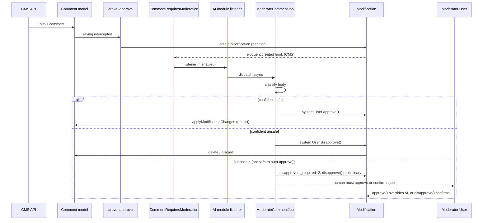

# CMS content comments with AI-assisted moderation (design)

**Status:** Approved direction (v5 — HasTranslations + comment locale overrides)  
**Date:** 2026-05-15

## Problem

The CMS module needs comments on `Content` records. Each content can have many comments. Comments must be moderated through the existing approval system (`HasApprovals` / `laravel-approval`). The CMS module must not depend on the AI module. When AI is enabled and configured, it may auto-approve or auto-reject comments with high confidence; otherwise a human moderator with the right permission must decide.

## Goals

1. **Comment entity in CMS** — `Comment` belongs to `Content` and `User`; text-only in v1.
2. **Moderation via `HasApprovals`** — new comments and body edits go through `Modification`; unapproved comments are not visible on public/read APIs.
3. **Decoupled AI** — CMS dispatches a domain event; AI module registers an optional listener (same pattern as `ModelRequiresIndexing` → embeddings).
4. **Automatic resolution when certain** — AI casts `approve` or `disapprove` on the `Modification` when confidence ≥ configured threshold.
5. **Human fallback when uncertain** — AI abstains; authorized user resolves via existing Filament modifications UI.
6. **Tests** — feature tests for CMS flow; AI listener tests with mocked classifier.

## Non-goals (v1)

- Threading / replies (`parent_id`)
- Guest comments (name/email without user)
- Media attachments on comments
- Comment likes/dislikes (distinct from content star rating)
- Indexing comments in Elasticsearch
- Dedicated Filament Comment resource (moderation reuses `ModificationResource`)
- Custom CMS API routes (use standard `CrudController` CRUD)

## Assumptions (v1 defaults)

| Topic | Default |
|-------|---------|
| Author | Authenticated `User` only |
| Fields (parent) | `content_id`, `user_id` |
| Translatable | `body` via `HasTranslations` + `CommentTranslation` |
| Table names | `CMSTables::Comments`, `CMSTables::CommentsTranslations` — **mandatory** in migrations/raw SQL |
| Approval on create | Always when `body` pending/saved for current locale |
| Approval on update | When `body` changes in any pending/saved translation |
| `deleteWhenDisapproved` | `true` (from `HasApprovals`) |
| Votes required (default mode) | See **§6 Approval modes** — Option A (default) |
| Locale on create | **Only** current `LocaleContext` (standard trait write path) |
| Locale on read | Override trait: current locale translation, else **original** (oldest `created_at`) — see **§9** |
| AI auto-translate | **v2** — disable `TranslatedModelSaved` hooks on `Comment` in v1 |
| AI actor | Configured system `User` (`ai.features.comment_moderation.system_user_id`) |

## Architecture overview



## Components

### 1. CMS — `Comment` model

**Table:** `cms_comments` (`CMSTables::Comments`)

| Column | Type | Notes |
|--------|------|-------|
| `id` | bigint PK | |
| `content_id` | FK → `cms_contents` | cascade on delete |
| `user_id` | FK → `core_users` | cascade on delete |
| `created_at` / `updated_at` | timestamps | set when approved and persisted |

**Translation table:** `cms_comments_translations` (`CMSTables::CommentsTranslations`)

| Column | Type | Notes |
|--------|------|-------|
| `id` | bigint PK | |
| `comment_id` | FK → `cms_comments` | cascade |
| `locale` | string(10) | |
| `body` | text | translatable + moderated |
| `created_at` / `updated_at` | timestamps | **used to pick original** (oldest = original) |

**Model:** `Modules\CMS\Models\Comment`

- Extends `Modules\Core\Overrides\Model`
- Uses `HasApprovals` + **`HasCommentTranslations`** (CMS trait wrapping `HasTranslations`)
- `CommentTranslation` in `Modules\CMS\Models\Translations\CommentTranslation` — `$fillable: ['comment_id', 'locale', 'body']`
- `requiresApprovalWhen`: `true` if `body` in dirty **or** `pending_translations` contains `body` for current locale (see §9 approval bridge)
- `modifier()`: `auth()->user()`
- Relations: `content(): BelongsTo`, `user(): BelongsTo`
- **Visibility:** no extra global scope required. `HasApprovals` blocks `save` until approved; only approved comments exist in `cms_comments`. Pending submissions live only as active `Modification` rows (same pattern as other moderated entities).

**Naming convention:** add to `Modules\CMS\Enums\CMSTables`:

```php
case Comments = 'cms_comments';
```

Use `CMSTables::Comments->value` in migrations, seeders, and any raw/`DB::table()` access.

**Content:**

```php
public function comments(): HasMany
{
    return $this->hasMany(Comment::class);
}
```

### 2. CMS — event (no AI dependency)

**Event:** `Modules\CMS\Events\CommentRequiresModeration`

```php
final class CommentRequiresModeration
{
    public function __construct(
        public readonly Modification $modification,
    ) {}
}
```

**Dispatch:** CMS `EventServiceProvider` listens to `eloquent.created` on `Modules\Core\Models\Modification` and dispatches when:

- `modifiable_type === Comment::class`, and
- `active === true`

This works for both creations (`is_update = false`, `modifiable_id = null`) and edits.

### 3. CMS — API via standard CRUD (no custom routes)

Comments use the existing **`CrudController`** stack (`Modules/Core/routes/crud.php` + module entity registration), same as other CMS models.

| Operation | Mechanism |
|-----------|-----------|
| List / detail | `CrudController::list` / `detail` on entity `comments` — returns only persisted (approved) rows |
| Insert | `CrudController::insert` — triggers `HasApprovals`; save intercepted → `Modification` created |
| Update body | `CrudController::update` — new `Modification` if `body` dirty |
| Approve / disapprove | `PATCH /crud/approve/{module}/comments` and `.../disapprove/...` (existing Core routes) |
| Moderator queue | `Modification` records (`modifiable_type = Comment`) — not the `comments` list |

**Insert response:** follows existing CRUD behaviour for moderated creates (modification pending; no row in `cms_comments` until approved). Frontend filters by `content_id` like any other relation.

**No** dedicated `CommentsController` or nested `/contents/{id}/comments` routes in v1.

### 4. Core — permissions & Filament

- Permission: `approve.cms_comments` (matches `HasApprovals` check `approve.{table}`)
- Seed role assignment for admin/moderator roles (follow existing seeder patterns)
- `ModificationResource` tabs auto-discover `Comment` via `HasApprovals` — no new Filament resource required for v1
- `ApprovalNotificationService` auto-discovers `cms_comments` threshold setting

### 5. AI module — optional listener

**Config** (`Modules/AI/config/config.php`):

```php
'comment_moderation' => [
    'enabled' => env('AI_COMMENT_MODERATION_ENABLED', true),
    'approve_confidence_threshold' => (float) env('AI_COMMENT_MOD_APPROVE_THRESHOLD', 0.85),
    'reject_confidence_threshold' => (float) env('AI_COMMENT_MOD_REJECT_THRESHOLD', 0.85),
    'system_user_id' => env('AI_MODERATOR_USER_ID'), // required when enabled
    'queue' => env('AI_COMMENT_MOD_QUEUE', 'default'),
],
```

**Listener:** `Modules\AI\Listeners\HandleCommentModerationListener`

- Registered in `Modules\AI\Providers\EventServiceProvider` for `CommentRequiresModeration`
- `shouldHandle()`: module enabled, feature flag, `system_user_id` set, modification still active
- Dispatches `ModerateCommentJob` (async; sync only in console/tests when explicitly requested)

**Job:** `Modules\AI\Jobs\ModerateCommentJob`

1. Load `body` from `$modification->modifications['body']['modified']` (or creation payload)
2. Call `CommentModerationService::analyze(string $body): ModerationVerdict`
3. If `verdict === approve` and `confidence >= approve_threshold` → `$systemUser->approve($modification, $reason)`
4. If `verdict === reject` and `confidence >= reject_threshold` → `$systemUser->disapprove($modification, $reason)`
5. If `verdict === uncertain` or below threshold → **no vote**; persist audit row (see below)

**Service:** `Modules\AI\Services\CommentModerationService`

- Reuse `GuardrailsService` for prompt-injection / unsafe patterns where applicable
- LLM classifier (structured JSON): `{ "verdict": "approve|reject|uncertain", "confidence": 0.0-1.0, "reason": "..." }`
- Map external API failures → `uncertain` (fail-safe: human moderates)

**DTO:** `Modules\AI\Data\ModerationVerdict` (enum + confidence + reason)

**System user:**

- Seeder creates `ai-moderator@system.local` (or uses env id)
- Must use `ApprovesChanges` trait (already on `User`)
- Not shown in normal user pickers

### 6. Approval modes (configurable A / B)

Two policies; **one config key** selects the behaviour for all comment moderations when AI participates.

**Config** (`ai.features.comment_moderation.approval_mode`):

| Value | Mode | Env example |
|-------|------|-------------|
| `threshold` | **A** — threshold-based (default) | `AI_COMMENT_APPROVAL_MODE=threshold` |
| `dual` | **B** — always two votes (AI + human) | `AI_COMMENT_APPROVAL_MODE=dual` |

Validated at boot / in job: only `threshold` and `dual` allowed; invalid value → log warning and fall back to `threshold`.

**Related flags:**

- `enabled` — master switch for AI comment moderation listener/job
- `ai_participates_in_approvals` — if `false`, AI does not vote (both modes degrade to human-only `1/1`)
- When AI module disabled or `enabled=false`, **ignore `approval_mode`** → human moderator only

**Implementation:** `Modules\AI\Enums\CommentApprovalMode` enum (`Threshold`, `Dual`) resolved from config in `ModerateCommentJob`.

#### Option A — threshold-based (default, recommended)

Per **that** `Modification`, set counters **before** the AI vote:

| AI outcome | `approvers_required` | `disapprovers_required` | AI action | Result |
|------------|---------------------|-------------------------|-----------|--------|
| **Approve** (confident) | `1` | `1` | `approve($mod, $reason)` | **APPROVED** — comment persisted immediately |
| **Reject** (confident) | `1` | `1` | `disapprove($mod, $reason)` | **DISAPPROVED** — discarded immediately |
| **Uncertain** | `1` | `2` | `disapprove($mod, $reason)` — **1 of 2** | Pending — AI lean-reject, **not** final |

**Uncertain row explained (your idea):**

```php
$modification->approvers_required = 1;
$modification->disapprovers_required = 2;
$modification->save();
$systemUser->disapprove($modification, $reason);
```

- `disapprovers_remaining = 1` → comment **not** deleted yet.
- Human **`approve()`** → removes AI disapproval, adds 1 approval → `approvers_remaining = 0` → **APPROVED** (ribalta la situazione).
- Human **`disapprove()`** → second disapproval → `disapprovers_remaining = 0` → **DISAPPROVED**.

So: uncertain = “serve umano”, con **voto negativo preliminare AI** visibile su quel record.

#### Option B — dual approval (`approval_mode = dual`)

When `approval_mode === dual` **and** AI module enabled **and** `ai_participates_in_approvals === true`:

- **Every** comment modification starts with `approvers_required = 2` and `disapprovers_required = 2` (set on `Modification` at create or before AI job).
- AI always casts the **first** vote (approve or disapprove as appropriate).
- Human **always** casts the **second** vote — nothing publishes or deletes without human confirmation, even when AI is confident.

| AI outcome | AI first vote | Human second vote | Final |
|------------|---------------|-------------------|-------|
| Approve | `approve` (1/2) | `approve` (2/2) | APPROVED |
| Reject | `disapprove` (1/2) | `disapprove` (2/2) | DISAPPROVED |
| Uncertain | `disapprove` (1/2) lean-reject | `approve` OR `disapprove` | Override or confirm |

**Trade-off:** Option B = maximum safety/compliance; Option A = better UX (auto-resolve when confident).

**Config block:**

```php
'comment_moderation' => [
    'enabled' => env('AI_COMMENT_MODERATION_ENABLED', true),
    'approval_mode' => env('AI_COMMENT_APPROVAL_MODE', 'threshold'), // threshold | dual
    'ai_participates_in_approvals' => env('AI_COMMENT_AI_VOTES', true),
    'approve_confidence_threshold' => (float) env('AI_COMMENT_MOD_APPROVE_THRESHOLD', 0.85),
    'reject_confidence_threshold' => (float) env('AI_COMMENT_MOD_REJECT_THRESHOLD', 0.85),
    'system_user_id' => env('AI_MODERATOR_USER_ID'),
    'queue' => env('AI_COMMENT_MOD_QUEUE', 'default'),
],
```

#### AI disabled

No AI listener → `approvers_required = 1`, `disapprovers_required = 1`; human moderator only.

### 7. AI moderation audit trail (uncertain / queue visibility)

The `laravel-approval` package stores a **`reason`** on each vote:

- `User::approve(Modification $mod, ?string $reason)` → `core_approvals.reason`
- `User::disapprove(Modification $mod, ?string $reason)` → `core_disapprovals.reason`

When AI auto-resolves, the job passes the classifier `reason` as the vote reason. **Uncertain outcomes do not create an approval/disapproval row** (no vote), so the reason must live elsewhere.

**CMS audit table:** `cms_comment_moderation_logs` (`CMSTables::CommentModerationLogs`)

| Column | Purpose |
|--------|---------|
| `modification_id` | FK → `core_modifications` |
| `status` | `queued` \| `processing` \| `auto_approved` \| `auto_rejected` \| `requires_human_review` \| `failed` |
| `requires_human_approval` | boolean — true when AI cast preliminary disapprove |
| `preliminary_disapproval` | boolean — true when `disapprovers_required` was bumped to 2 |
| `verdict` | `approve` \| `reject` \| `uncertain` (nullable until analyzed) |
| `confidence` | float 0–1 (nullable) |
| `reason` | text — why AI chose this verdict or why uncertain |
| `analyzed_at` | timestamp (nullable while queued) |

**Lifecycle:**

1. AI listener creates log with `status = queued`, dispatches job.
2. Job sets `processing` at start.
3. On completion: update to final status + `verdict`, `confidence`, `reason`, `analyzed_at`.
4. On auto approve/reject: also call `approve()` / `disapprove()` with same `reason` string.

**How the human moderator knows (Filament / CRUD):**

| Situation | Signal |
|-----------|--------|
| AI not configured / disabled | No log row; only `Modification` pending |
| In queue | Log `status = queued` or `processing` |
| AI uncertain / needs human | Log `requires_human_review` + `preliminary_disapproval`; **one** row in `core_disapprovals` (AI), `disapprovers_remaining = 1` |
| AI auto-approved | Log `auto_approved` + `Approval` from system user with `reason` |
| AI auto-rejected | Log `auto_rejected` + `Disapproval` from system user with `reason` |
| Human-only pending | Active `Modification`, no log (or log never created) |

**Filament v1 enhancement:** extend `ModificationsTable` (or `EditModification`) to show `moderationLog.status` and `reason` when `modifiable_type` is `Comment` (eager-load `Comment::moderationLog()`).

**Human vote reason (v1):** extend `CrudService::doApproveOperation` to pass optional `changes.reason` into `approve()` / `disapprove()` so moderators document overrides.

### 8. AI classifier prompt (content + comment context)

**Class:** `Modules\AI\Ai\Prompts\CommentModerationPrompt` (or `CommentModerationPromptBuilder`)

**Inputs assembled by `CommentModerationContextBuilder` from the pending `Modification`:**

| Input | Source |
|-------|--------|
| Content title | `Content` default locale translation |
| Content type / entity | `entity.name`, preset name |
| Content excerpt | Plain-text summary of main body/components (max ~1500 chars) |
| Comment body | `modifications['body']['modified']` |
| Comment locale | `modifications['locale']['modified']` if present |
| Author context | optional: public display name only (no PII beyond username) |

**Rejection categories (must be explicit in prompt):**

- Profanity / vulgar language
- Hate / harassment / threats
- Spam, advertising, off-topic promotion
- Incoherence or no relation to the content topic
- Prompt injection / malicious payloads
- Personal data / doxxing
- Duplicate or meaningless filler

**Output JSON schema (strict):**

```json
{
  "verdict": "approve|reject|uncertain",
  "confidence": 0.0,
  "categories": ["spam"],
  "reason": "Short explanation for moderators",
  "safe_to_auto_approve": false
}
```

**Decision mapping in `CommentModerationService`:**

- `safe_to_auto_approve === true` AND `confidence >= approve_threshold` → final `approve()`
- `verdict === reject` AND `confidence >= reject_threshold` → final `disapprove()` (`disapprovers_required = 1`)
- Otherwise → preliminary disapprove + `requires_human_review` (see §6)

Prompt must instruct the model to consider **both** the article context and whether the comment adds value or violates policy.

### 9. `HasTranslations` with comment-specific overrides

**Trait:** `Modules\CMS\Helpers\HasCommentTranslations`

Uses `HasTranslations` but **overrides** read/fallback behaviour (does not change Core trait globally).

#### v1 — create (standard trait write)

- Assign `body` via normal attribute: `$comment->body = '...'` → `pending_translations[current_locale]`.
- On approved save → `savePendingTranslations()` persists **one** row in `cms_comments_translations` for `LocaleContext::get()`.
- Do **not** create other locales in v1.
- **Disable** `TranslatedModelSaved` hooks in `Comment::bootHasTranslations()` until v2 (`auto_translate_enabled`).

#### v1 — read (override default-locale fallback)

Stock `HasTranslations` / `LocaleScope` fallback = `config('app.locale')`.  
**Comments** use **chronological original** instead:

| Priority | Source |
|----------|--------|
| 1 | `pending_translations[current_locale].body` |
| 2 | Saved translation where `locale = LocaleContext::get()` |
| 3 | **Original translation** — `translations()->orderBy('created_at')->orderBy('id')->first()` |

**Methods to override** (alias parent, then custom logic):

- `getTranslatableFieldValue(string $key)`
- `getTranslation(?string $locale = null, ?bool $with_fallback = null)` — when `$with_fallback` true or null, fall back to original not default app locale
- `translation(): HasOne` — eager load: prefer current locale, else oldest `created_at`

**Listing scope:** replace `LocaleScope` with `CommentTranslationScope`:

- Include comment if it has **at least one** translation (any locale).
- Eager-load resolved `translation` via overridden `translation()` relation.

#### HasApprovals + translations bridge

`RequiresApproval::captureSave()` uses `getDirty()`; translatable `body` lives in `pending_translations`.

**`Comment` must:**

1. `requiresApprovalWhen($modifications)`: return true if `$modifications` contains `body` **or** `hasPendingBodyForCurrentLocale()`.
2. Before approval capture (or custom `captureTranslatableSave()`): build modification diff including:

```php
'body' => [
  'original' => $existing?->body,
  'modified' => $pending_or_new_body,
],
'locale' => ['original' => null, 'modified' => LocaleContext::get()],
'content_id' => [...],
```

Reuse package `captureSave` by temporarily syncing pending body into attributes or delegate to a `CommentApprovalCapture` helper used from overridden `bootRequiresApproval` saving hook.

AI `CommentModerationContextBuilder` reads `body` / `locale` from this modification JSON (unchanged).

#### v2 — AI auto-translate

- Re-enable `TranslatedModelSaved` on `Comment` when `ai.features.comment_moderation.auto_translate_enabled`.
- AI listener creates additional `cms_comments_translations` rows (each with own moderation if required — product decision: inherit approved parent vs re-moderate; default **inherit** without re-moderation in v2 spec draft).

### 10. Ratings (post-v1 scope)

#### Content rating — separate from comment text (unchanged)

**Recommendation: separate entity, not a column on `Comment`.**

| Concept | Model / table | Notes |
|---------|---------------|-------|
| Comment (text) | `cms_comments` | Moderated via `HasApprovals` |
| Star rating | `cms_content_ratings` (`CMSTables::ContentRatings`) | `content_id`, `user_id`, `score` (1–5), optional `comment_id` |

**Rules:**

- **Rate without comment:** row in `cms_content_ratings` with `comment_id = null` (unique `user_id` + `content_id`).
- **Comment without rating:** comment only; no rating row (or rating row omitted).
- **Both together:** create modification for comment; on approval, persist comment and link rating row with `comment_id`.
- Rating values are **not** moderated through `HasApprovals` in v1 (optional: simple validation + anti-spam later).

Rating moderation policy (if toxic text in rating-only submissions) is out of scope unless ratings get a text field later.

## Error handling

| Scenario | Behavior |
|----------|----------|
| AI module disabled | Comments stay pending until human moderates |
| Missing `system_user_id` | Listener skips; log warning |
| Modification already resolved | Job no-ops |
| Invalid / empty body in modification | Job disapproves or marks uncertain (prefer disapprove if empty) |
| User without permission tries Filament approve | `authorizedToApprove` returns false (extend on `User` if needed for `cms_comments`) |

## Testing strategy

| Layer | Tests |
|-------|-------|
| CMS Unit | `Comment` rules, `requiresApprovalWhen`, relations |
| CMS Feature | POST comment → modification pending, not in list; human approve → visible |
| CMS Feature | Disapprove → comment not listed |
| AI Unit | `CommentModerationService` thresholds with mocked LLM |
| AI Feature | Listener + job: high-confidence approve/reject; uncertain leaves modification active |
| Integration | AI module disabled → no auto resolution |

## File checklist (implementation reference)

**CMS**

- `database/migrations/*_create_cms_comments_table.php`
- `app/Enums/CMSTables.php` — add `Comments`
- `app/Models/Comment.php`
- `app/Events/CommentRequiresModeration.php`
- `app/Providers/EventServiceProvider.php` — dispatch hook
- Entity registration for CRUD (`comments`) — seeder / `Entity` config (follow CMS patterns)
- `database/migrations/*_create_cms_comment_moderation_logs_table.php`
- `app/Models/CommentModerationLog.php`
- `database/factories/CommentFactory.php`
- `tests/Feature/CommentTest.php`

**AI**

- `config/config.php` — `comment_moderation` block
- `app/Listeners/HandleCommentModerationListener.php` — creates/updates `CommentModerationLog`
- `app/Jobs/ModerateCommentJob.php`
- `app/Services/CommentModerationService.php`
- `app/Data/ModerationVerdict.php` (or enum in Services)
- `database/seeders` — system moderator user (or document env)
- `tests/Feature/CommentModerationTest.php`

**Core**

- Permission seed: `approve.cms_comments`
- Optional v1.1: `CrudService::doApproveOperation` pass-through `reason`

## Risks

| Risk | Mitigation |
|------|------------|
| False positive reject | Tunable thresholds; uncertain → human |
| False negative approve | Guardrails + conservative prompts; lower approve threshold than reject |
| System user security | Dedicated account, no login, minimal permissions |
| Race: human votes before AI job | Job checks `modification->active` and remaining counts before voting |
| Creation flow confusion | API documents `pending_moderation` response clearly |

## Success criteria

1. Authenticated user can submit a comment on a content; it does not appear in public list until approved.
2. With AI enabled and high-confidence safe content, comment is auto-approved without human action.
3. With AI enabled and high-confidence unsafe content, comment is auto-rejected.
4. With uncertain AI result, modification stays in Filament until human approves/disapproves.
5. With AI module disabled, behavior is human-only moderation with no CMS→AI coupling.
6. All tests pass; `vendor/bin/pint --dirty` clean.

## Implementation plan

To be created via `writing-plans` skill after spec approval:  
`docs/superpowers/plans/2026-05-15-cms-comments-moderation.md`
