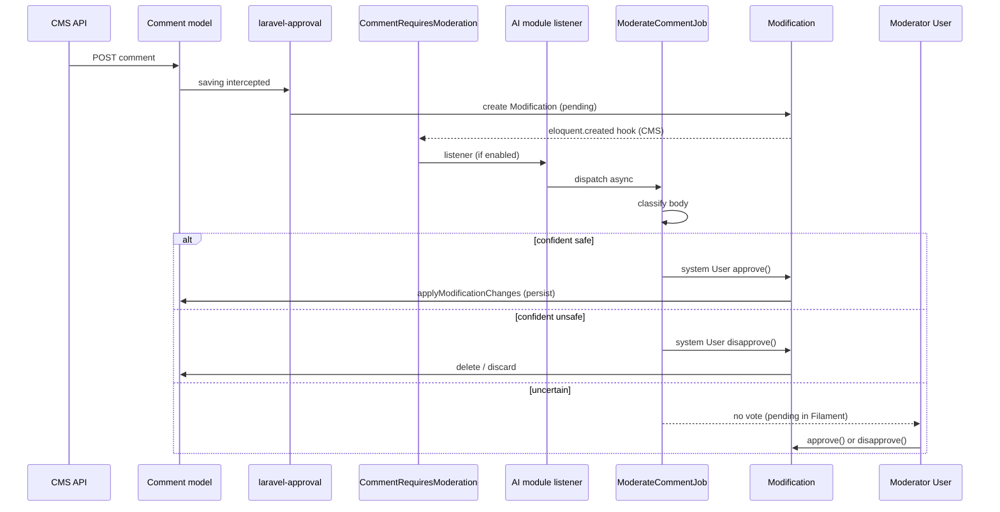

# CMS content comments with AI-assisted moderation (design)

**Status:** Draft — awaiting user review  
**Date:** 2026-05-15

## Problem

The CMS module needs comments on `Content` records. Each content can have many comments. Comments must be moderated through the existing approval system (`HasApprovals` / `laravel-approval`). The CMS module must not depend on the AI module. When AI is enabled and configured, it may auto-approve or auto-reject comments with high confidence; otherwise a human moderator with the right permission must decide.

## Goals

1. **Comment entity in CMS** — `Comment` belongs to `Content` and `User`; text-only in v1.
2. **Moderation via `HasApprovals`** — new comments and body edits go through `Modification`; unapproved comments are not visible on public/read APIs.
3. **Decoupled AI** — CMS dispatches a domain event; AI module registers an optional listener (same pattern as `ModelRequiresIndexing` → embeddings).
4. **Automatic resolution when certain** — AI casts `approve` or `disapprove` on the `Modification` when confidence ≥ configured threshold.
5. **Human fallback when uncertain** — AI abstains; authorized user resolves via existing Filament modifications UI.
6. **Tests** — feature tests for CMS flow; AI listener tests with mocked classifier.

## Non-goals (v1)

- Threading / replies (`parent_id`)
- Guest comments (name/email without user)
- Translations, ratings, media attachments
- Comment likes/dislikes
- Indexing comments in Elasticsearch
- Dedicated Filament Comment resource (moderation reuses `ModificationResource`)

## Assumptions (v1 defaults)

| Topic | Default |
|-------|---------|
| Author | Authenticated `User` only |
| Fields | `content_id`, `user_id`, `body` (text, max 5000) |
| Approval on create | Always (any non-empty `body`) |
| Approval on update | When `body` changes |
| `deleteWhenDisapproved` | `true` (from `HasApprovals`) |
| Votes required | `approversRequired = 1`, `disapproversRequired = 1` |
| AI when uncertain | No vote; human provides the single decisive vote |
| AI actor | Configured system `User` (`ai.features.comment_moderation.system_user_id`) |

## Architecture overview



## Components

### 1. CMS — `Comment` model

**Table:** `cms_comments` (`CMSTables::Comments`)

| Column | Type | Notes |
|--------|------|-------|
| `id` | bigint PK | |
| `content_id` | FK → `cms_contents` | cascade on delete |
| `user_id` | FK → `core_users` | cascade on delete |
| `body` | text | moderated field |
| `created_at` / `updated_at` | timestamps | set when approved and persisted |

**Model:** `Modules\CMS\Models\Comment`

- Extends `Modules\Core\Overrides\Model`
- Uses `HasApprovals` (same as `Content`)
- `requiresApprovalWhen`: always `true` when `body` is in dirty attributes (or on create)
- `modifier()`: `auth()->user()`
- Relations: `content(): BelongsTo`, `user(): BelongsTo`
- **Global scope `approvedOnly`:** for public/list APIs, only rows that exist in DB (post-approval). Pending items exist only as `Modification` records.

**Content:**

```php
public function comments(): HasMany
{
    return $this->hasMany(Comment::class);
}
```

### 2. CMS — event (no AI dependency)

**Event:** `Modules\CMS\Events\CommentRequiresModeration`

```php
final class CommentRequiresModeration
{
    public function __construct(
        public readonly Modification $modification,
    ) {}
}
```

**Dispatch:** CMS `EventServiceProvider` listens to `eloquent.created` on `Modules\Core\Models\Modification` and dispatches when:

- `modifiable_type === Comment::class`, and
- `active === true`

This works for both creations (`is_update = false`, `modifiable_id = null`) and edits.

### 3. CMS — API (v1)

| Method | Route | Behavior |
|--------|-------|----------|
| `GET` | `/api/cms/contents/{content}/comments` | Paginated approved comments for content |
| `POST` | `/api/cms/contents/{content}/comments` | Auth required; validates `body`; triggers approval flow; returns `202` with modification id / pending status |

**Authorization:**

- Create: authenticated user
- List: same as content visibility (reuse existing content policies/scopes)

**Response shape (pending create):**

```json
{
  "status": "pending_moderation",
  "modification_id": 123
}
```

Approved comment list returns normal comment resource (id, body, user summary, timestamps).

### 4. Core — permissions & Filament

- Permission: `approve.cms_comments` (matches `HasApprovals` check `approve.{table}`)
- Seed role assignment for admin/moderator roles (follow existing seeder patterns)
- `ModificationResource` tabs auto-discover `Comment` via `HasApprovals` — no new Filament resource required for v1
- `ApprovalNotificationService` auto-discovers `cms_comments` threshold setting

### 5. AI module — optional listener

**Config** (`Modules/AI/config/config.php`):

```php
'comment_moderation' => [
    'enabled' => env('AI_COMMENT_MODERATION_ENABLED', true),
    'approve_confidence_threshold' => (float) env('AI_COMMENT_MOD_APPROVE_THRESHOLD', 0.85),
    'reject_confidence_threshold' => (float) env('AI_COMMENT_MOD_REJECT_THRESHOLD', 0.85),
    'system_user_id' => env('AI_MODERATOR_USER_ID'), // required when enabled
    'queue' => env('AI_COMMENT_MOD_QUEUE', 'default'),
],
```

**Listener:** `Modules\AI\Listeners\HandleCommentModerationListener`

- Registered in `Modules\AI\Providers\EventServiceProvider` for `CommentRequiresModeration`
- `shouldHandle()`: module enabled, feature flag, `system_user_id` set, modification still active
- Dispatches `ModerateCommentJob` (async; sync only in console/tests when explicitly requested)

**Job:** `Modules\AI\Jobs\ModerateCommentJob`

1. Load `body` from `$modification->modifications['body']['modified']` (or creation payload)
2. Call `CommentModerationService::analyze(string $body): ModerationVerdict`
3. If `verdict === approve` and `confidence >= approve_threshold` → `$systemUser->approve($modification, $reason)`
4. If `verdict === reject` and `confidence >= reject_threshold` → `$systemUser->disapprove($modification, $reason)`
5. If `verdict === uncertain` or below threshold → **no vote**; log at info; optional metrics hook later

**Service:** `Modules\AI\Services\CommentModerationService`

- Reuse `GuardrailsService` for prompt-injection / unsafe patterns where applicable
- LLM classifier (structured JSON): `{ "verdict": "approve|reject|uncertain", "confidence": 0.0-1.0, "reason": "..." }`
- Map external API failures → `uncertain` (fail-safe: human moderates)

**DTO:** `Modules\AI\Data\ModerationVerdict` (enum + confidence + reason)

**System user:**

- Seeder creates `ai-moderator@system.local` (or uses env id)
- Must use `ApprovesChanges` trait (already on `User`)
- Not shown in normal user pickers

### 6. Moderation rules summary

| AI result | Confidence | Action |
|-----------|------------|--------|
| approve | ≥ approve threshold | System user `approve()` → comment persisted |
| reject | ≥ reject threshold | System user `disapprove()` → modification/comment discarded |
| uncertain | any | No AI vote; human with `approve.cms_comments` decides |
| AI disabled / module off | — | No listener; human only |
| AI error | — | Treat as uncertain |

**Note on “second vote”:** v1 implements **abstention** when uncertain (human is the only voter). AI does not cast a weak approve/reject that would require a second human vote. This keeps `approversRequired = 1` and avoids ambiguous states.

## Error handling

| Scenario | Behavior |
|----------|----------|
| AI module disabled | Comments stay pending until human moderates |
| Missing `system_user_id` | Listener skips; log warning |
| Modification already resolved | Job no-ops |
| Invalid / empty body in modification | Job disapproves or marks uncertain (prefer disapprove if empty) |
| User without permission tries Filament approve | `authorizedToApprove` returns false (extend on `User` if needed for `cms_comments`) |

## Testing strategy

| Layer | Tests |
|-------|-------|
| CMS Unit | `Comment` rules, `requiresApprovalWhen`, relations |
| CMS Feature | POST comment → modification pending, not in list; human approve → visible |
| CMS Feature | Disapprove → comment not listed |
| AI Unit | `CommentModerationService` thresholds with mocked LLM |
| AI Feature | Listener + job: high-confidence approve/reject; uncertain leaves modification active |
| Integration | AI module disabled → no auto resolution |

## File checklist (implementation reference)

**CMS**

- `database/migrations/*_create_cms_comments_table.php`
- `app/Enums/CMSTables.php` — add `Comments`
- `app/Models/Comment.php`
- `app/Events/CommentRequiresModeration.php`
- `app/Providers/EventServiceProvider.php` — dispatch hook
- `app/Http/Controllers/CommentsController.php` (or nested under contents)
- `app/Http/Requests/StoreCommentRequest.php`
- `routes/api.php`
- `database/factories/CommentFactory.php`
- `tests/Feature/CommentTest.php`

**AI**

- `config/config.php` — `comment_moderation` block
- `app/Listeners/HandleCommentModerationListener.php`
- `app/Jobs/ModerateCommentJob.php`
- `app/Services/CommentModerationService.php`
- `app/Data/ModerationVerdict.php` (or enum in Services)
- `database/seeders` — system moderator user (or document env)
- `tests/Feature/CommentModerationTest.php`

**Core**

- Permission seed: `approve.cms_comments`

## Risks

| Risk | Mitigation |
|------|------------|
| False positive reject | Tunable thresholds; uncertain → human |
| False negative approve | Guardrails + conservative prompts; lower approve threshold than reject |
| System user security | Dedicated account, no login, minimal permissions |
| Race: human votes before AI job | Job checks `modification->active` and remaining counts before voting |
| Creation flow confusion | API documents `pending_moderation` response clearly |

## Success criteria

1. Authenticated user can submit a comment on a content; it does not appear in public list until approved.
2. With AI enabled and high-confidence safe content, comment is auto-approved without human action.
3. With AI enabled and high-confidence unsafe content, comment is auto-rejected.
4. With uncertain AI result, modification stays in Filament until human approves/disapproves.
5. With AI module disabled, behavior is human-only moderation with no CMS→AI coupling.
6. All tests pass; `vendor/bin/pint --dirty` clean.

## Implementation plan

To be created via `writing-plans` skill after spec approval:  
`docs/superpowers/plans/2026-05-15-cms-comments-moderation.md`
