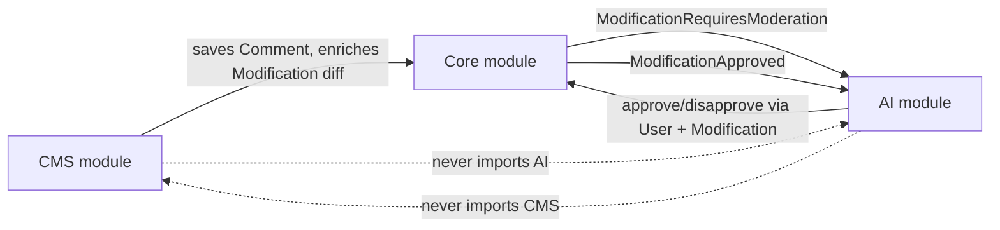

# Generic modification moderation (Core event bus + optional AI)

**Status:** Draft — supersedes comment-specific event names in `2026-05-15-cms-comments-moderation-design.md` for pipeline/orchestration only  
**Date:** 2026-05-15  
**Approach:** 1 — rename + move to Core; mirror `ModelRequiresIndexing` orchestration

## Problem

Comment moderation was wired with CMS-named events (`CommentRequiresModeration`, `CommentApproved`) and a separate `CommentModerationLog` table. We want:

1. **CMS must not reference AI** (no `config('ai…')`, no AI jobs/listeners).
2. **AI must not reference CMS** (no `Comment`, `Content`, or CMS events/models in AI code).
3. **Orchestration like search indexing** — always emit a Core event; AI optionally registers pre-processing and marks the event handled.
4. **No moderation log table** — pipeline state in queue + cache; durable outcomes on `approvals` / `disapprovals`, with optional AI metadata columns when the AI module is installed.

## How CMS and AI communicate (without knowing each other)

**Core is the only contract.** Both modules depend on Core, not on each other.



| Direction | Mechanism | CMS knows | AI knows |
|-----------|-----------|-----------|----------|
| CMS → pipeline | `Modification` saved (approval package) | `Comment`, capture service | — |
| Core → AI | `ModificationRequiresModeration` | — (Core emits) | `Modification`, config |
| AI → Core | `User::approve()` / `disapprove()` on `Modification` | — | `Modification`, `User` |
| CMS → post-approve hooks | `ModificationApproved` from `Comment::applyModificationChanges` | `Comment` + `Modification` | `Model` + `Modification` (no `Comment` type) |
| AI → translations | Listener on `ModificationApproved` + `HasTranslations` trait check | — | `Model`, config |

**CMS adapter (only place that knows both domains):** registers a `ModerationContextBuilder` implementation for comment modifications (e.g. in `CMSServiceProvider`) into a **Core or AI registry** keyed by `modifiable_type`. AI resolves the builder at runtime; if none registered, AI does not handle (fallback = human-only).

## Parallel with `ModelRequiresIndexing`

| Search indexing | Modification moderation |
|-----------------|-------------------------|
| Trigger: `Searchable::queueMakeSearchable()` | Trigger: Core on `Modification` saved (`active`) |
| Event: `ModelRequiresIndexing` | Event: `ModificationRequiresModeration` (see §Event naming) |
| Cache key: `model_indexing:{table}:{id}` | Cache key: `modification_moderation:{id}` |
| AI: `addRequiredPreProcessing('embeddings')` | AI: `addRequiredPreProcessing('ai_approval')` |
| Job: `GenerateEmbeddingsJob` | Job: `ApproveModificationJob` |
| Complete: `ModelPreProcessingCompleted` | Complete: `ModificationPreProcessingCompleted` |
| Finalize: `FinalizeModelIndexingListener` → `IndexInSearchJob` | Finalize: `FinalizeModificationModerationListener` → see §Finalize |
| Fallback: `IndexModelFallbackListener` if `!handled` | Fallback: `ModificationModerationFallbackListener` if `!handled` (no-op) |
| Persist: `core_model_embeddings` | Persist: vote on `approvals`/`disapprovals` + optional `meta` (Core column) |

### Event naming (`ModificationRequiresApproval` vs `ModificationRequiresModeration`)

We **always dispatch** the Core event when an active `Modification` is saved (same idea as always calling `queueMakeSearchable` for searchable models).

- **`ModificationRequiresModeration`** (recommended class name): means “this modification may need automated review before humans finish.” Avoids confusion with the `Approval` Eloquent model / `approvals` table.
- Pre-processing key **`ai_approval`**: means “AI module must cast an approve/disapprove vote (or mark for human review) before the orchestration round is complete.”
- Job **`ApproveModificationJob`**: analyze + apply vote via `User::approve()` / `disapprove()` (name reflects outcome, not only LLM call).

If the team prefers `ModificationRequiresApproval` as the event class name, document it explicitly in code reviews to distinguish from `Modules\Core\Models\Approval`.

## Events (Core)

### `ModificationRequiresModeration`

Same orchestration fields as `ModelRequiresIndexing`:

- `public Modification $modification`
- `public bool $sync = false`
- `public bool $handled = false`
- `public array $required_pre_processing = []`
- `public array $completed_pre_processing = []`
- Methods: `markAsHandled()`, `addRequiredPreProcessing()`, `markPreProcessingCompleted()`, `allPreProcessingCompleted()`

**Emitted by Core** when:

- `Modification` is saved
- `active === true`
- `modifiable_id` / `modifiable_type` present
- Same guards as today (e.g. only on create or morph change) — single emitter, remove CMS duplicate listeners

**Not filtered by comment type in Core** — always dispatch (like always calling `queueMakeSearchable` for searchable models). Whether AI runs is decided in the AI listener.

### `ModificationPreProcessingCompleted`

```php
public function __construct(
    public readonly Modification $modification,
    public readonly string $processing_type, // 'ai_approval'
) {}
```

### `ModificationApproved` (payload B)

```php
public function __construct(
    public readonly Modification $modification,
    public readonly Model $modifiable,
) {}
```

**Emitted by the modifiable model** when `applyModificationChanges($modification, approved: true)` finishes (today: `Comment` only).

## AI listener (first handler)

`HandleModificationModerationListener` — registered in **AI** `EventServiceProvider` **before** Core fallback (same order as indexing).

```text
handle(ModificationRequiresModeration $event):
  if !config('ai.features.moderation.enabled'): return
  if !system_user_id configured: return
  if !registry->supports($event->modification): return  // no builder for modifiable_type

  $event->addRequiredPreProcessing('ai_approval')
  saveEventToCache($event)
  dispatch ApproveModificationJob($event->modification)  // queue: config
  $event->markAsHandled()
```

No `CommentModerationLog`. No CMS imports.

## Core fallback listener (aligned with indexing *pattern*, different *effect*)

`ModificationModerationFallbackListener` — registered in **Core** after AI listeners (mirror `IndexModelFallbackListener` order):

```text
if $event->isHandled(): return
// AI did not handle — no job, no cache pre-processing required
// Human approval workflow continues unchanged (Modification stays active for moderators)
```

### Fallback matrix (same decision tree as embeddings)

| Condition | AI listener | `handled` | Fallback | Outcome |
|-----------|-------------|-----------|----------|---------|
| `ai.features.moderation.enabled` false | return early | false | no-op | Humans only |
| AI module not loaded / no listener | — | false | no-op | Humans only |
| `system_user_id` missing | return early (+ log) | false | no-op | Humans only |
| No `ModerationContextBuilder` for `modifiable_type` (e.g. `Setting`) | return early | false | no-op | Humans only |
| Builder exists + config OK (e.g. `Comment`) | dispatch `ApproveModificationJob`, cache event | **true** | no-op | AI vote (+ optional `meta` on approval/disapproval) |
| `ApproveModificationJob` fails | — | true (already) | — | Job applies uncertain policy (disapprove + human review); failure logged |

**Difference from Elasticsearch (intentional):** `IndexModelFallbackListener` still runs `IndexInSearchJob` when AI skips embeddings — search must happen without vectors. Moderation has **no parallel “default automated step”**: if AI skips, nothing is queued because **humans were always the primary path**. The event is still emitted for symmetry and future pre-processors; fallback is a deliberate no-op.

### Symmetry checklist with `ModelRequiresIndexing`

| Concern | Indexing | Moderation |
|---------|----------|------------|
| Core always emits event | yes (`queueMakeSearchable`) | yes (active `Modification` saved) |
| AI `shouldHandle` gates work | embeddings enabled + `$embed` + vector | moderation enabled + `system_user_id` + registry builder |
| `addRequiredPreProcessing` | `embeddings` | `ai_approval` |
| Cache orchestration | yes (async) | yes (async) |
| `markAsHandled()` when AI takes over | yes | yes |
| Core fallback if `!handled` | **runs** `IndexInSearchJob` | **no-op** (humans) |
| Finalize on `*PreProcessingCompleted` | dispatches `IndexInSearchJob` when all done | v1: clear cache only (vote in job) |

## `ApproveModificationJob` (AI)

1. Load fresh `Modification` (+ modifiable if needed).
2. Resolve context via registry → builder in **CMS** for comments.
3. Call `ModerationService::analyze($context)` (rename from comment-specific service).
4. Apply policy (threshold / dual / uncertain fallback) via `approve()` / `disapprove()` as system user.
5. When creating/updating `Approval` or `Disapproval`, set `meta` on the vote row (see §meta).
6. `event(new ModificationPreProcessingCompleted($modification, 'ai_approval'))`.

## Finalize listener (Core)

`FinalizeModificationModerationListener` on `ModificationPreProcessingCompleted`:

- Read cached `ModificationRequiresModeration` by `modification_moderation:{id}`.
- `markPreProcessingCompleted('ai_approval')`.
- If `allPreProcessingCompleted()`:
  - **v1:** cache forget only (vote already applied in `ApproveModificationJob`, mirroring “embed then index” only when finalize dispatches a *second* job).
  - **v2 (optional split):** split into `AnalyzeModificationJob` + finalize → `ApplyModificationVoteJob` — closer to `IndexInSearchJob` after embeddings.

**Recommendation for v1:** keep analyze + vote inside `ApproveModificationJob` (current behaviour); finalize only coordinates cache and future extra pre-processors.

## `meta` on `approvals` / `disapprovals` (Core) — done

Column added in Core create migrations (`2024_03_30_161513_create_*_table.php`):

| Column | Type | Notes |
|--------|------|--------|
| `meta` | json nullable | Opaque bag for any automated or external actor (AI, scripts, API, future modules). **No Core schema contract.** |

**Rationale:** Core owns the approval domain; `meta` is a generic extension point on a vote row. Writers (AI job, integrations) set their own JSON shape.

**Usage (implementation):** `ApproveModificationJob` sets `meta` on the system user’s approval/disapproval row (e.g. `source`, `verdict`, `confidence`, `categories`, `analyzed_at`).

**Human moderators:** leave `meta` null.

**Follow-up (optional):** cast `'meta' => 'array'` and `$fillable` on `Approval` / `Disapproval` when the moderation refactor lands.

**Filament / APIs:** read `meta` when present instead of removed `moderationLog.*`.

## Context builder registry (decoupling adapter)

**Interface** (location: `Modules\Core\Contracts\ModerationContextBuilder` or `Modules\AI\Contracts` — prefer **Core** so CMS registers against Core):

```php
interface ModerationContextBuilder {
    public function supports(Modification $modification): bool;
    public function build(Modification $modification): ModerationContext; // DTO in Core or AI
}
```

**Registry** (`ModerationContextBuilderRegistry` in Core):

- `register(ModerationContextBuilder $builder)`
- `resolve(Modification $modification): ?ModerationContextBuilder`

**CMS** (`CommentModerationContextBuilder`):

- `supports`: `modifiable_type === Comment::class`
- `build`: reads `modifications` diff, loads `Content` for prompt context

**AI** `ApproveModificationJob` uses registry only — **no `use Modules\CMS\...`**.

This replaces undecided trait vs config opt-in: **opt-in = register a builder**. No trait required on `Comment`; `Setting` has no builder → AI skips.

## Config (AI module)

Rename `comment_moderation` → `moderation`:

```php
'moderation' => [
    'enabled' => env('AI_MODERATION_ENABLED', true),
    'approval_mode' => env('AI_MODERATION_APPROVAL_MODE', 'threshold'),
    'ai_participates_in_approvals' => env('AI_MODERATION_AI_VOTES', true),
    'approve_confidence_threshold' => (float) env('AI_MODERATION_APPROVE_THRESHOLD', 0.85),
    'reject_confidence_threshold' => (float) env('AI_MODERATION_REJECT_THRESHOLD', 0.85),
    'system_user_id' => env('AI_MODERATOR_USER_ID'),
    'queue' => env('AI_MODERATION_QUEUE', 'default'),
    'provider' => env('AI_MODERATION_PROVIDER'),
],
'translation' => [
    'auto_translate_on_approval' => env('AI_AUTO_TRANSLATE_ON_APPROVAL', false),
],
```

Move `auto_translate_enabled` out of moderation config.

## Renames (implementation checklist)

| From | To |
|------|-----|
| `CommentRequiresModeration` | `ModificationRequiresModeration` (Core) |
| `CommentApproved` | `ModificationApproved` (Core) |
| `HandleCommentModerationListener` | `HandleModificationModerationListener` |
| `HandleCommentApprovedTranslationListener` | `HandleModificationApprovedTranslationListener` |
| `ModerateCommentJob` | `ApproveModificationJob` |
| `CommentModerationService` | `ModerationService` (or keep internal rename) |
| `CommentModerationContextBuilder` | stays in CMS, implements interface |
| `CommentModerationLog` + table | **remove** |
| CMS `EventServiceProvider` Modification listener | **remove** (Core only) |
| `CommentApprovalCapture` event dispatch | **remove** |

## CMS responsibilities (unchanged domain)

- `CommentApprovalCapture::enrichDiff`
- `Comment` translations, `applyModificationChanges`, emit `ModificationApproved($modification, $this)`
- Register `CommentModerationContextBuilder` in `CMSServiceProvider`

## Testing

- **Core:** emitting `ModificationRequiresModeration` on active modification save; cache + `allPreProcessingCompleted`; fallback when not handled.
- **AI:** listener marks handled, dispatches job when builder registered; skips when disabled.
- **AI:** `ApproveModificationJob` with mocked service; approvals get AI columns when set.
- **CMS:** comment flow end-to-end; `ModificationApproved` dispatched after approve; no `CommentRequiresModeration` references.

## Open decisions (defaults chosen above)

| Topic | Decision |
|-------|----------|
| Opt-in | **Builder registry** (no trait/config on model required) |
| `ModificationApproved` payload | **B** — `Modification` + `Model $modifiable` |
| Finalize after `ai_analysis` | **v1:** vote in analyze job; finalize clears cache |
| Vote metadata | **`meta` json** on approvals/disapprovals (**Core** — migration done) |

## Relation to previous spec

`2026-05-15-cms-comments-moderation-design.md` remains valid for **comment product rules** (translations, dual mode, Filament, ratings). This document replaces **event names, pipeline, and CMS/AI boundaries**.
