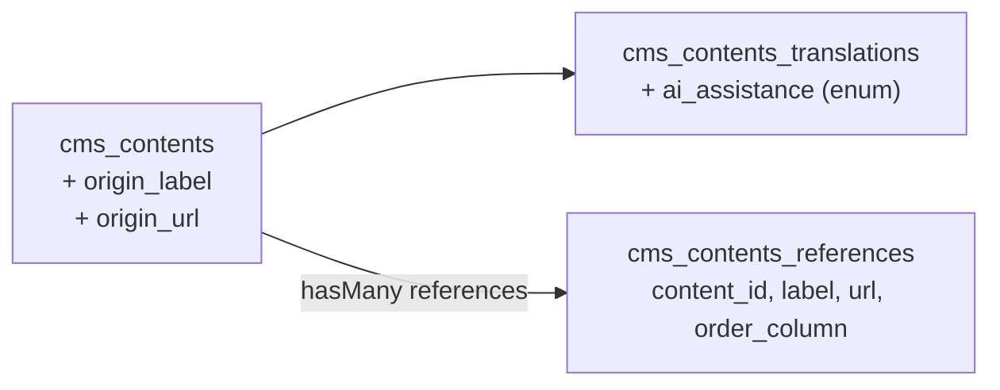

# CMS content provenance, references and AI-assistance disclosure (design)

**Status:** Approved direction (v1)  
**Date:** 2026-07-02

## Problem

The CMS module must track additional editorial metadata on contents to satisfy
both editorial/legal attribution needs and the EU AI Act (Regulation (EU)
2024/1689, Article 50) transparency obligations that apply from 2 August 2026.

Three distinct pieces of information are required:

1. **Origin** — when a content was imported or quoted verbatim from an external
   source, record where it came from (a label and an optional URL).
2. **References** — the external sources consulted to write the content
   (a bibliography), potentially many per content.
3. **AI assistance** — whether a content (or a specific translation of it) was
   produced with the help of AI, and in which way (generated, translated,
   edited, summarized). AI-assisted translation is explicitly in scope: a
   human-written article translated by AI must be disclosed on that translation.

## Goals

1. **Origin on the aggregate** — `origin_label` + `origin_url` on `cms_contents`.
   Single origin per content; the imported original is one language, later
   translated inside Laraplate, so origin does not vary per locale.
2. **References as a 1:N child** — new `cms_contents_references` table holding
   `label` (required) + `url` (nullable), ordered per content.
3. **AI assistance per translation** — `ai_assistance` enum column on
   `cms_contents_translations`, source of truth for the public disclosure of
   each locale-specific version.
4. **Consistency with project conventions** — reuse `Core\Overrides\Model`,
   `MigrateUtils`, `CMSTables` enum, `SortableTrait`, settings-driven soft
   deletes, and the `getRules()` validation pattern.
5. **Tests** — Pest feature/unit tests proving schema, relation, enum casting,
   ordering scope, and soft-delete behavior.

## Non-goals (v1)

- Reference `type` classification (article/book/website/interview) — deferred (YAGNI).
- Translatable reference `label` — references live at content level, shared
  across locales; the label is language-neutral (publisher/source name).
- Per-locale origin override — origin is a single aggregate-level fact in v1.
- Frontend disclosure widgets, JSON-LD/watermarking machine-readable marking,
  and Article 50(2) provider-side technical marking — out of scope for the DB
  layer; tracked separately when the public rendering layer is addressed.
- Filament form/table wiring beyond what already exists (can follow in a
  separate UI pass).

## Decisions (confirmed with product owner)

| Topic | Decision |
|-------|----------|
| `ai_assistance` location | `cms_contents_translations` (per locale) |
| `ai_assistance` type | Backed enum `none \| generated \| translated \| edited \| summarized` |
| Origin location | `cms_contents` (`origin_label`, `origin_url`) |
| References table | `cms_contents_references`, censited in `CMSTables` enum |
| Content relation | `references(): HasMany<ContentReference, $this>` |
| Reference fields | `content_id`, `label` (required), `url` (nullable, 2048), `order_column` |
| Reference `url` | Nullable (offline sources allowed) |
| Reference ordering | `SortableTrait` scoped per `content_id` via `buildSortQuery()` |
| Reference `type` | Not included in v1 |
| Reference `label` | Not translatable |
| Soft delete | Yes, inherited from `Core\Overrides\Model` + `MigrateUtils::timestamps(hasSoftDelete: true)`; toggle via `soft_deletes_cms_contents_references` setting |

## Data model



### 1. `cms_contents` — origin columns (ALTER existing table)

New nullable columns on the existing contents table:

- `origin_label` — `string`, nullable. Human-readable source name (publisher/site).
- `origin_url` — `string(2048)`, nullable. Link to the original external source.

Presence of `origin_url`/`origin_label` marks the content as externally
sourced. The `Fonte:` / `Source:` prefix is frontend i18n, not stored.

Added to `Content::$fillable`. No cast needed (plain strings). Validation rules
extended in `Content::getRules()`:

- `origin_label`: `sometimes|nullable|string|max:255`
- `origin_url`: `sometimes|nullable|url|max:2048`

### 2. `cms_contents_translations` — `ai_assistance` column (ALTER existing table)

- `ai_assistance` — string enum column, `nullable(false)`, default `none`,
  indexed for filtering ("all AI-assisted versions").

Backed PHP enum `Modules\CMS\Enums\AiAssistance: string` with TitleCase keys:

```php
enum AiAssistance: string
{
    case None = 'none';
    case Generated = 'generated';
    case Translated = 'translated';
    case Edited = 'edited';
    case Summarized = 'summarized';
}
```

Cast on `ContentTranslation` via the `casts()` method:
`'ai_assistance' => AiAssistance::class`. Added to `ContentTranslation::$fillable`
and default `$attributes` (`'ai_assistance' => 'none'`).

Validation (in `Content::getRules()`, translation array rules):
`translations.*.ai_assistance` → `sometimes|string|in:none,generated,translated,edited,summarized`.

### 3. `cms_contents_references` — new table

Migration using `CMSTables::ContentsReferences->value` and `MigrateUtils`:

```php
$table->id();
$table->foreignId('content_id')->nullable(false)
    ->constrained(CMSTables::Contents->value, 'id', "{$table_name}_content_id_FK")
    ->cascadeOnDelete()
    ->comment('The content that the reference belongs to');
$table->string('label')->nullable(false)->comment('Human-readable name of the source');
$table->string('url', 2048)->nullable()->comment('Optional link to the source');
$table->integer('order_column')->nullable(false)->default(0)
    ->index("{$table_name}_order_column_IDX")->comment('Display order of the reference');

MigrateUtils::timestamps($table, hasCreateUpdate: true, hasSoftDelete: true);

$table->index(['content_id', 'order_column'], "{$table_name}_content_order_IDX");
```

### Enum addition

`CMSTables` gains, in the `cms models` group after `ContentRatings`:

```php
case ContentsReferences = 'cms_contents_references';
```

### Model `Modules\CMS\Models\ContentReference`

- Extends `Core\Overrides\Model`, implements `Spatie\EloquentSortable\Sortable`.
- `use SortableTrait;`
- `$table = CMSTables::ContentsReferences->value`
- `$fillable = ['content_id', 'label', 'url', 'order_column']`
- `$hidden = ['created_at', 'updated_at']`
- `$sortable = ['order_column_name' => 'order_column', 'sort_when_creating' => true]`
- `content(): BelongsTo<Content, $this>`
- Scoped ordering so each content keeps an independent sequence:

```php
public function buildSortQuery(): Builder
{
    return static::query()->where('content_id', $this->content_id);
}
```

- `getRules()` following sibling pattern:
  - create: `content_id` required + `exists`, `label` required string max:255,
    `url` nullable url max:2048, `order_column` sometimes integer min:0.
  - update: same with `sometimes`.

### Relation on `Content`

```php
/**
 * The external references (bibliography) cited by this content.
 *
 * @return HasMany<ContentReference, $this>
 */
public function references(): HasMany
{
    return $this->hasMany(ContentReference::class);
}
```

Optionally add `references` to `Content::toSearchableWith()` only if references
should be indexed; **deferred** in v1 (non-goal).

## Migrations plan

1. `alter_contents_table_add_origin_columns` — add `origin_label`, `origin_url`.
2. `alter_contents_translations_table_add_ai_assistance` — add `ai_assistance`
   (not null, default `none`, indexed). On existing rows the default backfills.
3. `create_contents_references_table` — new child table.

Each migration includes a symmetric `down()` dropping the columns/table.
Column modifications restate all existing attributes (Laravel 12 requirement),
but here we only add new columns, so no restatement risk.

## Legal alignment notes (informational, not legal advice)

- **Origin / references** support attribution obligations (copyright/licensing,
  DSM Directive art. 15 hyperlink-to-source for press extracts). The stored
  fields must be resolvable for the publicly displayed locale version.
- **AI Act art. 50** disclosure applies to the *version exposed to the public*.
  Storing `ai_assistance` per translation is the source of truth; the visible,
  human-perceivable label and any machine-readable marking are a separate
  rendering concern (out of scope here). AI translations fall in scope, which
  is why the flag lives on the translation, not the parent.

## Testing strategy

Module-owned Pest tests under `Modules/CMS/tests/`:

- **Unit — `ContentReference` model**: traits present (`SortableTrait`,
  `SoftDeletes`), `$table`, `$fillable`, `getRules()` shape, `buildSortQuery`
  scopes by `content_id`.
- **Feature — references relation**: creating references via `Content`,
  eager loading, `ordered` scope returns per-content sequence, cascade delete
  on content deletion, soft delete of a reference (and settings toggle honored).
- **Feature — origin columns**: mass-assign + validation rules pass/fail cases.
- **Feature — `ai_assistance`**: enum cast round-trip on `ContentTranslation`,
  default `none`, validation rejects unknown values, filtering by enum works.
- Use `ContentFactory` and a new `ContentReferenceFactory` (with states, e.g.
  `withoutUrl`).

## Rollout / files touched

- `Modules/CMS/app/Enums/CMSTables.php` — add `ContentsReferences`.
- `Modules/CMS/app/Enums/AiAssistance.php` — new enum.
- `Modules/CMS/app/Models/ContentReference.php` — new model.
- `Modules/CMS/app/Models/Content.php` — `references()`, `origin_*` fillable +
  rules.
- `Modules/CMS/app/Models/Translations/ContentTranslation.php` — `ai_assistance`
  fillable/cast/default + rules delegation.
- `Modules/CMS/database/migrations/*` — three migrations.
- `Modules/CMS/database/factories/ContentReferenceFactory.php` — new factory.
- `Modules/CMS/tests/**` — unit + feature tests.
- After changes: `vendor/bin/pint --dirty`, targeted `php artisan test --compact`.
- Evaluate a CMS semantic version bump (`minor`, backward-compatible feature)
  per `.cursor/rules/08-versioning.mdc`, on explicit user confirmation.
