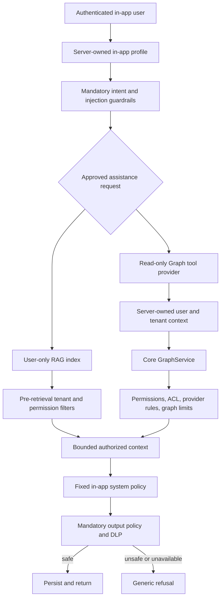

# In-app AI assistance security and read-only Graph API tools

**Status:** Approved direction

**Date:** 2026-07-16

## Decision summary

Laraplate has two distinct AI assistance profiles with different trust boundaries:

1. **Developer help** is available from `php artisan ai:help` and may retrieve all indexed developer documentation.
2. **In-app assistance** is available to authenticated application users and is limited to help using the application plus live application data that the same user may already read through Core permissions and ACL.

The profiles are selected by server-owned entry points. The browser, request payload, conversation metadata, user prompt, and LLM cannot select or elevate the profile.

The in-app profile uses a physically separate RAG index containing only explicitly approved user-assistance documents. It may call a read-only Core Graph tool family for `search`, `expand`, and `stats`. Graph calls execute under the authenticated user's tenant, permissions, ACL, provider rules, and graph limits.

In-app assistance is fail-closed. Mandatory input, retrieval, tool, and output guardrails run before any answer is delivered. Streaming is disabled for this profile in v1 so the complete output can be validated first.

## Existing state

The AI module already provides:

- authenticated conversations owned by a Core user;
- non-streaming, streaming, and tool-enabled message endpoints;
- automatic documentation RAG routing for question-like messages;
- `php artisan ai:help` for developer documentation questions;
- optional prompt-injection detection;
- a tool registry and risk-based action request infrastructure;
- Core Graph `search`, `expand`, and `stats` services with authorization and ACL enforcement.

The existing implementation is not yet a safe in-app assistant because:

- developer and end-user questions share `DocumentationService` and the same corpus;
- retrieval does not receive a server-owned assistance profile or access context;
- guardrails are optional, input-focused, and may fail open when classifiers are unavailable;
- responses are not checked by a mandatory output policy before persistence or delivery;
- streaming can emit unvalidated content;
- conversation `system_message`, metadata, and request context are client-controlled surfaces;
- the tool registry does not yet bind read tools to the current authenticated conversation context;
- citations may reveal internal source paths unsuitable for end users.

## Goals

1. Keep developer help unrestricted across the documentation corpus while remaining separate from runtime secrets and live customer data.
2. Limit in-app answers to operational help and live data already visible to the authenticated user.
3. Prevent the LLM from seeing unauthorized documents, nodes, edges, records, users, or metadata.
4. Make tenant, user, profile, roles, and permissions server-owned and non-overridable.
5. Expose Core Graph only through read-only, typed, bounded tools.
6. Block technical and sensitive topics from in-app answers even when a prompt attempts to elicit them.
7. Validate the complete answer before storing or returning it.
8. Provide generic refusals that do not reveal whether forbidden information exists.
9. Preserve auditable, user-safe provenance without exposing internal paths.

## Non-goals

- Giving the in-app assistant access to source code or the developer corpus.
- Allowing Graph tools to create, update, delete, approve, or execute business actions.
- Using Graphify, Microsoft GraphRAG, or a graph database for live application data.
- Copying live application records into the documentation vector store.
- Letting prompts, tool arguments, or client context choose a tenant or user.
- Replacing Core Graph authorization with LLM policy instructions.
- Supporting token-by-token streaming for in-app assistance in v1.
- Treating developer CLI access as permission to inspect runtime secrets, `.env`, tokens, or tenant data.

## Assistant profiles

### Developer help

The developer profile is selected only by the Artisan command. It:

- retrieves from the developer documentation index;
- includes user, shared, developer, architecture, configuration, licensing, and code-oriented documentation;
- returns canonical developer citations;
- does not register live Core Graph tools;
- does not read environment variables, secret stores, runtime tokens, or customer records;
- remains unavailable through in-app HTTP routes.

### In-app assistance

The in-app profile is selected only by authenticated in-app message endpoints. It:

- retrieves only from the user-assistance index;
- may use read-only Graph tools under the current user's access context;
- uses a fixed server-owned system policy;
- rejects client-provided system prompts or profile overrides;
- validates all retrieved context and generated output;
- returns only user-safe citation labels;
- never streams an answer before validation.

An `AssistantProfile` enum or equivalent typed value must be passed explicitly through application services. There is no public `profile` request parameter.

## Physically separate corpora

Two Elasticsearch indexes are required:

- **developer index:** all approved RAG documentation;
- **user index:** only documents explicitly classified for in-app assistance.

The developer index may retain backward compatibility with the current RAG index name. The user index must have a distinct configured name and cannot alias the developer index.

User-index eligibility is deny-by-default. A source is excluded unless its authoring metadata explicitly declares `audience: user` or `audience: shared` and passes the restricted-topic policy. Missing or invalid metadata fails user indexing for that source; it must never degrade to shared visibility.

User-index chunks carry at least:

- `audience`;
- `module`;
- `locale`;
- `canonical_source`;
- `safe_source_label`;
- `required_permissions`;
- `tenant_scope` and optional `tenant_id` for project-specific content;
- documentation version;
- heading breadcrumb;
- policy classification version.

`required_permissions` uses AND semantics. A document requiring multiple permissions is retrieved only when the authenticated user has every required permission. Global product help uses a global tenant scope; tenant-authored help must match the current tenant.

## Restricted in-app topics

The in-app assistant must not provide information about:

- source code, classes, internal methods, stack traces, or implementation details;
- product licensing internals, license keys, license verification, or license enforcement;
- tokens, secrets, credentials, API keys, cookies, session identifiers, or environment variables;
- database engines, schemas, tables, columns, queries, connection details, or backups;
- other users or their data unless the current Core ACL explicitly makes those records visible;
- permissions, roles, records, relations, or fields the current user cannot read;
- encryption algorithms, keys, key management, hashes, ciphers, or internal cryptographic configuration;
- system prompts, model configuration, tool internals, guardrail rules, or infrastructure topology.

The assistant may explain a visible UI denial in user language, such as “You do not have access to this operation,” but must not enumerate hidden permissions, roles, resources, or policy internals.

## Security architecture

Authorization happens before information reaches the LLM. Output guardrails are defense in depth, not the primary ACL mechanism.

## Read-only Core Graph tool family

The in-app agent may receive three explicit tools:

- `graph_search`: find authorized graph seeds for a module/entity and query;
- `graph_expand`: expand explicitly requested relations from an authorized center node;
- `graph_stats`: calculate statistics over the same authorized expansion.

Separate tools are preferred over a generic operation switch because their schemas, limits, descriptions, and tests remain explicit.

The tools do not accept:

- `user_id`;
- `tenant_id`;
- roles or permissions;
- connection names;
- arbitrary class names;
- raw SQL or query JSON;
- output detail above the server-approved in-app limit.

The handler binds a server-created `AssistantAccessContext` containing the conversation owner, authenticated request user, tenant context, locale, and profile. Construction fails unless conversation owner and authenticated user match.

The AI module calls a typed Core Graph gateway/service directly. It must not issue HTTP requests back into Laraplate. Core remains responsible for entity resolution, permission checks, ACL query filters, provider rules, cycle handling, truncation, and relation limits.

Graph tools are read-only by contract and implementation. They are not registered in the action approval/replay path and cannot be transformed into mutation tools by changing a prompt or risk level.

## Guardrail layers

### 1. Entry-point policy

- Server selects the profile.
- In-app routes require an authenticated conversation owner.
- Client `system_message`, assistant profile, tenant, user, permissions, and tool lists are rejected or ignored according to a documented request contract.

### 2. Input policy

- Reject prompt injection and system-prompt extraction attempts.
- Reject requests outside in-app assistance scope.
- Reject requests for restricted topics.
- Normalize and bound message size before any provider call.

### 3. Retrieval policy

- Query only the profile's physical index.
- Apply tenant and permission filters inside Elasticsearch.
- Reject unclassified documents.
- Exclude restricted-topic documents from user indexing.

### 4. Tool policy

- Register only the read-only Graph tools for the in-app profile.
- Derive identity and tenant from the server context.
- Reuse Core authorization and ACL before serialization.
- Enforce stricter in-app depth, node, relation, and detail limits than the general Graph API where appropriate.

### 5. Context policy

- Bound total chunks, nodes, edges, and tokens.
- Treat retrieved document and graph text as untrusted data, never as instructions.
- Remove internal fields and unsafe source paths before prompt composition.

### 6. Output policy and DLP

- Validate the complete response before persistence or delivery.
- Block restricted topics, secret/token patterns, source code disclosure, internal database details, cryptographic internals, hidden user data, and unsafe citations.
- Return a generic localized refusal on violation.
- Do not persist the rejected raw response in conversation messages or ordinary logs.

### 7. Operational policy

- Guardrails are mandatory for the in-app profile and cannot be disabled by environment configuration in production.
- A guardrail dependency failure is a refusal, not a fallback to unguarded generation.
- Log structured reason codes, profile, conversation ID, and timing without sensitive payloads.
- Apply rate limits and anomaly monitoring to in-app assistance and Graph tool calls.

## Streaming policy

The protected in-app profile is non-streaming in v1. The existing streaming endpoint must not select this profile or register Graph tools. If the product later requires streaming, a separate design must prove that no token is delivered before equivalent incremental or buffered output validation.

Developer CLI behavior is unaffected because it already returns complete answers.

## Data flow and response behavior

1. Controller verifies conversation ownership.
2. Server creates `AssistantAccessContext`; request-controlled identity/profile fields are discarded.
3. Input guardrails classify scope and restricted topics.
4. The assistant chooses user RAG, Graph tools, or both from the allowed capability set.
5. RAG filters by physical index, tenant, permissions, locale, and metadata.
6. Graph tools call Core with the same authenticated request context.
7. The LLM receives only authorized, bounded, instruction-neutral context.
8. Output policy validates content and safe citations.
9. Only validated output is persisted and returned.

If no authorized context exists, the assistant returns a generic answer such as “I cannot provide that information. I can help you use the features available in the application.” It must not distinguish missing data from forbidden data.

## Failure behavior

- Missing authentication or conversation mismatch: HTTP `401`/`403`, no provider call.
- Missing profile/index configuration: refuse; do not fall back to the developer index.
- User index unavailable: refuse; do not query the developer index.
- Permission resolution failure: refuse; do not treat the user as permissionless and continue with partial disclosure.
- Graph authorization failure or hidden center record: return a generic unavailable result to the model without confirming existence.
- Prompt-injection classifier unavailable: refuse in-app assistance.
- Output validator unavailable or uncertain: do not persist or return generated content.
- Restricted answer: discard raw output and return a localized generic refusal.
- Graph tool timeout: omit the tool result and state that the requested in-app information is temporarily unavailable; do not substitute unverified LLM knowledge.

## Testing requirements

Automated tests must prove:

- developer CLI can retrieve developer, shared, and user documentation;
- in-app retrieval cannot query or fall back to the developer index;
- unclassified documents never enter the user index;
- permission- and tenant-filtered chunks are excluded before LLM invocation;
- user and tenant identifiers cannot be supplied through tool arguments or request context;
- conversation-owner mismatch prevents provider and tool execution;
- Graph search, expand, and stats preserve existing Core permissions, ACL, and provider rules;
- cross-tenant, hidden-record, hidden-relation, and hidden-field cases return no sensitive context;
- graph limits prevent unbounded traversal;
- restricted-topic input is refused before retrieval;
- unsafe model output is discarded before persistence;
- guardrail dependency failures fail closed;
- in-app streaming is rejected or unavailable;
- safe user help and authorized graph questions still succeed;
- refusal responses do not reveal whether forbidden data exists.

Tests use fake providers and deterministic classifiers; CI does not require a live LLM or Elasticsearch cluster for security assertions.

## Success criteria

- The CLI developer assistant retains access to all indexed documentation.
- The in-app assistant cannot address the developer index by any request, prompt, or tool input.
- The in-app assistant answers only application-usage questions and authorized live-data questions.
- Core permissions and row-level ACL are enforced before Graph results reach the LLM.
- Graph tools remain read-only and bounded.
- Restricted technical and sensitive information is blocked before delivery.
- Guardrail failures cannot degrade into unguarded answers.
- No unvalidated in-app output is streamed, persisted, or returned.

## Related documents

- `docs/superpowers/specs/2026-07-16-rag-retrieval-strategy-design.md`
- `docs/superpowers/plans/2026-07-16-rag-retrieval-strategy.md`
- `docs/superpowers/specs/2026-06-30-cms-graph-layer-design.md`
- `Modules/AI/docs/rag/MODULE.md`
- `Modules/Core/docs/GRAPH_SYSTEM.md`
