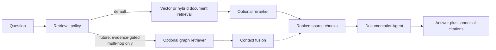

# RAG retrieval strategy — vector baseline and evidence-gated graph retrieval

**Status:** Approved direction

**Date:** 2026-07-16

## Decision summary

Laraplate keeps **documentation vector RAG** as its default and required retrieval architecture. The production baseline is curated documentation, Markdown-aware chunking, embeddings, Elasticsearch kNN retrieval, LLM answer generation, and structured citations.

Graphify, Microsoft GraphRAG, a graph database, and graph traversal are **not baseline dependencies**. A graph retriever may be evaluated later as an optional, query-selected complement for relationship-heavy or multi-hop questions. It must not replace vector retrieval for ordinary documentation lookup.

The adoption order is locked:

1. implement the approved assistant-profile, corpus-isolation, guardrail, and read-only Graph tool boundary in `2026-07-16-in-app-ai-assistance-security-design.md`;
2. establish a repeatable RAG evaluation dataset and baseline;
3. improve corpus metadata and retrieval scoping;
4. evaluate hybrid lexical + vector retrieval;
5. evaluate cross-encoder reranking;
6. run a graph-retrieval spike only if measured residual documentation failures are genuinely relational or multi-hop.

## Context

The current documentation RAG already provides:

- curated roots under `docs/rag/` and `Modules/*/docs/rag/`;
- `MarkdownAwareSplitter` chunking;
- configurable embeddings;
- filesystem, memory, and Elasticsearch vector stores;
- incremental reindexing by source;
- vector similarity top-K retrieval;
- LLM answers with structured citations;
- in-app chat for operators and `ai:help` for developers.

Elasticsearch is the production and multi-instance store. Filesystem remains suitable for simple single-instance deployments, and memory remains test-only.

## Problem

Vector similarity is appropriate for most Laraplate documentation questions, such as locating a configuration key, explaining a workflow, or identifying a required permission. It can be weaker when an answer depends on traversing several explicit relationships across modules, events, models, policies, and workflows.

Introducing a knowledge graph prematurely would add ingestion cost, entity-resolution rules, synchronization, storage, observability, and a second retrieval path before Laraplate has measured whether those costs solve a material product problem.

The architecture therefore needs a stable vector baseline, measurable quality gates, and a clean extension boundary for future retrieval strategies without committing the product to Graphify or any graph vendor.

## Goals

1. Preserve a simple, production-ready vector RAG default.
2. Measure retrieval and answer quality before adding retrieval complexity.
3. Improve ordinary lookup quality with metadata, hybrid retrieval, and reranking before graph retrieval.
4. Permit an optional graph retriever without changing chat or CLI public contracts.
5. Route graph retrieval only for questions whose structure benefits from relationship traversal.
6. Keep citations traceable to canonical source documents, including when a graph contributes context.
7. Keep end-user documentation and developer documentation in physically separate indexes with server-owned profile selection.
8. Use the existing Core Graph API as a read-only, ACL-preserving live-data tool for in-app assistance; this is separate from documentation GraphRAG.

## Non-goals

- Graphifying the entire repository or corpus by default.
- Replacing Elasticsearch vector retrieval with Graphify or GraphRAG.
- Making Neo4j, another graph database, or a Graphify installation mandatory.
- Using the UI Graph Explorer as the RAG knowledge graph.
- Automatically learning graph facts from user conversations.
- Adding database/API/PDF ingestion in this strategy; each new source type requires its own ingestion spec.
- Treating model search in Core and documentation RAG as the same index or service.
- Treating the read-only Core Graph tool as a documentation graph retriever or as permission to implement graph mutations.

## Terminology and boundaries

### Documentation RAG

The AI module pipeline that retrieves chunks from the curated documentation corpus and supplies them to `DocumentationAgent`.

### Core orchestrated search

The Core search system for application models. It already supports lexical/vector ensemble search and reranking contracts. Its patterns may be reused, but its indexes, result DTOs, permissions, and lifecycle remain separate from documentation RAG.

### Graph Explorer

The product UI for exploring application relations. It is not a RAG retriever and does not imply that the documentation corpus is stored as a knowledge graph.

### Graphify and GraphRAG

Graphify is an external knowledge-graph tool. GraphRAG is a family of retrieval approaches that extracts or uses entities and relationships. Neither is selected as a Laraplate production dependency by this decision.

### Core Graph tools for in-app assistance

Core Graph tools query live application records through the existing authorized Graph framework. They are an approved read-only capability for the in-app assistant and are not gated by the future GraphRAG experiment. They use `search`, `expand`, and `stats`, inherit the authenticated user's tenant, permissions, ACL, provider rules, and graph limits, and never write live records into the documentation index.

## Target architecture

The solid path is the committed architecture. The dotted graph path is a future extension point, not an implementation commitment.

The public entry points retain their purpose but no longer share one trust profile:

- `DocumentationService::answerQuestion()`;
- in-app `ChatService` RAG routing;
- `php artisan ai:help`;
- `php artisan ai:index-rag-docs`.

Developer CLI and in-app assistance must use the separate profiles and physical indexes defined in `2026-07-16-in-app-ai-assistance-security-design.md`. The in-app profile is non-streaming in v1 and requires mandatory fail-closed input, retrieval, tool, and output guardrails.

NeuronAI's `RetrievalInterface` is the internal extension seam. The current default remains similarity retrieval. Hybrid, reranked, or future graph-aware implementations must remain replaceable behind this interface.

## Retrieval phases

### Phase 0 — evaluation baseline

Create a version-controlled evaluation dataset with questions, audience, locale, expected source documents, required answer facts, and whether the question is single-hop or multi-hop.

The baseline must report at least:

- source hit rate at K;
- mean reciprocal rank;
- citation precision;
- supported-answer rate;
- correct refusal rate for unsupported questions;
- latency and provider cost where measurable;
- results split by audience, locale, module, and hop class.

No new retrieval strategy becomes the default without comparison against this baseline.

### Phase 1 — metadata and scoping

Every indexed chunk should carry stable metadata sufficient to filter or analyze retrieval:

- audience: `user`, `developer`, or `shared`;
- module or application scope;
- locale;
- documentation version when applicable;
- canonical source path;
- heading breadcrumb;
- source type.

Missing metadata may use an explicit neutral value in the developer index. It must exclude the source from the user index; user visibility is deny-by-default.

### Phase 2 — hybrid retrieval

For Elasticsearch documentation RAG, evaluate lexical relevance together with vector similarity. The two result lists should be fused with a deterministic method such as reciprocal rank fusion rather than relying on incomparable raw scores.

Vector-only retrieval remains available as a fallback and as the reference baseline. Filesystem and memory drivers are not required to emulate Elasticsearch lexical retrieval.

Hybrid retrieval becomes the default only when the evaluation dataset shows a material quality improvement without unacceptable latency or operational regression.

### Phase 3 — reranking

Evaluate reranking only on a bounded candidate set produced by vector or hybrid retrieval. Reuse the Core `IReranker` contract where practical, but keep documentation-specific conversion and failure behavior inside the AI module.

If the reranker is unavailable or returns invalid scores, retrieval must fall back to the pre-rerank order and record the fallback. It must not discard all context.

### Phase 4 — optional graph spike

A graph spike is authorized only when all of the following are true:

1. the evaluation dataset contains a representative multi-hop subset;
2. failure analysis shows that a meaningful share of residual failures comes from lost or untraversed relationships;
3. metadata filtering, hybrid retrieval, and reranking have already been evaluated;
4. the spike has explicit ingestion, freshness, provenance, and deletion semantics;
5. the spike compares quality, latency, indexing cost, storage cost, and operational complexity against the non-graph baseline.

The spike may test Graphify, Microsoft GraphRAG, a Laraplate-native graph projection, or another implementation. The experiment must not encode a vendor decision in public contracts.

## Graph adoption gate

Graph retrieval may proceed from experiment to an optional production capability only if it:

- materially improves the multi-hop evaluation subset over hybrid + reranking;
- preserves or improves citation provenance to canonical documents;
- has deterministic tenant and permission isolation;
- supports incremental updates and deletion of stale facts;
- has bounded indexing and query costs acceptable for supported deployments;
- fails closed or falls back safely when the graph backend is unavailable;
- remains disabled by default.

If those conditions are not met, the graph spike is archived and the vector/hybrid architecture remains authoritative.

## Query routing

The default policy is non-agentic and deterministic: use the configured document retriever. A future graph-capable policy may select the graph path only for relationship-oriented questions. It must expose the selected strategy in response diagnostics.

The system must not invoke graph retrieval merely because a query contains several words. Classification should use demonstrated relational signals and must be covered by evaluation cases.

## Citations and provenance

Every answer fact must remain attributable to canonical source material. Graph nodes and edges are retrieval aids, not independent truth unless their provenance identifies the source document and extraction version.

Graph-derived context must retain:

- source document path;
- source chunk or heading;
- extraction timestamp/version;
- confidence or extraction status when inferred;
- tenant and permission scope.

The answer API continues returning document-oriented citations so current consumers do not need graph-specific rendering.

## Failure behavior

- Vector-store failure: fail fast as currently documented; do not answer as if context were retrieved.
- Hybrid lexical branch failure: fall back to vector retrieval and record diagnostics.
- Reranker failure: keep the pre-rerank order.
- Optional graph failure: fall back to the non-graph path when safe; never silently cite graph facts without document provenance.
- Empty or insufficient context: answer honestly that the corpus is insufficient.

## Security and tenancy

Retrieval filtering must happen before context reaches the LLM. Future tenant-specific corpora or graph facts must not rely on prompt instructions for isolation.

The in-app assistant security boundary is normative and defined by `2026-07-16-in-app-ai-assistance-security-design.md`: developer and user indexes are physically separate; profile, identity, tenant, permissions, and tools are server-owned; Graph tools are read-only; guardrail failures fail closed; and unvalidated output cannot be streamed or persisted.

Any graph experiment must document:

- tenant partitioning;
- permission propagation;
- deletion and right-to-erasure behavior;
- handling of secrets and non-indexable documents;
- resistance to prompt injection embedded in indexed content.

## Testing and evaluation

Automated coverage must include:

- stable ingestion metadata;
- retrieval strategy selection;
- deterministic fallback behavior;
- source and permission filters;
- citation preservation through fusion and reranking;
- single-hop and multi-hop evaluation slices;
- unsupported questions and refusal behavior;
- graph-disabled default configuration.

Live-provider or live-Elasticsearch benchmarks may be opt-in, but deterministic unit and integration tests must run without external services.

## Success criteria

- The default documented and configured strategy remains vector documentation RAG.
- Elasticsearch remains the recommended production vector store.
- Evaluation results exist before hybrid, reranking, or graph defaults are changed.
- Graphify and GraphRAG are explicitly recorded as unselected optional experiments.
- Graph Explorer is explicitly separated from RAG retrieval.
- Future retrieval implementations preserve current chat, CLI, answer, and citation contracts.

## Related documents

- `docs/superpowers/specs/2026-05-13-rag-multi-instance-design.md`
- `docs/superpowers/specs/2026-07-16-in-app-ai-assistance-security-design.md`
- `docs/superpowers/plans/2026-05-13-rag-multi-instance-elasticsearch.md`
- `Modules/AI/docs/rag/MODULE.md`
- `Modules/AI/docs/rag/DEPLOYMENT.md`
- `docs/rag/README.md`
