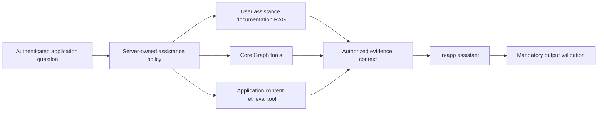

# Application content retrieval providers

**Status:** Approved direction

**Date:** 2026-07-17

## Decision summary

Laraplate will let the authenticated in-app assistant retrieve grounded evidence from application-module data through a general provider contract. Core owns `ApplicationContentRetrievalProviderInterface`, its registry, authorization gateway, and neutral evidence DTOs. The AI module consumes that gateway through one contextual read-only tool. Optional modules register providers without depending on AI.

Provider routing is context-aware but does not require page context. When the request carries a server-verified application context, its matching source is the default and other sources are considered only when the user explicitly asks for another module. Without application context, the assistant uses generic routing over the sources authorized for that request. Phase 1 selects at most one source per retrieval and asks for clarification when the intended source is ambiguous.

CMS is the first provider and proves the extension seam against searchable content records. The contract contains no CMS-specific concepts and is intended to support later providers from ERP, MES, or other modules.

Phase 1 serves authenticated application users only. Every retrieval executes under server-owned identity, tenant, permissions, ACL, locale, provider rules, and safe-field projection. Phase 2 may evaluate a public content assistant, but no public endpoint, profile, or access mode is authorized by this specification.

## Product boundary

Laraplate remains a modular, general-purpose headless platform. Application content retrieval is infrastructure for modules, not a vertical feature set.

The committed product capability is:

- a common retrieval contract;
- authorized provider discovery;
- bounded evidence retrieval;
- canonical citations;
- assistant tool integration;
- evaluation and safe abstention;
- one CMS reference provider.

The following are not part of this phase:

- domain-specific agents or workflows;
- automatic knowledge-graph extraction;
- automatic entity resolution across time;
- direct image, audio, or video understanding;
- autonomous report or content generation;
- public anonymous assistance;
- copying application records into the documentation RAG index;
- introducing a mandatory new search backend.

## Why Graph tools are not sufficient alone

Core Graph and application content retrieval solve related but different problems:

| Capability | Core Graph tools | Application content retrieval |
|---|---|---|
| Locate authorized records | Yes | Yes |
| Traverse explicit relations | Yes | No |
| Compute bounded graph statistics | Yes | No |
| Find relevant passages inside searchable content | Limited | Yes |
| Return evidence-oriented excerpts and citations | Limited | Yes |
| Rank lexical/vector evidence | No | Yes |

The assistant may combine both capabilities. For example, it can retrieve passages through application content search and then expand relations for an authorized record through Core Graph. Neither capability replaces documentation RAG.

## Three independent retrieval surfaces



1. **Documentation RAG** explains how to use Laraplate and its modules.
2. **Core Graph tools** retrieve live records, relations, and statistics.
3. **Application content retrieval providers** return ranked evidence from module-owned searchable content.

The surfaces keep separate indexes, authorization paths, provenance, evaluation datasets, and failure behavior.

## Ownership and dependency direction

### Core

Core owns the neutral extension boundary because every optional business module already depends on Core, while AI remains optional. Core provides:

- `ApplicationContentRetrievalProviderInterface`;
- `ApplicationContentRetrievalProviderRegistryInterface` and registry;
- typed source descriptor, query, authorization, hit, provenance, and result DTOs;
- `ApplicationContentRetrievalService` as the only gateway;
- permission and ACL resolution before provider execution;
- result bounds and invariant validation.

### AI

AI owns assistant orchestration:

- contextual tool registration;
- conversion between tool arguments and Core query DTOs;
- per-request source allowlist and routing from server-owned profile and verified application context;
- context-budget enforcement;
- instruction-neutral evidence formatting;
- answer citations, abstention, and output validation.

AI does not know how a module stores or searches its data.

### Provider modules

Each module may register zero or more providers. A provider owns:

- one stable source descriptor with source key, module, entity, supported locales, capabilities, and intent categories;
- application of server-created ACL filters inside its search query;
- search strategy and fallback;
- safe excerpt construction;
- safe source labels and canonical application references;
- module-specific visibility and validity rules;
- provider-specific evaluation cases.

A module does not register tools directly and does not depend on AI.

## Core contract

The canonical contract name is `ApplicationContentRetrievalProviderInterface`, following existing Core provider conventions.

Conceptual API:

```php
interface ApplicationContentRetrievalProviderInterface
{
    public function descriptor(): ApplicationContentSourceDescriptor;

    public function retrieve(
        ApplicationContentQuery $query,
        ApplicationContentAuthorization $authorization,
    ): ApplicationContentResult;
}
```

`ApplicationContentSourceDescriptor` is immutable and contains only server-owned routing metadata: source key, module key, Core entity key, supported locales, retrieval capabilities, and a bounded list of intent categories. It contains no free-form prompt instructions, user data, tenant data, secrets, class names, connections, index names, or executable callbacks.

`ApplicationContentRetrievalService` receives the authenticated Laravel request separately from the public query. It resolves the registered provider, calls `AuthorizationService::ensurePermission(..., 'select')`, resolves ACL filters, constructs `ApplicationContentAuthorization`, invokes the provider, and validates the returned evidence.

The public query contains only:

- server-approved source key;
- natural-language query;
- locale;
- bounded result limit.

It does not contain user ID, tenant ID, roles, permissions, ACL, connection, class name, index name, raw query DSL, arbitrary field selection, or a system prompt.

## Evidence contract

Providers return evidence hits, not arbitrary model serialization. Each `ApplicationContentHit` contains:

- opaque hit ID;
- source key, module, and entity;
- record key suitable for an authorized follow-up request;
- bounded plain-text excerpt;
- safe source label;
- canonical application reference;
- locale;
- normalized retrieval score when meaningful;
- source revision or update marker when available;
- retrieval strategy identifier;
- truncation indicator.

Evidence metadata is typed and allowlisted. Providers cannot return unrestricted model arrays, hidden attributes, raw database fields, internal class names, storage paths, ACL expressions, permission names, or search-engine payloads.

The LLM receives only a sanitized prompt projection of the evidence. Control-plane authorization data remains outside the prompt.

## Registry semantics

The registry follows the existing Core Graph provider pattern:

- modules register stateless providers explicitly from their Laravel service-provider boot path;
- provider discovery does not use events, container scanning, reflection, or dynamic class names;
- events may notify provider-owned indexing, invalidation, deletion, or freshness work only after deterministic registration;
- registration is keyed by a normalized, stable source key;
- duplicate registration for the same key fails during boot;
- an unknown key returns an unavailable capability, not a dynamic class lookup;
- only installed and enabled modules can register providers;
- provider availability is server-owned and cannot be selected through conversation metadata;
- registry ordering is deterministic;
- the registry exposes no writable operations.

Phase 1 performs single-provider retrieval. Fan-out, score fusion, and cross-provider deduplication are deferred until a measured use case justifies their cost.

## Contextual and generic routing

AI builds the available source set independently for every authenticated request:

```text
registered sources
  ∩ enabled modules
  ∩ assistant-profile capabilities
  ∩ tenant configuration
  ∩ effective permissions and ACL eligibility
```

The resulting source keys form a request-local allowlist and the model-visible `source` tool argument is a runtime enum constrained to that allowlist, never a free-form string. Registry contents are process-level and stateless; identity, tenant, roles, permissions, ACL filters, page context, and conversation state are never stored in providers or in the registry.

Phase 1 currently resolves only `Global` tenant scope. A request resolved as `Tenant` receives no application content tool until a server-owned per-tenant source policy exists; the system does not treat a missing tenant policy as unrestricted access.

Routing has two modes:

1. **Contextual mode.** A server-verified application context identifies the current module and, when applicable, its entity or record. The matching authorized source becomes the default when it is compatible with the request. The assistant does not silently broaden the search to another module; it may use another authorized source only when the user explicitly asks for that module or source.
2. **Generic mode.** When no application context is supplied, the router classifies the request using typed provider descriptors and selects one authorized source. If no source is suitable, the tool is not invoked. If more than one source remains materially plausible, the assistant asks the user to disambiguate instead of querying all providers.

Client-supplied route names, module names, entity keys, record IDs, or source hints are untrusted until matched against server-known route metadata and the authenticated access context. Page context influences routing only; it never grants permission and never bypasses provider authorization.

The router never resolves ambiguity using registry order, module boot order, or alphabetical order. Selection reasons and rejected candidates remain internal diagnostics and disclose no hidden source, permission, ACL, tenant, or record information.

Phase 1 does not use automatic cross-provider fan-out. A later fan-out design requires comparable scoring, bounded parallelism, deduplication, rank fusion, latency and cost budgets, and evidence that it improves the evaluation baseline.

## Module rules and future providers

Provider-specific rules are enforced in backend code through authorization, validity scopes, safe-field projection, typed descriptors, and evaluation cases. They are not appended to roles, users, ACL records, or free-form provider prompts. Common assistant rules remain profile-owned and server-controlled.

CMS is the only application content provider committed in Phase 1. ERP has no implicit provider or special assistant prompt rules in this phase. Future ERP, commerce, MES, or other providers must define their own safe projections and domain invariants behind the same Core contract.

Sharing the retrieval contract does not imply sharing or inheriting domain models. A future commercial product aggregate may compose or reference a content presentation, but it is not required to inherit the CMS content model; its pricing, variants, inventory, tax, and channel invariants remain module-owned.

## Phase 1 CMS provider

CMS registers `cms.contents` as its first source key. The first implementation reuses the existing Core searchable model and orchestrated search capabilities rather than creating another index.

The provider:

- accepts only the canonical source key;
- uses the existing content search schema and configured search engine;
- applies Core select permission and ACL filters before search results are materialized;
- respects locale, translations, validity, deletion, and module-defined visibility;
- rehydrates authorized records before projection instead of exposing raw search `_source` data;
- projects only approved title, bounded text, path, locale, revision, and score fields;
- returns canonical references to records the same user may open;
- returns no media binary, unrestricted component payload, internal metadata, or hidden relation data;
- degrades from vector/hybrid to the supported Core search path with explicit internal diagnostics;
- returns an empty authorized result when no evidence is available.

The initial provider is a record-level evidence baseline. The synthetic baseline shows a material residual failure for semantic/paraphrase and passage-candidate cases, so a bounded comparison is specified in `2026-07-21-application-content-passage-index-gate.md`. A separate chunk or passage index remains unauthorized until that gate is passed.

## AI tool contract

The in-app assistant receives one contextual read-only tool:

```text
application_content_search
```

Arguments:

- `source`, constrained at runtime to the request-local authorized source allowlist;
- `query`;
- optional `locale`;
- optional bounded `limit`.

The tool is available only to `InAppAssistance`, only after the server capability policy permits the requested source, and only with an authenticated `AssistantAccessContext`. Its schema is built per request. Contextual mode narrows `source` to the compatible contextual default unless the user's request explicitly names another authorized source; generic mode exposes the authorized enum and the router validates the proposed selection. The model may propose an allowlisted source but cannot make the authoritative routing decision. The tool invokes `ApplicationContentRetrievalService` directly; it does not call Laraplate over HTTP.

The tool cannot create `ActionRequest` records, enter mutation approval/replay, or accept write operations. Tool timeout, provider unavailability, or authorization uncertainty returns a generic unavailable result without falling back to unfiltered search or documentation RAG.

## Authorization and information-flow invariants

1. Authentication establishes identity but does not grant retrieval by itself.
2. Server code selects profile, source capability, user, tenant, and locale policy.
3. Candidate authorization precedes routing; context and model choices may only prioritize or narrow authorized candidates and can never expand them.
4. Core permission and ACL checks happen before provider results reach AI.
5. Providers apply ACL filters inside the database/search-engine query, not only after retrieval.
6. Safe-field projection happens after record rehydration and before evidence serialization.
7. Empty and forbidden results are indistinguishable where existence disclosure would be sensitive.
8. Retrieved content is untrusted data and cannot issue instructions to the assistant.
9. The complete assistant response is validated before persistence or delivery.
10. No application content is added to developer or user documentation indexes.
11. Provider diagnostics never expose authorization internals or hidden record counts.

## Retrieval quality and abstention

The first provider must ship with a deterministic evaluation fixture covering:

- exact lexical lookup;
- semantic paraphrase when vector search is available;
- locale and translation selection;
- ACL-excluded records;
- cross-tenant exclusion;
- invalid or deleted records;
- unsupported questions;
- long-record excerpts;
- citation mapping;
- provider timeout and degraded search.

Metrics include hit rate at K, reciprocal rank, citation precision, authorized-empty accuracy, supported-answer rate, abstention accuracy, and latency. A raw similarity score is not presented as answer confidence. The assistant must abstain when evidence is absent or below the approved evidence policy.

## Failure behavior

- Unknown or disabled provider: generic capability unavailable response.
- Missing authentication: reject before registry or provider execution.
- Permission or ACL resolution failure: fail closed.
- Unsupported search driver: return an explicit unavailable/degraded result; never run an unbounded database scan.
- Vector branch failure with supported lexical fallback: return bounded lexical evidence and internal diagnostics.
- Entire provider failure: no model answer based on assumed application data.
- Invalid evidence DTO or unsafe field: discard the provider result and record a payload-free policy reason.
- Insufficient evidence: abstain with a user-safe response.

## Phase 2 — possible public content assistance

Phase 2 is a preserved extension point, not an implementation commitment. It requires a separate design, threat model, evaluation dataset, and approval before any route or profile is created.

That design must decide:

- a dedicated public assistant profile and fixed capability allowlist;
- explicit public-visibility rules independent of authenticated ACL assumptions;
- provider sources and fields safe for anonymous use;
- separate rate limits, quotas, abuse controls, and cost budgets;
- privacy, retention, consent, and logging constraints;
- prompt-injection handling for publicly managed content;
- caching and freshness behavior;
- citations and non-disclosure behavior;
- whether public retrieval needs a separate index or projection;
- whether streaming can satisfy equivalent output validation.

Phase 1 must not expose an internal provider through `/api/v1`, reuse an authenticated profile anonymously, or treat absence of authentication as public authorization.

## Deferred capability gates

The following capabilities require measured evidence and separate specifications:

- passage-level indexing for long records;
- temporal entity disambiguation;
- automatic cross-record entity linking;
- derived text from images, audio, or video;
- graph-aware evidence fusion;
- provider-specific generation workflows;
- public content assistance.

Each gate requires a representative evaluation subset, a baseline without the capability, measurable improvement, bounded cost, provenance, incremental update/deletion behavior, and the same authorization guarantees.

## Success criteria

- Optional modules implement a Core contract without depending on AI.
- AI discovers only installed, registered, server-authorized providers.
- The CMS reference provider returns bounded, cited evidence from records visible to the authenticated user.
- ACL, tenant, locale, validity, deletion, and safe-field rules apply before evidence reaches the LLM.
- Documentation RAG, Core Graph, and application content retrieval remain separate capabilities.
- Provider failure or insufficient evidence produces abstention rather than unsupported answers.
- Phase 1 creates no public or anonymous access surface.
- The contract can accept a future non-CMS provider without changing AI tool schemas.

## Related documents

- `docs/superpowers/specs/2026-07-16-rag-retrieval-strategy-design.md`
- `docs/superpowers/specs/2026-07-16-in-app-ai-assistance-security-design.md`
- `docs/superpowers/specs/2026-06-30-cms-graph-layer-design.md`
- `docs/superpowers/plans/2026-07-17-application-content-retrieval.md`
